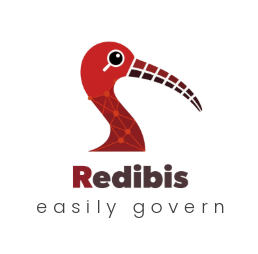

# redibis

**Open-source continuous data protection and ODCS data-contract generation.**

redibis sits in your data platform and CI/CD so tabular data is profiled,
classified for PII, quality-gated, reviewed by humans, enriched with business
context, and de-identified before it is shared or sent to an LLM.

The name combines **"redact" + "ibis"** — the Egyptian ibis was Thoth's sacred
bird, the symbol of writing, records, and the categorization of knowledge.

This repository is the **Apache-2.0 open core**. Commercial add-ons (filtered
reports console, hosted codegen, air-gapped enterprise bundles) are separate
products and are not included here.

---

## Why use it

| Need | What redibis gives you |
|------|-------------------------|
| Know what is in a table | Profile + quality expectations (Great Expectations) and PII detection (Presidio, GLiNER, phone rules, optional LLM) |
| One governed artifact | An **ODCS v3** active data contract with version history and audit |
| Humans in the loop | Steward Review overlays so verified PII decisions survive the next scan |
| Safe sharing | Mask / hash / encrypt / NIST FF3-1 FPE and locale-aware fakers before export or LLM use |
| Business language | LLM enrichment for definitions and glossary (validity-gated) |
| Catalog sync | Push contracts toward OpenMetadata and related sinks |
| Operator choice | **Dashboard UI**, **CLI**, and **HTTP API** over the same stores |

Put redibis at the heart of monitoring and release pipelines so contracts stay
current as schemas and data drift.

---

## What is possible (open core)

High-level capabilities — descriptions only. Worked examples ship gradually as
tutorials are verified; today the hands-on path is the
**[Intro tutorial](docs/tutorials/INTRO.md)** (e-shop customer CSV).

### Scan & contracts
- Profile-only, quality, PII, or combined scans on CSV / Parquet
- Per-run subcontracts with optional auto-merge into an active ODCS contract
- Equation modes for PII verdicts (`strict` / `balanced` / `lenient` / `independent`)
- Deep scan: multi-producer evidence fan-out without forcing a contract write

### PII & quality
- Regex catalogue, phonenumbers, GLiNER / BYOM NER weights (local paths only)
- Quality discovery and continuous quality-monitor mode
- Rule export targets (GE / SodaCL / dbt-oriented views)

### Stewardship
- Contracts v2 Steward Review: accept / edit / needs_review / finalize
- Portable verdict memory and attach-at-scan so human-verified columns stay locked
- Sampling consent and review audit trails

### Enrichment & packs
- LLM enrich (any LiteLLM-backed provider): glossary, definitions, refinements
- Multistep enrich and context/prompt packs
- Portable `.rdbpack` export / import

### Masking & sharing
- Plan / apply / auto mask; FPE for format-preserving joins
- Share links and session-approved property baskets

### Catalog & memory
- Catalog push status and backends
- Optional column-memory learning loop (when configured)

### Agentic (optional)
- Ask / Composer style board behind config flags (disabled until you enable it)

### Free-text / gateway
- Text PII scan policies, gateway sessions, and evaluation helpers for unstructured content

---

## Surfaces: UI · CLI · API

All three talk to the same contract and run stores (local filesystem by default,
optional S3/MinIO).

### Dashboard UI

| Area | Purpose |
|------|---------|
| Start / scan console (`/`) | Upload or pick sample CSV, run scans, watch session progress |
| Contracts v2 (`/v2`) | Active contract, PII/quality views, Steward Review, enrich, synthesis, share |
| Settings (`/settings`) | Models, LLM providers, agents, governance, runtime |
| Agents (`/agents`) | Optional agentic Ask / Composer / results (config-gated) |
| Gateway | Free-text / evaluation operator UI (when enabled) |
| Login / users | Auth on by default; bootstrap `admin` / `admin` if empty users store |
| Swagger (`/docs`) | Interactive HTTP API after login |

**Start / stop (local filesystem):**

```bash
export USE_LOCAL_STORAGE=true
export LOCAL_STORAGE_ROOT=./_local_storage
export SCAN_OUTPUT_DIR=./scan_output
./scripts/webapp.sh --start          # or: python -m redibis.webapp.backend
./scripts/webapp.sh --stop
./scripts/webapp.sh --status
```

Prefer loopback for local use; put internet-facing deploys behind HTTPS.

### CLI

Install extras as needed (`[ge]`, `[ner-runtime]`, `[enrich]`, `[mask]`, `[web]`),
then:

```bash
redibis --help
redibis <command> --help
```

| Command | What it does |
|---------|----------------|
| `scan` | Scan a file into run subcontracts; optional `--automerge` into the active contract |
| `profile` | Profile-only scan (no PII / quality gatekeeper) |
| `quality` | Profile + Great Expectations quality scan |
| `deep-scan` | Multi-producer evidence scan (+ optional synthesis bundle) |
| `show` / `list` / `history` / `merge` | Inspect or dump active contracts |
| `runs` | List / merge / discard PII or quality run subcontracts |
| `contract` | Lifecycle views: PII/quality/definitions, strip/add PII, purge, export package |
| `steward` | Steward review overview, column verdicts, export-verdicts, finalize |
| `verdict` | Portable verdict package export / preview / import |
| `enrich` | LLM-enrich the active contract (or a YAML file) |
| `llm` | List / test / add LLM providers and capability routes |
| `mask` | Plan / apply / auto de-identify a data file |
| `data` | Preview a tabular file |
| `pii` | Regex catalogue, NER inventory, free-text PII helpers |
| `models` | Upload / activate / delete BYOM NER weights |
| `catalog` | Push contracts to governance catalogs |
| `quality-monitor` (`monitor`) | Continuous validate-only quality monitoring |
| `rules` | List / export quality rules |
| `retention` | Table-level TTL policy |
| `approved` / `session` | Session-approved property baskets |
| `config` | Dump default YAML config |
| `get` | Fetch run artifacts (e.g. LLM call logs) |
| `pack` / `rdbpack` / `context` | Enrichment packs and portable Redibis packs |
| `classify` | Multi-domain classification policy engine |
| `behavior` | Behavior policy lifecycle |
| `memory` / `golden` / `vector` / `similar` | Column memory and golden similarity (when enabled) |
| `workspace` / `scan-batch` | Named multi-table workspaces and folder batch scan |
| `eval` / `dataset` (`training`) | Evaluation datasets and steward training export |
| `agents` | Agentic pipeline board helpers |
| `report` | PII reporting (needs commercial `redibis-reports` add-on) |
| `import-business` | Import business metadata into contracts |

Global flags include `--output-dir` (CLI store root), `--use-s3`, and logging
options. Use the **same** `--output-dir` across a workflow so scan / show /
enrich / steward share one `_dev_storage`.

### HTTP API

The dashboard exposes **400+** JSON routes under `/api/…` plus HTML pages.
Full method/path listing:

**[docs/API_SURFACE.md](docs/API_SURFACE.md)**

Grouped areas include: sessions & scan, contracts & steward, evidence, enrich,
masking, PII / gateway, agents, catalog, classification, behavior, workspaces,
LLM providers, models, packs, users/auth, and settings. Session cookie auth
applies by default; use `/docs` after login for live schemas.

---

## Install

```bash
python3 -m venv .venv
source .venv/bin/activate
pip install -e ".[dev,web]" -c requirements/constraints.txt
# optional: ./scripts/setup_dev_env.sh
```

NER weights are not bundled — download once with
`./scripts/download_ner_model.sh` when you need GLiNER.

---

## Tutorial (verified path)

Hands-on walkthrough with the shipped e-shop customer CSV:

→ **[docs/tutorials/INTRO.md](docs/tutorials/INTRO.md)**  
→ Fixture: [`tests/data/realistic_eshop_customer_account.csv`](tests/data/realistic_eshop_customer_account.csv)

Further tutorials and deep CLI sheets remain in the monorepo until each is
operator-tested and explicitly added to the OSS extract.

---

## Architecture (short)

```text
CSV / Parquet / DataFrame
        → ScanService → run evidence + quality/PII subcontracts
        → ContractStore.upsert()   (single writer)
        → steward overlays / enrich / mask / catalog
```

Invariants: single contract writer; PII demotions only via decision overlay;
detector evidence vs equation verdict; enrichment output scrub; optional
fingerprint-gated steward attach so human-verified columns win over engines.

---

## Commercial add-ons

- `redibis-reports` — filtered KPI / reports console at `/reports`
- Hosted codegen and air-gapped enterprise bundles — separate products

---

## Contributing & security

- [CONTRIBUTING.md](CONTRIBUTING.md)
- [SECURITY.md](SECURITY.md)

```bash
pytest tests/ -q
```

## License

Apache-2.0 — see [LICENSE](LICENSE) and [NOTICE](NOTICE).
