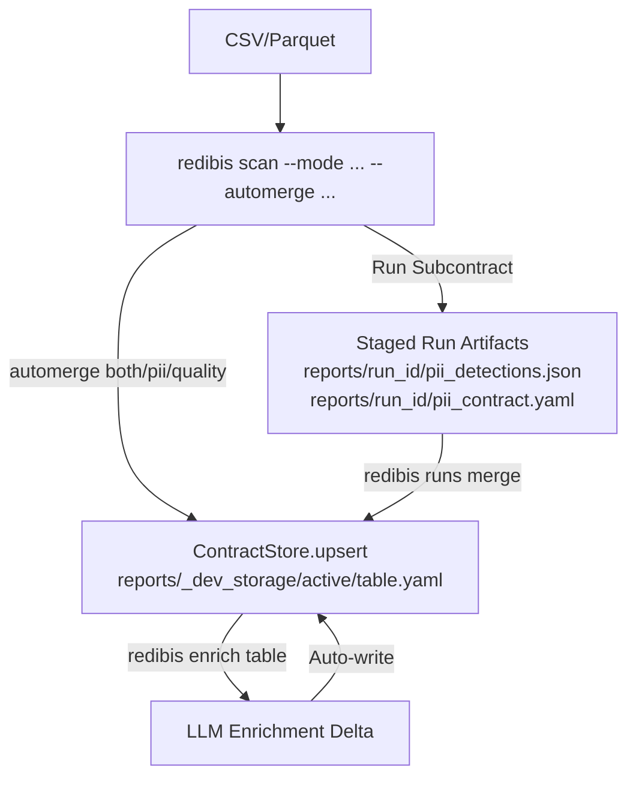

# CLI tour — scan, contracts, enrich (no UI)

Operator guide for generating ODCS (Open Data Contract Standard) contracts with the **`redibis` command line only**.
Covers scan modes, YAML config, writing to active storage, local OpenAI-compatible LLMs,
batch runs, PII-only export, and enrich context/instructions.

**Short command help (linked from README):** [`docs/cli/`](cli/README.md) —
[scan](cli/scan.md) · [contract](cli/contract.md) · [enrich](cli/enrich.md) ·
[catalog](cli/catalog.md) · [llm](cli/llm.md) · [config/batch](cli/config-batch.md) ·
[mask](cli/mask.md) · [evidence store](EVIDENCE_STORE.md).

Related deep dives: [`SCAN_CSV_TO_CONTRACT_GUIDE.md`](SCAN_CSV_TO_CONTRACT_GUIDE.md),
[`data_scanning.md`](data_scanning.md), [`LLM_ENRICHMENT.md`](LLM_ENRICHMENT.md),
[`LLM_PROVIDERS.md`](LLM_PROVIDERS.md),
[`BEHAVIOR_POLICY_IMPLEMENTATION_PLAN.md`](BEHAVIOR_POLICY_IMPLEMENTATION_PLAN.md)
(§ **Implementation status** + CLI §5 below).

---

## 0. Mental model (read once)



| Concept | Meaning |
|---------|---------|
| **ODCS** | Open Data Contract Standard, a schema and metadata specification describing data qualities, PII, and service levels. |
| **Active contract** | Latest merged ODCS in the contracts bucket (`redibis show <table>`) |
| **Run subcontract** | Staged partial from one scan (`redibis runs list/merge`) |
| **Automerge** | Scan writes the partial *and* merges it into active in one step |
| **Local storage** | Default: `./reports/_dev_storage/` (override with `--output-dir`) |
| **S3/MinIO** | Pass `--use-s3` + `--s3-endpoint` + bucket flags (or env credentials) |

Always use the **same** `--output-dir` (and S3 flags) for `scan`, `show`, `enrich`,
`runs`, and `contract …` so they see the same store.

---

## 1. One-command: full contract → active storage

```bash
# Install (dev) + enrich extra if you will call / test an LLM
pip install -e ".[dev,enrich]" -c requirements/constraints.txt

# Probe LLM connectivity (no contract needed)
redibis llm list
redibis llm test demo
redibis llm test ollama
redibis llm test vllm --endpoint http://localhost:8001/v1
redibis llm test sglang --endpoint http://localhost:30000/v1   # alias: slang
redibis llm test openai --model gpt-4o-mini
redibis llm test claude
redibis llm test gemini

# Full scan (profile + quality + PII) and merge into active
redibis scan data/customers.csv telecom.customers \
  --mode all \
  --automerge both \
  --equation balanced \
  --pii-engines both \
  --output-dir ./reports

# Confirm active contract exists
redibis list --output-dir ./reports
redibis show telecom.customers --output-dir ./reports > telecom.customers.contract.yaml
```

| Flag | Effect |
|------|--------|
| `--mode all` | profile + quality + PII |
| `--automerge both` | merge PII **and** quality partials into active |
| `--output-dir ./reports` | reports + local contract store root |

Without `--automerge` (default `none`), the scan only stages run subcontracts — merge later:

```bash
redibis runs list telecom.customers --output-dir ./reports
redibis runs merge telecom.customers <run_id> --output-dir ./reports
```

---

## 2. Scan modes (what to run)

| Command / `--mode` | Profile | Quality (GE) | PII |
|--------------------|---------|--------------|-----|
| `redibis scan … --mode all` | ✓ | ✓ | ✓ |
| `redibis scan … --mode profile` or `redibis profile …` | ✓ | | |
| `redibis scan … --mode quality` or `redibis quality …` | ✓ | ✓ | |
| `redibis scan … --mode pii` | | | ✓ |
| `redibis scan … --mode pii,quality` | ✓ | ✓ | ✓ |
| `redibis scan … --mode profile,pii` | ✓ | | ✓ |

Examples:

```bash
# PII only → merge PII into active
redibis scan data/customers.csv telecom.customers \
  --mode pii --automerge pii --equation balanced --output-dir ./reports

# Quality only → merge quality into active
redibis quality data/customers.csv telecom.customers \
  --automerge quality --output-dir ./reports

# Fast PII (regex only, no NER, no GE docs)
redibis scan data/customers.csv telecom.customers \
  --mode pii --pii-engines regex --no-ge-docs --automerge pii --output-dir ./reports
```

### All important `scan` flags

| Flag | Values / notes |
|------|----------------|
| `--mode` | `all` \| `profile` \| `pii` \| `quality` \| comma list |
| `--automerge` | `none` (default) \| `pii` \| `quality` \| `both` |
| `--equation` | `strict` \| `balanced` \| `lenient` \| `independent` |
| `--pii-engines` | `regex` \| `gliner` \| `ner` \| `llm` \| `both` |
| `--ner-model` | local NER weights dir (or `REDIBIS_NER_MODEL`) |
| `--ner-labels` | comma-separated GLiNER labels for this run |
| `--profiler-engine` | `great_expectations` \| `open_metadata` |
| `--config` | path to `redibis.yaml` (see §3) |
| `--no-ge-docs` | skip GE Data Docs HTML (faster) |
| `--no-validate` | skip ODCS validation on write |
| `--no-phonenumbers` | disable libphonenumber telephony gate |
| `--session-id` | reuse a fixed session UUID |
| `--scan-output-dir` | session root (defaults to `--output-dir`) |
| `--enable-metadata` / `--enable-pushdown` | catalog tiers (needs `source` in config) |
| `--enable-memory` | column-memory learning loop |
| `--use-s3` + `--s3-endpoint` + `--s3-*-bucket` | remote storage |

Global flags (before the subcommand):

```bash
redibis --debug --log-format plain scan …
```

---

## 3. Config file (`redibis.yaml`) — create and tweak

```bash
# Write a starter config you can edit
redibis config dump-default -o redibis.yaml
```

Or set `export REDIBIS_CONFIG=/path/to/redibis.yaml` so every command loads it.

### Minimal practical config

```yaml
table: telecom.customers          # optional default; CLI table arg still wins
scan_types: [profile, quality, pii]

profiling:
  engine: great_expectations      # or open_metadata

quality:
  generate_ge_docs: true

pii:
  engines: both                   # regex | gliner | ner | llm | both
  equation_mode: balanced         # strict | balanced | lenient | independent
  use_phonenumbers: true
  default_region: EG
  thresholds:
    presidio_min: 0.80
    gliner_min: 0.70
    llm_min: 0.82
    phone_min: 0.80
  ner:
    model_path: ""                # set for BYOM / local GLiNER
    always_run: false
  selected_columns: null          # or ["email", "msisdn", …]

contract:
  automerge: none                 # override with CLI --automerge
  validate: true

storage:
  backend: local
  contracts_bucket: active-contracts
  runs_bucket: pii-reports

report:
  output_dir: ./reports

enrich:
  include_pii_evidence: false     # put regex/NER catalogue in enrich prompt
  similar_context:
    enabled: true
    k: 5

classification:
  policy_pack: telecom

rai:
  enabled: true
  mode: report                    # open-source default is advisory
  default_residency: local
```

### Use the config on a scan

```bash
redibis scan data/customers.csv telecom.customers \
  --config redibis.yaml \
  --automerge both \
  --output-dir ./reports
```

CLI flags **override** matching YAML fields for that run (equation, engines, automerge,
profiler engine, output dir, etc.).

### Common tweaks

| Goal | Change |
|------|--------|
| Fewer false-positive phones | keep `use_phonenumbers: true`, raise `thresholds.phone_min` |
| Stricter PII | `--equation strict` or `pii.equation_mode: strict` |
| Regex-only / air-gapped | `pii.engines: regex` or `--pii-engines regex` |
| Local NER weights | `pii.ner.model_path: /models/my-gliner` or `--ner-model …` |
| Faster quality | `--no-ge-docs` or `quality.generate_ge_docs: false` |
| Scan only some columns | `pii.selected_columns: [col_a, col_b]` |
| Always write active | `contract.automerge: both` **or** pass `--automerge both` |

Example snippets: `config/examples/` (memory, catalog, RAI).

### Environment Variables Config

Instead of declaring them in `redibis.yaml`, you can configure the runtime behavior and secrets using environment variables. These are loaded dynamically:

| Env Variable | Purpose / Equivalent |
|--------------|----------------------|
| `REDIBIS_CONFIG` | Path to load the default `redibis.yaml` configuration file. |
| `GEMINI_API_KEY` \| `GOOGLE_API_KEY` | API key for Gemini LLM engine (used when LLM PII or enrichment is enabled). |
| `OPENAI_API_KEY` | API key for OpenAI engines. |
| `ANTHROPIC_API_KEY` | API key for Claude/Anthropic engines. |
| `REDIBIS_NER_MODEL` | Local directory containing weights for NER/GLiNER model (e.g. `/models/my-gliner`). |
| `REDIBIS_MODELS_DIR` | Root directory for uploaded/stored model weights. |
| `BEHAVIOR_POLICIES_DIR` | Storage root for custom pluggable policy rules (`redibis behavior`). |
| `REDIBIS_LOG_LEVEL` | Logging level (`DEBUG`, `INFO`, `WARNING`, `ERROR`). |
| `REDIBIS_LOG_FORMAT` | Format output (`rich`, `json`, `plain`). |

For example, to configure Gemini PII classification entirely through environment variables without hardcoding secrets in `redibis.yaml`, set:

```bash
export REDIBIS_CONFIG=/path/to/redibis.yaml
export GEMINI_API_KEY="your-api-key"
```

And in `redibis.yaml`, simply specify the provider and model under the `pii.llm` block:
```yaml
pii:
  llm:
    enabled: true
    provider: gemini
    model_name: gemini-3.5-flash
```

---

## 4. Dynamic PII Configuration: NER, Regex & Presidio Context

Redibis enables runtime PII detection customization without code changes.

### 4.1 Custom Regex Rules via YAML overrides
You can dynamically add or remove regex patterns using the `pii.regex_overrides` config block in `redibis.yaml`. The `add` dictionary registers patterns onto Presidio's underlying regex analyzer catalog.

```yaml
pii:
  regex_overrides:
    replace_all: false  # True will disable the default catalog and use only your additions
    add:
      egyptian_mobile_custom:
        pattern: "^(\\+20|0)?1[0125]\\d{8}$"
        entity_type: "PHONE_NUMBER"
        recognizer_group: "structured"
        presidio_score: 0.95
        context_hints: ["mobile", "msisdn", "phone", "جوال"]
    remove:
      - default_eg_nid  # Suppresses a default regex pattern by name
```

### 4.2 Spacy/Presidio Context Hints
The `context_hints` list mapped to a regex entry will be dynamically sent to Presidio as context triggers. If a column name (or adjacent word) contains any word in this list, Presidio boosts the matching confidence score of that regex.

### 4.3 Runtime NER Entities (`--ner-labels`)
You can pass custom GLiNER/NER labels dynamically on the CLI to detect specific entity types during a scan:
```bash
redibis scan data/customers.csv telecom.customers \
  --mode pii \
  --pii-engines ner \
  --ner-labels "ORGANIZATION,GPE,PRODUCT_NAME" \
  --output-dir ./reports
```
This overrides the configured labels in the default policy pack/manifest on the fly.

---

## 5. Pluggable Behavior Policies Lifecycle (`redibis behavior`)

Behavior policies let you correct recurring FP/FN at judgment hooks **without editing
engine code**. Rules read registered facts, emit a typed patch, and never write the
contracts bucket (`ContractStore.upsert()` remains the only contract writer).

Deep design: [`BEHAVIOR_POLICY_ARCHITECTURE.md`](BEHAVIOR_POLICY_ARCHITECTURE.md) ·
implementation status: [`BEHAVIOR_POLICY_IMPLEMENTATION_PLAN.md`](BEHAVIOR_POLICY_IMPLEMENTATION_PLAN.md).

**Default off.** Existing edge packs keep working until you enable the runtime:

```yaml
# redibis.yaml
behavior:
  enabled: true
  mode: shadow          # disabled | shadow | active
  # engine_modes: { pii: active }
  fail_mode: baseline_with_warning   # or fail_run
  # policies: ["./policies/lac.yaml"]   # optional paths or store IDs
  plugin_allowlist: []                 # empty = no third-party plugins
```

| Mode | Effect |
|------|--------|
| `disabled` / `enabled: false` | Byte-identical to prior edge-rule path |
| `shadow` | Evaluate behavior policies; keep edge/equation baseline; emit mismatch warnings |
| `active` | Apply reduced patches (active store policies, then configured paths, else edge-compat conversion) |

**Store root:** `CONFIGS_DIR/behavior-policies` (override with `--store-dir` or
`BEHAVIOR_POLICIES_DIR`). Policy ids/versions must be path-safe (`a-zA-Z0-9._-`);
`../` is rejected.

### 5.1 Commands

| Command | What it covers |
|---------|----------------|
| `catalog` \| `status` \| `metrics` | Fact/operator/effect catalogue, config status, lifecycle metrics |
| `validate` \| `create` \| `list` \| `get` | Compile, lint, and manage immutable drafts |
| `simulate` | Evaluate against sanitized contexts; writes a durable simulation receipt (not contracts) |
| `approve` \| `activate` \| `deactivate` \| `rollback` | Lifecycle gates (approve/activate need a real `simulation_id`) |
| `promote` | Human correction → draft only (never auto-activates) |
| `history` \| `audit` | Lifecycle trail |
| `plugins` | Allow-listed entry-point plugins |
| `outcomes` \| `signals` \| `suggest` \| `draft-from` | Learning loop (propose-only) |

### 5.2 Steward workflow

```bash
# 1) Validate local policy document (apiVersion redibis.io/behavior-policy/v1)
redibis behavior validate custom_policy.json --json

# 2) Save immutable draft
redibis behavior create custom_policy.json --actor alice --json

# 3) Simulate (keep simulation_id from the JSON response)
redibis behavior simulate --policy-id cli-lac-policy --version 1.0.0 \
  --column lac \
  --facts '{"column.name":"lac","verdict.entity":"PHONE_NUMBER","verdict.detected":true}' \
  --json

# 4) Approve with the receipt id (forged strings are rejected)
redibis behavior approve cli-lac-policy 1.0.0 \
  --actor steward --simulation-id <sim_id>

# 5) Activate for scans when behavior.mode is active
redibis behavior activate cli-lac-policy 1.0.0 --actor admin

# Rollback pops the prior active version (second rollback goes further back)
redibis behavior rollback cli-lac-policy --actor admin
```

Gates: production activation requires **approval + successful simulation** unless you
pass the explicit CLI opt-outs (`--no-approval-gate` / `--no-simulation-gate`) for
local experiments only.

REST mirror (Settings → Behavior, and `/api/behavior/*`): same lifecycle; mutating
calls still take `actor`/`role` in the body like other settings endpoints.

### 5.3 What is wired today

| Surface | Wired |
|---------|-------|
| PII `pre_verdict` thresholds + `post_verdict` corrections | Yes (`services/pipeline.py`) |
| Edge-rule pack → behavior compat when no active policies | Yes |
| Human `PiiDecisionStore` overlays block policy | Best-effort when contract store is available |
| Classification / quality / profiling / masking adapters | Library only (`redibis.behavior.adapters.*`) |
| Learning drafts | Propose-only; never auto-activate |

---

## 6. Advanced PII Tuning: Equations

The final verdict on whether a column contains PII is governed by combining regex detection, NER (GLiNER), and LLM signals. You can configure how these signals are combined using the `--equation` CLI flag or `pii.equation_mode` YAML field.

| Equation Mode | Logic |
|---|---|
| `strict` | Demands positive verdicts from all configured engines. Minimizes false positives. |
| `balanced` | Uses weighted engine scores. Best general-purpose classification. |
| `lenient` | Any single positive engine signal triggers a PII verdict. Minimizes false negatives. |
| `independent` | (Default) Engines evaluate and vote independently without unified weighting. |

Example command:
```bash
redibis scan data/customers.csv telecom.customers \
  --mode pii \
  --equation strict \
  --output-dir ./reports
```

---

## 7. Advanced Capabilities: Memory & Masking

### 7.1 Column-Memory Learning Loop
When memory is enabled, Redibis remembers previous scan outcomes and user corrections in a semantic store (local or pgvector). Subsequent scans query this memory to automatically resolve ambiguous columns.

Enable memory via the CLI:
```bash
redibis scan data/customers.csv telecom.customers \
  --mode all \
  --enable-memory \
  --memory-domain telecom \
  --output-dir ./reports
```
In `redibis.yaml`:
```yaml
memory:
  enabled: true
  store: pgvector  # or memory
  dsn_ref: "postgresql://..."
```

### 7.2 Masking Workflow (`redibis mask`)
Masking allows you to de-identify datasets based on classifications established in active contracts.
1. **Generate a masking plan**:
   ```bash
   redibis mask plan data/customers.csv telecom.customers --output-dir ./reports -o masking_plan.json
   ```
2. **Apply masking to produce a clean file**:
   ```bash
   redibis mask apply data/customers.csv masking_plan.json -o customers_masked.csv
   ```
3. **Run auto-masking in one step**:
   ```bash
   redibis mask auto data/customers.csv telecom.customers -o customers_masked.csv --output-dir ./reports
   ```

---

## 8. Extract PII only (YAML or JSON)

After an active contract exists:

```bash
# PII-only contract slice → YAML (default)
redibis contract pii-view telecom.customers --output-dir ./reports \
  > pii_only.yaml

# Same slice → JSON
redibis contract pii-view telecom.customers --json --output-dir ./reports \
  > pii_only.json
```

Other slices:

```bash
redibis contract quality-view telecom.customers --output-dir ./reports
redibis contract definitions-view telecom.customers --json --output-dir ./reports
redibis contract metadata telecom.customers --output-dir ./reports
redibis contract export-package telecom.customers --output-dir ./reports
# → full package (spec + telemetry) as JSON
```

### Detection evidence (from a scan run)

Under `--output-dir/<run_id>/` (or `<session_id>/<run_id>/` for web sessions):

| Artifact | Content |
|----------|---------|
| `pii_detections.json` | Per-column engine scores / verdicts (`llm_reasoning` omitted) |
| `evidence_bundle.shareable.json` | Sanitized evidence (use this, not the raw bundle) |
| `evidence_manifest.json` | Coverage, `run_status`, artifact hashes |
| `pii_contract.yaml` | PII subcontract partial for that run |
| `pii_detection_report.html` | Human-readable report |

`evidence_bundle.json` stays on disk for local debugging and is **not** served by
`get llm-call-logs` or the web artifact API. Exact LLM prompts live under
`./reports/_restricted_evidence/`. Full guide: [EVIDENCE_STORE.md](EVIDENCE_STORE.md).

```bash
ls ./reports/*/pii_detections.json
ls ./reports/*/evidence_bundle.shareable.json
cp ./reports/<run_id>/pii_contract.yaml ./exports/
```

### Manual PII overlay (CLI, no rescan)

```bash
redibis contract add-pii telecom.customers --column notes --entity-type PERSON \
  --output-dir ./reports
redibis contract strip-pii telecom.customers --column notes --output-dir ./reports
```

---

## 9. Enrich with a local OpenAI-compatible LLM

Enrichment needs an **active contract** (or `--contract FILE`). On success it
**auto-writes** the enriched ODCS to active storage.

### 9.1 Install + list providers

```bash
pip install -e ".[enrich]" -c requirements/constraints.txt
redibis enrich --list-providers
```

Built-in local providers: **`vllm`** (OpenAI-compatible `/v1`) and **`ollama`**.
Packaged defaults live in `./llm_providers.json` (or `REDIBIS_LLM_PROVIDERS`).

### 9.2 Point at your local OpenAI-compatible server

Any server that speaks OpenAI Chat Completions (vLLM, llama.cpp server, LocalAI,
text-generation-webui, etc.) works via the **`vllm`** provider + `--endpoint`.

```bash
# Example: your server at http://127.0.0.1:8080/v1
export VLLM_API_KEY=sk-local   # only if the server requires a key

redibis enrich telecom.customers \
  --provider vllm \
  --endpoint http://127.0.0.1:8080/v1 \
  --model Qwen/Qwen2.5-7B-Instruct \
  --output-dir ./reports
```

Multistep stages (YAML + ODCS validate/retry; optional table description):

```bash
redibis enrich telecom.customers \
  --provider vllm \
  --endpoint http://127.0.0.1:8080/v1 \
  --model Qwen/Qwen2.5-7B-Instruct \
  --multistep \
  --steps-file config/examples/enrich-steps-default.yaml \
  --output-dir ./reports
```

See [`cli/enrich.md`](cli/enrich.md) and [`LLM_ENRICHMENT.md`](LLM_ENRICHMENT.md).

Persistent config — put `./llm_providers.json` next to your cwd (or pass
`--providers-file`):

```json
{
  "providers": {
    "vllm": {
      "description": "My local OpenAI-compatible LLM",
      "litellm_model": "hosted_vllm/Qwen/Qwen2.5-7B-Instruct",
      "model_prefix": "hosted_vllm",
      "api_base": "http://127.0.0.1:8080/v1",
      "api_key_env": "VLLM_API_KEY",
      "supports_json": true,
      "params": { "temperature": 0.2 }
    }
  }
}
```

Then:

```bash
redibis enrich telecom.customers --provider vllm --output-dir ./reports
```

For YAML-defined stages (including table description), per-stage retries, and a
final ODCS validation gate:

```bash
redibis enrich telecom.customers --provider vllm --multistep \
  --steps-file config/examples/enrich-steps-default.yaml \
  --output-dir ./reports
```

The default is three attempts per stage, ending with a whole-contract `contract_review`
pass. Disable that extra LLM call with `enrich.multistep.review_enabled: false`.
RAI is optional for local models; use `enrich.multistep.rai_enabled: false` or
`--bypass-rai` when appropriate.

Export the reusable prompt profile (normal + per-stage multistep markdown), then
attach custom overlays:

```bash
redibis enrich export-context ./context-profile --output-dir ./reports

redibis enrich add-context docs/domain_glossary.md --scope global --mode shared \
  --output-dir ./reports
redibis enrich add-context docs/pii-policy.md --scope global \
  --mode multistep --stage classification_pii --output-dir ./reports
redibis enrich list-context --scope global --json --output-dir ./reports

# Reuse the export as --pack (round-trip)
redibis enrich telecom.customers --pack ./context-profile --provider vllm \
  --multistep --output-dir ./reports
```

Ollama:

```bash
redibis enrich telecom.customers --provider ollama --model qwen2.5 \
  --endpoint http://localhost:11434 --output-dir ./reports
```

Offline dry-run (no network): `--provider demo`.

### 9.3 Enrich from a contract file (no prior active)

```bash
redibis enrich --contract ./reports/<run_id>/contract.deterministic.yaml \
  --provider vllm --endpoint http://127.0.0.1:8080/v1 \
  --output-dir ./reports
# table comes from physicalName in the file; or pass: redibis enrich telecom.customers -f …
```

### 9.4 Verify + fetch LLM evidence

```bash
redibis show telecom.customers --output-dir ./reports | head
redibis get llm-call-logs <run_id> --zip evidence.zip --output-dir ./reports
```

Shareable only (no raw bundle, no `*.raw.json`). Restricted reads:
[EVIDENCE_STORE.md](EVIDENCE_STORE.md).

Run artifacts typically include `llm_prompt_context.json`, `contract.llm.yaml`,
`enrichment_meta.json`. Details: [`LLM_ENRICHMENT.md`](LLM_ENRICHMENT.md).

Local providers use **raw samples** in the prompt; the written contract is still
scrubbed of personal examples.

---

## 10. Enrich context and instructions (CLI = UI context bundle)

These flags are how you “add context” and steer the prompt from the CLI
(same path as the web enrich context UI).

| Flag | Purpose |
|------|---------|
| `--context FILE [FILE …]` | Upload design/company docs into the enrich context store for the table |
| `--example-docs FILE …` | Few-shot example documents |
| `--examples TABLE …` | Few-shot **example contract tables** already in the store |
| `--prompt FILE` | Replace the default **system** prompt entirely |
| `--instructions TEXT_OR_FILE` | Extra steward guidance appended to the system prompt |
| `--external-masked-ack` | Required attestation when sending samples to a **cloud** provider |
| `--bypass-rai` | Dev only — skip RAI residency checks (logged) |

### Example: company glossary + custom instructions

```bash
# instructions.txt — free text or a path; either works
cat > /tmp/enrich_instructions.txt <<'EOF'
Prefer telecom terminology (MSISDN, IMSI, CGI).
Do not mark network identifiers (CGI, LAC, TAC) as PHONE_NUMBER.
Keep business definitions short (1–2 sentences).
EOF

redibis enrich telecom.customers \
  --provider vllm \
  --endpoint http://127.0.0.1:8080/v1 \
  --context docs/domain_glossary.md docs/masking_policy.md \
  --example-docs examples/good_column_defs.md \
  --examples telecom.subscribers \
  --instructions /tmp/enrich_instructions.txt \
  --output-dir ./reports
```

Inline instructions (no file):

```bash
redibis enrich telecom.customers --provider vllm \
  --instructions "Tag all Egyptian mobile columns as PHONE_NUMBER with classification pii_personal." \
  --output-dir ./reports
```

Custom system prompt file:

```bash
redibis enrich telecom.customers --provider vllm \
  --prompt ./prompts/my_enrich_system.txt \
  --output-dir ./reports
```

YAML knobs that also affect enrich context:

```yaml
enrich:
  include_pii_evidence: true   # include regex/NER inventory in the user prompt
  similar_context:
    enabled: true
    k: 5
classification:
  policy_pack: telecom
```

---

## 11. Batch style (many files / many tables)

### 11.1 Shell loop (simplest)

```bash
#!/usr/bin/env bash
set -euo pipefail
IN_DIR="${1:-./data}"
OUT="${2:-./reports/batch}"
mkdir -p "$OUT"

for csv in "$IN_DIR"/*.csv; do
  table="telecom.$(basename "$csv" .csv)"
  echo ">> $csv → $table"
  redibis scan "$csv" "$table" \
    --mode all --automerge both --equation balanced \
    --pii-engines both --output-dir "$OUT" \
    --config ./redibis.yaml || { echo "FAILED $csv"; continue; }

  redibis show "$table" --output-dir "$OUT" > "$OUT/${table}.contract.yaml"
  redibis contract pii-view "$table" --json --output-dir "$OUT" \
    > "$OUT/${table}.pii.json"

  # Optional: enrich each table with local LLM
  # redibis enrich "$table" --provider vllm --endpoint http://127.0.0.1:8080/v1 \
  #   --output-dir "$OUT" || true
done
```

### 11.2 Packaged batch script

```bash
# Filename convention: schema_table….csv  →  schema.table
./scripts/batch_scan.sh --input /data/csvs --output ./scan_output --mode both --auto-write

# Env overrides:
#   REDIBIS_BATCH_MODE=pii
#   REDIBIS_BATCH_PII_ENGINES=regex
#   REDIBIS_BATCH_AUTO_WRITE=1
```

After a subcontract-only batch (no auto-write), merge later:

```bash
redibis runs list golden.merchant_seller_registry --output-dir ./scan_output
redibis runs merge golden.merchant_seller_registry <run_id> --output-dir ./scan_output
```

### 11.3 Batch enrich

There is no `redibis enrich-batch`. Use `./scripts/batch_enrich.sh` (default
`./scan_output`) or loop tables / contract files. How-to (including `--multistep`
on every table): [cli/multi-and-batch-enrich.md](cli/multi-and-batch-enrich.md).

```bash
./scripts/batch_enrich.sh -o ./scan_output --provider sglang

OUT=./scan_output
for table in telecom.customers telecom.orders telecom.subscribers; do
  redibis enrich "$table" \
    --provider vllm --endpoint http://127.0.0.1:8080/v1 \
    --context docs/domain_glossary.md \
    --instructions /tmp/enrich_instructions.txt \
    --output-dir "$OUT" || echo "enrich failed: $table"
done
```

SGLang + every YAML in `./scan_output` (equivalent to `catalog push-batch`):

```bash
find ./scan_output/_dev_storage/active-contracts/active -type f \( -name '*.yaml' -o -name '*.yml' \) \
  | while read -r f; do
      redibis enrich --contract "$f" \
        --provider sglang \
        --endpoint http://localhost:30000/v1 \
        --model Qwen/Qwen2.5-7B-Instruct \
        --api-key sk-local \
        --output-dir ./scan_output \
        || echo "enrich failed: $f"
    done
```

### 11.4 Agent batch pipeline (optional)

If agentic mode is enabled in config (`agents.enabled`), you can run a pipeline
spec over many tables:

```bash
redibis agents run \
  --tables telecom.customers,telecom.orders \
  --sample-dir ./data \
  --pipeline-file my_pipeline.yaml \
  --config redibis.yaml \
  --output-dir ./reports
```

Prefer the shell loop (§7.1) unless you need LangGraph HITL / review gates.

---

## 12. End-to-end recipe (scan → active → enrich → export)

```bash
export OUT=./reports
export ENDPOINT=http://127.0.0.1:8080/v1
export MODEL=Qwen/Qwen2.5-7B-Instruct

# 1) Config
redibis config dump-default -o redibis.yaml
# edit pii.equation_mode / engines as needed

# 2) Full deterministic contract → active
redibis scan data/customers.csv telecom.customers \
  --config redibis.yaml \
  --mode all --automerge both \
  --output-dir "$OUT"

# 3) Inspect / export
redibis show telecom.customers --output-dir "$OUT" > customers.contract.yaml
redibis contract pii-view telecom.customers --json --output-dir "$OUT" > customers.pii.json

# 4) LLM enrich (local OpenAI-compatible)
redibis enrich telecom.customers \
  --provider vllm --endpoint "$ENDPOINT" --model "$MODEL" \
  --context docs/domain_glossary.md \
  --instructions "Use telecom terms; short definitions." \
  --output-dir "$OUT"

# 5) Save enriched contract
redibis show telecom.customers --output-dir "$OUT" > customers.enriched.yaml
```

---

## 13. CLI cheat sheet

| Task | Command |
|------|---------|
| Full scan → active | `redibis scan FILE TABLE --mode all --automerge both` |
| PII only → active | `redibis scan FILE TABLE --mode pii --automerge pii` |
| Profile only | `redibis profile FILE TABLE` |
| Quality only | `redibis quality FILE TABLE --automerge quality` |
| List tables | `redibis list` |
| Print active YAML | `redibis show TABLE` |
| Audit history | `redibis history TABLE` |
| Stage merge | `redibis runs list\|merge\|discard TABLE …` |
| PII YAML/JSON | `redibis contract pii-view TABLE [--json]` |
| Enrich | `redibis enrich TABLE --provider vllm --endpoint URL` |
| Batch enrich (SGLang / folder) | `./scripts/batch_enrich.sh` (default `./scan_output`) or loop `redibis enrich --contract FILE --provider sglang …` |
| Multistep enrich | `redibis enrich TABLE --provider vllm --multistep` |
| Export prompt profile | `redibis enrich export-context DIR` |
| Add enrich overlay | `redibis enrich add-context FILE --scope global --mode shared` |
| Add enrich context (per-run) | `… --context DOC.md --instructions "…" --prompt FILE` |
| Catalog push (active) | `redibis catalog push TABLE --backend openmetadata` |
| Catalog push (one file) | `redibis catalog push-file CONTRACT.yaml --backend openmetadata` |
| Catalog push (scan folder) | `redibis catalog push-scan SCAN_DIR --backend openmetadata` |
| Catalog push (contract dir) | `redibis catalog push-batch DIR [-r] --backend openmetadata` |
| Continuous quality monitor | `redibis quality-monitor run\|batch\|export TABLE …` · [`cli/monitor.md`](cli/monitor.md) |
| Dump default config | `redibis config dump-default -o redibis.yaml` |
| List LLM providers | `redibis enrich --list-providers` |
| Mask data | `redibis mask auto\|plan\|apply …` (see `docs/masking_guide.md`) |
| Deep multi-producer scan | `redibis deep-scan FILE TABLE [--producers …]` |
| Behavior Policy Lifecycle | `redibis behavior catalog\|validate\|simulate\|approve\|activate\|deactivate\|rollback …` |
| PII catalog details | `redibis pii regex list\|export` or `redibis pii ner list\|export` |
| Local NER model weights | `redibis models list\|upload …` |

Storage reminder: pass the same `--output-dir` (or `--use-s3` set) on every command
in a workflow.

---

## 14. Troubleshooting

| Symptom | Fix |
|---------|-----|
| `No active contract for …` | Run scan with `--automerge`, or `runs merge`, or `enrich -f contract.yaml` |
| Enrich can't reach LLM | Check `--endpoint` ends with `/v1` for OpenAI-compatible servers; `curl $ENDPOINT/models` |
| Wrong / empty store | Same `--output-dir` on scan and show/enrich; local path is `<output-dir>/_dev_storage` |
| JSON parse errors from local model | Prefer models with JSON instruction following; set `supports_json: true`; lower temperature |
| RAI blocked cloud provider | Use local `vllm`/`ollama`, or `--external-masked-ack` + masked samples for cloud |
| Slow quality | `--no-ge-docs`, or `--profiler-engine open_metadata` |
| Phone FPs | Keep phonenumbers gate on; raise `phone_min`; see `docs/PII_DETECTION_TUNING.md` |

```bash
redibis --debug scan …     # verbose logs
redibis --log-format plain …
```
)
