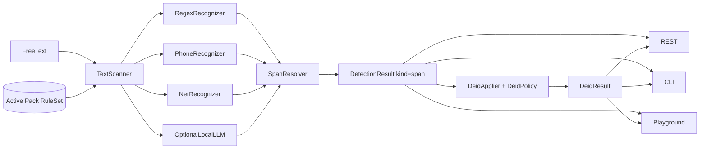

# Free-Text PII Scanner + De-Identification — Implementation Plan

**Status:** Phases 1–8 largely landed (detection, de-id, API/CLI/playground, LLM
refiner, pack-compiled `RuleSet` + LocalePack language alignment). Remaining polish:
richer policy UI params editor, fuller `.rdbpack` policy round-trip, optional auth gate
beyond loopback.
**Design refs:** `docs/TEXT_PII_SCAN_DESIGN.md` (full design, esp. §4 de-id),
`docs/PII_GUARD_AND_RULE_UNIFICATION_PLAN.md` (shared RuleSet / recognizers — see
"Reconciliation" below), `docs/REDIBIS_PACK_DESIGN.md`, `CLAUDE.md` (esp. #6, #11).

## Overview

Add a stateless free-text PII scanner that returns exact spans, **then applies a
de-identification policy** (mask / hash / FPE / fake / redact — general rule + per-entity
overrides). Shared by a REST API, CLI, and an in-app playground. Detection combines catalog
regexes, validated phone detection, GLiNER NER, and optional local-LLM proposals; masking
reuses `redibis.masking`. The existing column and contract pipeline is unchanged.

Two shippable phases:

- **Phase 1 — Detection** (spans, API/CLI/UI). Usable alone.
- **Phase 2 — De-identification** (policy + apply, API/CLI/UI panel). Adds the masking half.

## Reconciliation with the rule-unification plan (read first)

`PII_GUARD_AND_RULE_UNIFICATION_PLAN.md` decides that column scan and text scan must share
one compiled `RuleSet` and one set of `Recognizer` classes. This plan honors that:

- Detection here is built as the **`Recognizer` implementations** named in that plan
  (`RegexRecognizer`, `PhoneRecognizer`, `NerRecognizer`) plus `SpanResolver` — NOT a
  second, independent recognizer stack. `TextScanner` is the text adapter over them.
- Rules (patterns, context tokens, NER labels/phrases, thresholds) are read from the
  active pack's compiled `RuleSet` via `RuleSetCompiler.from_stack` /
  `TextPIIService` (config `packs` or imported active stack). `RuleSetCompiler.default()`
  remains the no-pack fallback (= today's constants).
- Consequence: a pattern or label added to a pack appears in **both** column and text
  scanning with no extra code. A parity test enforces it.

This supersedes the earlier "build a separate span path, do not wrap detect_pii"
instruction: we still don't wrap the column *verdict* path, but we **do** share the
recognizer layer beneath both.

## Architecture



## Span & result models

- `redibis/pii/scan/text_scanner.py` (`TextScanner`) + shared models in
  `redibis/pii/scan/result.py` (`Detection`, `DetectionResult`) per the unification plan.
  Text detections carry offsets; the same `DetectionResult` shape serves de-id.
- Each finding includes inclusive `start`, exclusive `end`, `entity_type`, optional matched
  `text`, `score`, `engine`, `recognizer`/model, `validator`, and **`is_proposal`** (true
  for LLM-only findings — surfaced distinctly in every adapter, never silently merged).
- **Offsets are Unicode code-point indices.** Responses include
  `offset_unit: "unicode_codepoint"`. Enforce `text[start:end]` server-side in Python; the
  browser renderer walks code points, **not** JavaScript UTF-16 positions. This is a
  correctness requirement, not a nicety — Arabic + emoji + combining characters break naive
  UTF-16 offsets. It is a named acceptance test.

## Detection and resolution

- Reuse `redibis/pii/recognizer_factory.py`, `redibis/pii/presidio_nlp.py`, and the
  catalog patterns **via the compiled `RuleSet`**, preserving every Presidio `start`/`end`
  result. `RegexRecognizer` maps `AnalyzerEngine.analyze()` offsets to spans.
- `PhoneRecognizer` validates candidates through the existing phonenumbers/telecom rules in
  `redibis/pii/phone_engine.py`, excluding network identifiers (CGI/LAC/TAC), region driven
  by the request `language` → pack phone regions.
- Add `NERSpan` + an optional `analyze_text()` capability to
  `redibis/pii/ner_backend.py`, implement exact offsets for GLiNER, and extend
  `redibis/pii/backends/http_ner.py`, **without changing column aggregation behavior**.
  Missing models degrade cleanly to deterministic engines. NER labels/phrases come from the
  `RuleSet` (so language selection is pack-driven).
- Optional local-only LLM refinement through `guarded_model_call`: strict-JSON output,
  bounds-checked, every returned span validated against the source slice
  (`text[start:end]`) before acceptance; LLM-only findings marked `is_proposal=true` and
  never bypass deterministic resolution. Never a cloud model on this path by default.
- `SpanResolver` resolves overlaps deterministically (`priority`, `longest`, `all`), with
  validated phone and validated regex above NER above LLM; filters by score and requested
  entity types.

## De-identification (Phase 2)

- `redibis/pii/deid/policy.py`: `DeidPolicy`, `EntityRule`, `resolve_rule` — a **general
  rule** (`entity_type: "*"`) plus **per-entity overrides**; precedence = override (if
  `score ≥ rule.min_score`) → default → `unknown_entity`. Strategies: `redact` (total
  mask), `mask` (keep-N via `start_index`/`end_index`), `hash`, `fpe`, `fake`,
  `passthrough`. Loads from the pack `masking/` section; multiple named policies coexist.
- `redibis/pii/deid/applier.py`: `DeidApplier.apply(result, policy) -> DeidResult`. Applies
  each span right-to-left (offsets stay valid) through the existing `MaskingEngine` with
  per-run `RunKeys` — **no new crypto**. Reuse `suggest_rule`/`auto_suggest_plan` to
  pre-fill a starter policy from a scan.
- **Fail-closed:** no policy ⇒ detection only / 400 on the deid endpoint, never silent
  passthrough; an entity matching no rule ⇒ `unknown_entity` (default `redact`).
- **Keys never leave:** absent from every response, log, and exported policy (invariant 11).
  `DeidResult` reports `reversible_spans` (FPE count) and `run_key_ref` (not the key).
- Same applier serves column and text results, so text de-id == column de-id for the same
  value (a parity test proves it).

## Shared service, REST, and CLI

- `redibis/services/text_pii_service.py` — the single config/factory boundary used by all
  adapters (this is the `ScanBackend`/`MaskBackend` entry point from the guard plan). Export
  the public facade from `redibis/pii/__init__.py`.
- Modular route registrar `redibis/webapp/pii_text_routes.py`, registered by
  `redibis/webapp/backend.py`:
  - `POST /api/pii/text/scan` — text + engine/language/threshold/entity/overlap options.
  - `POST /api/pii/text/deidentify` — scan + apply a policy (by id from the active pack, or
    inline). Fail-closed if no policy. Returns `deidentified_text` + `applied` audit +
    `reversible_spans` + `run_key_ref` (never a key).
  - `GET /api/pii/text/entities` — entity catalogue **and which engine detects each**;
    drives the UI's entity filter and the policy panel's per-entity rows, and reflects
    pack-added entities automatically.
  - `GET /api/pii/text/policies` — named de-id policies from the active pack.
  - `GET /api/pii/text/health` — loaded engines, NER model state, language support.
- Stateless: no contract writes, no raw-body logging (metadata-only: char count, entity
  counts, latency, language), bounded input (default 50k chars), `413` on overflow,
  `return_text:false` for offset-only responses. Defer batch until a concrete caller — but
  keep the request/response shape batch-compatible (log/ticket triage will want it).
- **Auth:** follows existing webapp auth; if the endpoint is ever exposed beyond loopback,
  gate it with the same vendor-token model as the codegen service. State this in the doc so
  nobody exposes a raw PII playground unauthenticated.
- CLI in `redibis/cli/main.py`:
  - `redibis pii text` — inline / `--file` / stdin, JSON or table, engine/language/entity
    filters, safe right-to-left `--redact`.
  - `redibis pii deid` — `--policy <id>` (from pack) / `--policy-file <yaml>` /
    `--default <strategy>` + `--set ENTITY=strategy` (ad-hoc); `-o` output; fail-closed with
    no policy.

## Playground UI

- Additive `pii-playground` view under Results in `redibis/webapp/static/app.js` + styles in
  `app.css`, preserving existing scan/session flows.
- Controls: large textarea, engine controls, language, score threshold, entity filters
  (populated from `/entities`), overlap mode, and a local-LLM toggle shown only when health
  reports it available.
- Render escaped source slices into colored marks from **code-point** offsets; never inject
  server-generated HTML. Count chips + a sortable findings table: matched text, type,
  offsets, score, engine, validator, **proposal state** (LLM findings visibly flagged), copy
  JSON, download, redacted preview.
- **Policy panel (Phase 2):** general-rule dropdown + per-entity strategy table (rows from
  `/entities`, pre-filled by `suggest_rule`), a params popover per strategy, a
  detected⇄de-identified preview toggle, Apply (calls `/deidentify`, shows clean text +
  `applied` audit), and "Save as policy" (writes to the pack `masking/` section). FPE rows
  show a "reversible with key" chip.
- Explicit in-memory/no-storage notice; a second notice when the local-LLM toggle is on.

## Verification and documentation

- Core: `tests/test_text_pii_scan.py` — email, phone, financial/government IDs,
  PERSON/address NER, overlaps, filters, absent models, LLM hardening, and
  **ASCII/Arabic/emoji/combining-character offset** correctness (`text[start:end]` holds).
- De-id: `tests/test_text_pii_deid.py` — each strategy on a span; override beats default;
  `min_score` gate; fail-closed with no policy; keys never in output; right-to-left splice
  keeps offsets valid; **text de-id == column de-id** for the same value (engine parity);
  `auto_suggest_plan` pre-fill.
- Shared-rule parity: `tests/test_ruleset_parity.py` — a pattern/label added to a pack
  appears in **both** column scan and text scan.
- API: `tests/test_pii_text_api.py` — response schema incl. `offset_unit`/`is_proposal`,
  health/entities/policies, max size, no raw logging, offset-only mode, `/deidentify`
  fail-closed + no-key-in-response, graceful optional-engine failure, no persistence.
- CLI: `tests/test_cli_pii_text.py` — inline/file/stdin, JSON/table, filters, exact
  redaction; `pii deid` policy selection + ad-hoc + fail-closed.
- UI safety: XSS escaping, Unicode (code-point) highlighting, overlap display, policy-panel
  preview matches `/deidentify`, "save as policy" round-trips the pack, frozen manual flows.
- Update `docs/TEXT_PII_SCAN_DESIGN.md` status; run focused tests, then full `pytest tests/`
  before commit and push.

## Implementation tasks

**Phase 1 — Detection**
- [x] Span/result models with `offset_unit` + `is_proposal`; `RegexRecognizer` +
  `PhoneRecognizer` over the (default or pack) `RuleSet`; `SpanResolver`; `TextScanner`;
  `text_pii_service` facade.
- [x] `analyze_text()` GLiNER/remote span support (no change to column aggregation);
  guarded local-LLM proposal refinement with source-slice validation.
- [x] Stateless REST (`/scan`, `/entities`, `/health`) + `redibis pii text` CLI.
- [x] Additive highlighted-text playground + findings table (code-point rendering, proposal
  flag).
- [x] Core/API/CLI/UI + offset + shared-rule-parity tests.

**Phase 2 — De-identification**
- [x] `DeidPolicy`/`EntityRule`/`resolve_rule` (pack `masking/` section) + `DeidApplier` over
  `MaskingEngine` with per-run keys; fail-closed.
- [x] `/deidentify` + `/policies` routes; `redibis pii deid` CLI.
- [x] Playground policy panel (named/ad-hoc default strategy + apply + download; full
  per-entity editor / pack save can follow).
- [x] De-id + engine-parity + key-safety tests; docs update; full suite green.
```
