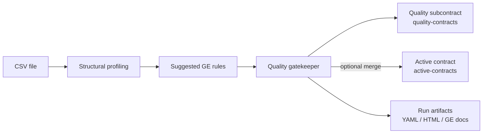
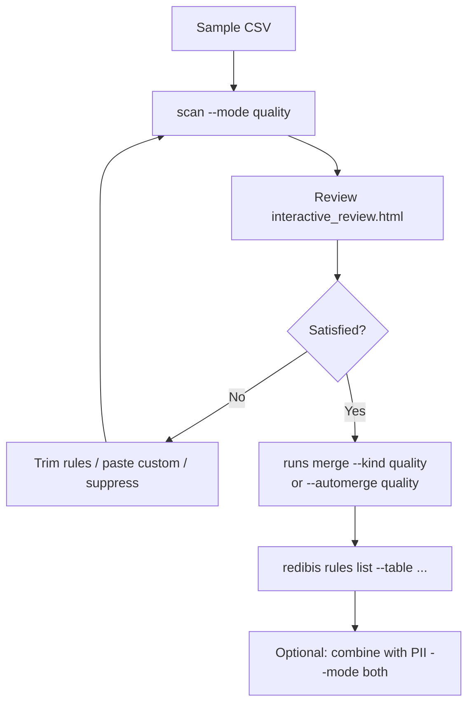

# CLI Quality Scan Tutorial

A hands-on walkthrough for data-quality scanning with `redibis scan`, using the same golden
e-shop fixtures and scenarios covered by `tests/test_quality_scan_integration.py` and related
quality tests.

This tutorial focuses on **local development** (`--use-local`). For S3/MinIO production
setup, bucket names, and the full command reference, see [PIPELINE_GUIDE.md](PIPELINE_GUIDE.md).

Commands below use `--output-dir ./scan_output` as a **fixed tutorial root**. The
CLI/library default is `./reports` — pick one directory and reuse it on every command.

For PII-only scanning, see [CLI_SCAN_TUTORIAL.md](CLI_SCAN_TUTORIAL.md).

---

## What you will learn

- Run a **quality-only** scan (profile + Great Expectations validation)
- Choose a **profiler engine** (Great Expectations vs OpenMetadata metrics)
- Inspect **quality artifacts** (contract YAML, interactive review, GE reports)
- Understand **subcontracts** vs the **active contract**
- Merge a run into the active contract (`--automerge quality` or `redibis runs merge`)
- **Customize rules** — trim profiler suggestions, paste GE code, or use the approved basket
- **Suppress / restore** rules via the quality decision overlay
- Reproduce the integration tests with `pytest`

---

## Prerequisites

### Install

Quality scanning requires Great Expectations:

```bash
pip install -e ".[ge,dev]"        # GE profiling + gatekeeper + pytest
pip install -e ".[spark]"           # optional — Spark TableSampler in tests
```

Verify the CLI:

```bash
redibis --help
redibis scan --help
redibis quality --help
```

### Golden fixtures

The tutorial uses sampled rows from the 1000-record golden CSVs under:

```
agents/pii/data/golden/generated_1000_records/
```

| Dataset | File | Example quality targets |
|---|---|---|
| Merchant registry | `realistic_merchant_seller_registry.csv` | `merchant_email`, `merchant_mobile`, `settlement_iban` |
| Order header | `realistic_eshop_order_header.csv` | `order_id`, `recipient_mobile`, row counts |
| Customer account | `realistic_eshop_customer_account.csv` | account identifiers, nullable columns |

Create a 20-row sample (same as CI):

```bash
mkdir -p /tmp/redibis_quality_tutorial

python -c "
import pandas as pd
from pathlib import Path
src = Path('agents/pii/data/golden/generated_1000_records')
name = 'realistic_merchant_seller_registry'
df = pd.read_csv(src / f'{name}.csv', nrows=20)
df.to_csv(f'/tmp/redibis_quality_tutorial/{name}_sample.csv', index=False)
print('wrote', name)
"
```

---

## Core concepts



| Term | Meaning |
|---|---|
| **Profiling** | Column triage + suggested expectations (GE Assistant or OpenMetadata metrics). |
| **Gatekeeper** | Runs the GE suite against the sample and exports an ODCS quality partial. |
| **Quality subcontract** | Partial contract in `quality-contracts`. Default scan does **not** touch the active contract. |
| **Active contract** | Merged ODCS spec in `active-contracts`. Updated via `--automerge`, `--auto-write`, or `redibis runs merge`. |
| **Decision overlay** | Sidecar under `_meta/quality_decisions/` — suppressed rules stay removed across rescans. |
| **Portable rules** | Native ODCS rules (`missingCount`, `regex`, `validValues`, …) that round-trip to Soda/dbt/GE. |

With `--use-local`, all buckets are stored on disk under:

```
<output-dir>/_dev_storage/
```

---

## Tutorial 1 — Basic quality scan

**Test equivalent:** `test_cli_quality_scan_mode`, `test_quality_scan_service_generates_contract_and_reports`

Run profiling + GE validation on merchant data. This is the standard quality path.

```bash
redibis scan /tmp/redibis_quality_tutorial/realistic_merchant_seller_registry_sample.csv \
  --table golden.merchant_seller_registry \
  --mode quality \
  --no-ge-docs \
  --no-validate \
  --use-local \
  --output-dir ./scan_output
```

Shorthand (fixed `--mode quality`):

```bash
redibis quality /tmp/redibis_quality_tutorial/realistic_merchant_seller_registry_sample.csv \
  --table golden.merchant_seller_registry \
  --no-ge-docs \
  --no-validate \
  --use-local \
  --output-dir ./scan_output
```

### Expected CLI output

```
Scan success for golden.merchant_seller_registry
  session_id=<uuid>
  run_id=<uuid>
  artifacts=.../scan_output/<session_id>/runs/<run_id>/artifacts
  rows=20 cols=11
  quality: <passed>/<expectations> passed (in quality-contracts bucket)

Review & merge with:  redibis runs list golden.merchant_seller_registry --kind pii|quality
```

The `(in quality-contracts bucket)` suffix means the active contract was **not** updated.

---

## Tutorial 2 — Inspect quality artifacts

**Test equivalent:** `_assert_quality_artifacts` in `test_quality_scan_integration.py`

After a scan, locate the session directory:

```bash
SESSION_DIR=$(find ./scan_output -name session.json -printf '%h\n' | head -1)
RUN_ID=$(python -c "import json; print(json.load(open('$SESSION_DIR/session.json'))['latest_run_id'])")
ARTIFACTS="$SESSION_DIR/runs/$RUN_ID/artifacts"

ls -la "$ARTIFACTS"
```

### Quality artifact files

| File | Format | Purpose |
|---|---|---|
| `quality_contract.yaml` | YAML | ODCS quality partial (portable rules per column) |
| `interactive_review.html` | HTML | Review / curate suggested rules before merge |
| `triage_report.html` | HTML | Structural column triage report |
| `quality-report-<run_id>.html` | HTML | GE validation summary (pass/fail per expectation) |
| `ge_report/index.html` | HTML | GE Data Docs (only when GE docs enabled — see Tutorial 5) |

Quick content checks:

```bash
# Contract is ODCS v3 with physical table name
grep -E 'apiVersion|physicalName' "$ARTIFACTS/quality_contract.yaml"

# Redibis quality report title
grep 'Quality Report' "$ARTIFACTS"/quality-report-*.html

# Run manifest records expectation counts
python -c "
import json
m = json.load(open('$SESSION_DIR/runs/$RUN_ID/run_manifest.json'))
print('quality_expectations:', m['counts']['quality_expectations'])
"

# Subcontract exists in local storage
ls ./scan_output/_dev_storage/quality-contracts/golden.merchant_seller_registry/
```

---

## Tutorial 3 — Subcontract without merge (default)

**Test equivalent:** `test_publish_quality_subcontract_to_storage`

By default, `redibis scan --mode quality` writes a **quality subcontract** but leaves the
active contract unchanged. This is the safe review-first workflow.

```bash
redibis scan /tmp/redibis_quality_tutorial/realistic_merchant_seller_registry_sample.csv \
  --table golden.merchant_seller_registry \
  --mode quality \
  --automerge none \
  --no-ge-docs \
  --no-validate \
  --use-local \
  --output-dir ./scan_output
```

Verify:

```bash
# Subcontract in quality-contracts bucket
ls ./scan_output/_dev_storage/quality-contracts/golden.merchant_seller_registry/

# Active contract still empty
redibis show --table golden.merchant_seller_registry --use-local --output-dir ./scan_output
# → "No active contract for golden.merchant_seller_registry"
```

List pending quality runs:

```bash
redibis runs list golden.merchant_seller_registry --kind quality \
  --use-local --output-dir ./scan_output
```

---

## Tutorial 4 — Auto-merge quality into the active contract

**Test equivalent:** `test_merge_quality_contract_to_active_storage`

When you are satisfied with the scan, merge immediately:

```bash
redibis scan /tmp/redibis_quality_tutorial/realistic_merchant_seller_registry_sample.csv \
  --table golden.merchant_seller_registry \
  --mode quality \
  --automerge quality \
  --no-ge-docs \
  --no-validate \
  --use-local \
  --output-dir ./scan_output
```

CLI output should show `→ merged v1` (or higher) for quality.

Confirm rules landed in the active contract:

```bash
redibis rules list golden.merchant_seller_registry \
  --use-local --output-dir ./scan_output

redibis contract quality-view golden.merchant_seller_registry \
  --use-local --output-dir ./scan_output
```

Or merge a previous run manually:

```bash
redibis runs merge golden.merchant_seller_registry --kind quality \
  --use-local --output-dir ./scan_output
```

Export the active rules back to a GE suite dict:

```bash
redibis rules export golden.merchant_seller_registry --target ge \
  --use-local --output-dir ./scan_output
```

**Test equivalent:** `test_regenerate_ge_suite_from_active_contract`

---

## Tutorial 5 — Profiler engine options

**Test equivalents:** `test_ge_profiler_on_golden_merchant`, `test_cli_quality_scan_openmetadata_profiler`

The profiler suggests rules; the **gatekeeper always validates with Great Expectations**.
Choose how rules are discovered:

| `--profiler-engine` | Rule source | Typical use |
|---|---|---|
| `great_expectations` (default) | GE Assistant + structural triage | Full GE-native suggestions |
| `open_metadata` | OpenMetadata-style metrics → portable rules | Metric-driven suggestions; GE still validates |

### Great Expectations profiler (default)

```bash
redibis scan /tmp/redibis_quality_tutorial/realistic_merchant_seller_registry_sample.csv \
  --table golden.merchant_seller_registry \
  --mode quality \
  --profiler-engine great_expectations \
  --no-ge-docs \
  --no-validate \
  --use-local \
  --output-dir ./scan_output
```

### OpenMetadata profiler

```bash
redibis scan /tmp/redibis_quality_tutorial/realistic_merchant_seller_registry_sample.csv \
  --table golden.merchant_seller_registry \
  --mode quality \
  --profiler-engine open_metadata \
  --no-ge-docs \
  --no-validate \
  --use-local \
  --output-dir ./scan_output
```

OpenMetadata profiling also emits a native HTML metrics report inside the profile result
(useful when inspecting via the Python API).

---

## Tutorial 6 — Profile only (no gatekeeper)

Use `--mode profile` when you want structural profiling and triage reports **without**
running the GE gatekeeper or writing quality rules.

```bash
redibis profile /tmp/redibis_quality_tutorial/realistic_merchant_seller_registry_sample.csv \
  --table golden.merchant_seller_registry \
  --no-ge-docs \
  --use-local \
  --output-dir ./scan_output
```

Artifacts include `interactive_review.html` and `triage_report.html` but **not**
`quality_contract.yaml` or GE validation results.

---

## Tutorial 7 — GE Data Docs

**Test equivalent:** `test_quality_scan_generates_ge_data_docs` (marked `@pytest.mark.slow`)

By default, local/CI runs pass `--no-ge-docs` for speed. Enable full GE Data Docs:

```bash
redibis scan /tmp/redibis_quality_tutorial/realistic_merchant_seller_registry_sample.csv \
  --table golden.merchant_seller_registry \
  --mode quality \
  --no-validate \
  --use-local \
  --output-dir ./scan_output
```

Omit `--no-ge-docs` so the gatekeeper copies Data Docs into `artifacts/ge_report/`.

Or set in YAML config:

```yaml
quality:
  generate_ge_docs: true
```

```bash
redibis scan ... --config redibis.yaml --mode quality --use-local --output-dir ./scan_output
```

---

## Tutorial 8 — Customize quality rules

### Option A — Trim profiler suggestions (Python API)

**Test equivalent:** `test_remove_profiler_expectations_and_rerun_gatekeeper`

After profiling, drop unwanted expectations before validation:

```python
from pathlib import Path
import pandas as pd
from redibis.scan.base import Scan
from redibis.scan.quality_phase import run_quality_phase
from redibis.services.scan_service import ScanConfig

df = pd.read_csv("/tmp/redibis_quality_tutorial/realistic_merchant_seller_registry_sample.csv")
config = ScanConfig(table="golden.merchant_seller_registry", run_quality=True, run_profile=True)
scan = Scan(config)
profile = scan.profile(df, tbl_name="merchant_seller_registry")
suggested = scan.suggest_quality_rules()

# Keep only the first two suggested rules
from redibis.quality.rule_set import QualityRuleSet
trimmed = QualityRuleSet(rules=list(suggested.rules[:2]))

run_dir = Path("./quality_custom_run")
run_quality_phase(df, config, profile, db_name="golden", tbl_name="merchant_seller_registry",
                  run_dir=run_dir, rule_set=trimmed)
```

### Option B — Paste custom GE code (safe parse, never exec)

**Test equivalent:** `test_paste_custom_quality_rules_and_validate`

Paste GE-style calls; `parse_ge_rules` uses `ast.parse` only — pasted Python is **never executed**:

```python
from redibis.contracts.rule_code_parser import parse_ge_rules
from redibis.quality.rule_set import QualityRuleSet

code = """
qa.add_gx_expectation(
    expectation_name='expect_column_values_to_not_be_null',
    column='merchant_email')
qa.add_gx_expectation(
    expectation_name='expect_column_values_to_not_be_null',
    column='merchant_mobile')
qa.add_gx_expectation(
    expectation_name='expect_table_row_count_to_be_between',
    min_value=1, max_value=1000)
"""
parsed = parse_ge_rules(code)
assert parsed["errors"] == []

rules = []
for r in parsed["rules"]:
    kwargs = dict(r.get("kwargs") or {})
    col = r.get("column")
    if col and "column" not in kwargs:
        kwargs["column"] = col
    rules.append({"rule": r["expectation_type"], "column": col, "kwargs": kwargs})

custom = QualityRuleSet(rules=rules)
# Pass custom to run_quality_phase(...) as rule_set=custom
```

In the web UI, curated rules flow: **Quality page → parse-rules → approved basket → merge**.

### Option C — Approved basket (cherry-pick rules)

**Test equivalent:** `test_build_approved_partials`, `test_merge_approved`

Add individual rules to the session basket, then merge:

```bash
# After a scan session exists under ./scan_output
SESSION_ID=$(find ./scan_output -name session.json -printf '%h\n' | xargs basename)

redibis approved add-quality --session-id "$SESSION_ID" \
  --column age \
  --payload '{"rule":"rangeCheck","mustBeBetween":[0,120]}'

redibis approved merge --session-id "$SESSION_ID" \
  --use-local --output-dir ./scan_output
```

Re-merging the full basket is **idempotent** — previously merged rules are not dropped.

### Portable regex rules (E.164, IMSI, …)

**Test equivalent:** `test_match_regex_maps_to_portable_regex_rule`

GE `expect_column_values_to_match_regex` maps to portable ODCS:

```yaml
quality:
  - rule: regex
    pattern: '^\+?[1-9]\d{1,14}$'
```

These round-trip back to GE via `redibis rules export ... --target ge`.

---

## Tutorial 9 — Suppress and restore rules

**Test equivalents:** `test_suppress_quality_rule_after_merge`, `test_overlay_wins_over_later_merge`

After merging, suppress a rule so rescans cannot reintroduce it:

```bash
# List rules to find rule_id
redibis rules list golden.merchant_seller_registry \
  --use-local --output-dir ./scan_output

redibis contract quality-suppress golden.merchant_seller_registry \
  --rule-id <rule_id> \
  --column merchant_email \
  --use-local --output-dir ./scan_output
```

Re-scan with `--automerge quality` — the overlay wins; suppressed rules stay out.

Restore later:

```bash
redibis contract quality-restore golden.merchant_seller_registry \
  --rule-id <rule_id> \
  --use-local --output-dir ./scan_output
```

---

## Tutorial 10 — Sampling (Python API)

**Test equivalents:** `test_pandas_sampler_fixed_rows`, `test_quality_scan_with_pandas_sampler`

The CLI scans the **entire CSV file** you pass in. For large tables, use `ScanConfig.sampling_config`
in the Python API (Pandas locally, Spark on cluster):

```python
from redibis.quality.sampling import SamplingConfig, PandasTableSampler
from redibis.services.scan_service import ScanConfig, ScanService

# Fixed row count (reproducible with seed)
cfg = SamplingConfig(strategy="fixed_rows", fixed_row_count=10, seed=1)

# Statistical fraction
# cfg = SamplingConfig(strategy="statistical", sample_fraction=0.5, seed=3)

scan_config = ScanConfig(
    table="golden.merchant_seller_registry",
    run_profile=True,
    run_quality=True,
    sampling_config=cfg,
)
# ScanService(...).scan_dataframe(df, scan_config)
```

| Strategy | Key parameters | Use case |
|---|---|---|
| `fixed_rows` | `fixed_row_count`, `seed` | Exact N rows for fast local/CI runs |
| `statistical` | `sample_fraction`, `seed` | Random fraction of the table |
| `partition_picker` | `partition_col`, `partition_date` | Latest or named Hive partition |
| `column_first` | `column_name_hints` | Target PII-like columns first |

---

## Tutorial 11 — Combined PII + quality scan

**Test equivalent:** `test_cli_scan_both_mode_runs_pii_and_quality` in `tests/test_cli_pii_scan.py`

Requires both `[ner]` and `[ge]`:

```bash
redibis scan /tmp/redibis_quality_tutorial/realistic_merchant_seller_registry_sample.csv \
  --table golden.merchant_seller_registry \
  --mode both \
  --pii-engines regex \
  --no-ge-docs \
  --no-validate \
  --use-local \
  --output-dir ./scan_output
```

Merge selectively:

```bash
redibis runs merge golden.merchant_seller_registry --kind quality --use-local --output-dir ./scan_output
redibis runs merge golden.merchant_seller_registry --kind pii    --use-local --output-dir ./scan_output
```

Or merge both at scan time:

```bash
--automerge both
# or
--auto-write
```

---

## Scan modes reference

| `--mode` | Profiling | GE gatekeeper | Typical use |
|---|---|---|---|
| `profile` | yes | no | Column triage only |
| `quality` | yes | yes | Data quality contract draft |
| `pii` | no* | no | Privacy assessment (see PII tutorial) |
| `both` | yes | yes | Full contract draft (PII + quality) |

\*PII mode runs its own column triage inside the PII detector, not the quality profiler.

Shorthand commands:

```bash
redibis profile data.csv --table db.t --use-local
redibis quality data.csv --table db.t --use-local
```

---

## Automerge options

| Flag | Effect |
|---|---|
| `--automerge none` (default) | Write subcontract only; review first |
| `--automerge quality` | Merge quality partial into active contract |
| `--automerge pii` | Merge PII partial only |
| `--automerge both` | Merge both workflows that ran |
| `--auto-write` | Shorthand for `--automerge both` |
| `--no-merge` | Alias for `--automerge none` |

---

## Useful flags cheat sheet

| Flag | When to use |
|---|---|
| `--use-local` | Development; stores contracts under `<output-dir>/_dev_storage` |
| `--output-dir ./scan_output` | Root for sessions + local storage |
| `--table schema.table` | Lock contract identity (recommended) |
| `--profiler-engine open_metadata` | Metric-based rule suggestions |
| `--no-ge-docs` | Skip GE Data Docs (faster local/CI runs) |
| `--no-validate` | Skip ODCS validation on merge |
| `--config redibis.yaml` | Load defaults (`redibis config dump-default`) |
| `--session-id <uuid>` | Reuse a session for multiple runs on the same table |

---

## Verify with pytest

The integration tests exercise the same paths as the CLI and Python API.

```bash
# Full quality integration suite (~needs great_expectations)
pytest tests/test_quality_scan_integration.py -v

# Fast subset: profilers, customize rules, publish/merge
pytest tests/test_quality_scan_integration.py -v -k "ge_profiler or customize or merge"

# GE Data Docs copy (slow)
pytest tests/test_quality_scan_integration.py -v -m slow

# Quality decision overlay (suppress / restore / manual rules)
pytest tests/test_quality_decisions.py -v

# Portable regex rules + masking defaults
pytest tests/test_masking_dq.py -v -k regex

# Approved basket merge idempotency
pytest tests/test_merge_approved.py -v

# Profiling strategy seam
pytest tests/test_profiling.py -v
```

To scan more rows locally, edit `SAMPLE_ROWS` at the top of
`tests/test_quality_scan_integration.py` (default `20`; golden files have 1000 rows each).

---

## Troubleshooting

| Symptom | Likely cause | Fix |
|---|---|---|
| `could not import 'great_expectations'` | `[ge]` not installed | `pip install -e ".[ge]"` |
| No `quality_contract.yaml` | `--mode profile` or scan failed | Use `--mode quality` or `redibis quality` |
| `No active contract` after scan | Expected — default is subcontract-only | `--automerge quality` or `redibis runs merge` |
| Suppressed rule reappears | Used raw edit instead of overlay | `redibis contract quality-suppress` |
| `ge_report/` missing | `--no-ge-docs` passed | Omit flag or set `quality.generate_ge_docs: true` |
| OpenMetadata profiler empty rules | Very small sample | Increase rows or check column types |
| Spark sampler test skipped | PySpark not installed | `pip install -e ".[spark]"` |

---

## Suggested workflow



1. **Scan** with `--mode quality` and review HTML artifacts.
2. **Curate** rules in `interactive_review.html` or via the approved basket.
3. **Merge** when ready (`runs merge --kind quality` or `--automerge quality`).
4. **Govern** with suppress/restore for rules you never want auto-reintroduced.
5. **Extend** with PII (`--mode both`) or enrichment — see [PIPELINE_GUIDE.md](PIPELINE_GUIDE.md).

---

## Continuous monitoring (after merge)

Discovery (`redibis scan --mode quality`) proposes rules; **monitoring** re-validates the
approved contract without overwriting it:

```bash
redibis quality-monitor run "$TABLE" \
  --sample "$SAMPLE_CSV" \
  --output-dir "$OUT" \
  --use-local \
  --json

redibis quality-monitor batch --all-contracts --output-dir "$OUT" --use-local
redibis quality-monitor export "$TABLE" -o "$OUT/packages" --use-local
redibis quality-monitor airflow generate --tables "$TABLE" -o "$OUT/dags" --use-local
```

See [../cli/monitor.md](../cli/monitor.md) and [QUALITY_WORKFLOW_TUTORIAL.md](QUALITY_WORKFLOW_TUTORIAL.md) Part 4.

---

## Related docs

- [CLI_SCAN_TUTORIAL.md](CLI_SCAN_TUTORIAL.md) — PII scanning walkthrough
- [../cli/monitor.md](../cli/monitor.md) — continuous validate-only monitoring
- [PIPELINE_GUIDE.md](PIPELINE_GUIDE.md) — full CLI reference, Python API, masking, enrichment
- [../REDIBIS_COMPLETE_USER_GUIDE.md](../REDIBIS_COMPLETE_USER_GUIDE.md) — architecture invariants and package boundaries
- `tests/test_quality_scan_integration.py` — authoritative quality integration scenarios
- `tests/test_quality_decisions.py` — quality rule overlay (suppress / restore / manual)
