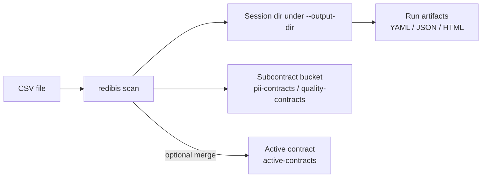
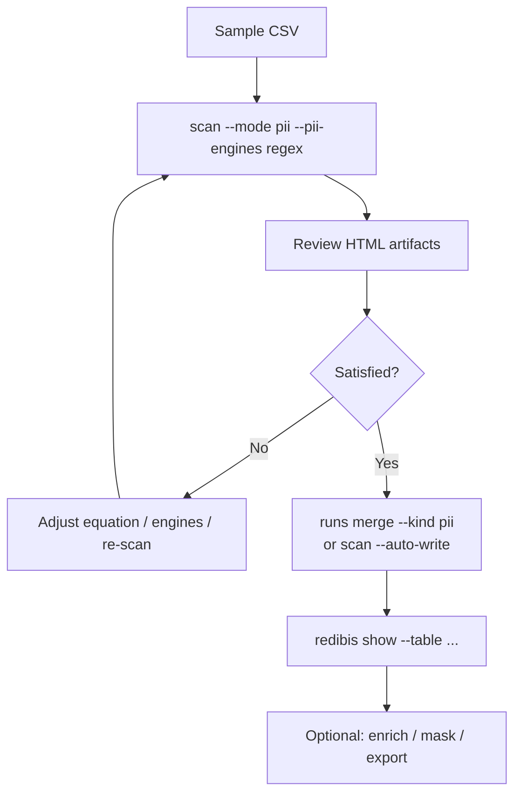

# CLI Data Scanning Tutorial

A hands-on walkthrough for scanning CSV data with `redibis scan`, using the same golden
e-shop fixtures and scenarios covered by `tests/test_cli_pii_scan.py`.

> **Current CLI flags:** local storage is the **default** (do **not** pass `--use-local`).
> Merge with `--automerge pii|quality|both` (there is **no** `--auto-write`).
> Canonical golden CSVs live under [`tests/data/`](../../tests/data/).
>
> This walkthrough uses `--output-dir ./scan_output` as a **fixed tutorial root**.
> The CLI/library default is `./reports` — pick one directory and pass it on every
> command (`scan`, `show`, `runs merge`, …).
>
> For the verified **PII → enrich → OpenMetadata** all-CLI path, see
> [PII_CSV_ENRICH_OPENMETADATA_CLI.md](PII_CSV_ENRICH_OPENMETADATA_CLI.md).

This tutorial focuses on **local development**. For S3/MinIO production
setup, bucket names, and the full command reference, see [PIPELINE_GUIDE.md](PIPELINE_GUIDE.md).

---

## What you will learn

- Run a **PII-only** scan with Presidio regex (fast, ~30s)
- Inspect **run artifacts** (YAML, JSON, HTML reports)
- Understand **subcontracts** vs the **active contract**
- Merge a run into the active contract (`--automerge pii` or `redibis runs merge --kind pii`)
- Run a **full scan** (PII + quality) when Great Expectations is installed
- Reproduce the integration tests with `pytest`

---

## Prerequisites

### Install

```bash
pip install -e ".[ner,dev]"     # Presidio PII detection + pytest
pip install -e ".[ge]"            # optional — for --mode both / quality
pip install -e ".[ner]"           # includes GLiNER for --pii-engines gliner|both
```

Verify the CLI:

```bash
redibis --help
redibis scan --help
```

### Golden fixtures

The tutorial uses sampled rows from the 1000-record golden CSVs under:

```
tests/data/
```

| Dataset | File | Example PII columns |
|---|---|---|
| Merchant registry | `realistic_merchant_seller_registry.csv` | `merchant_email`, `merchant_mobile`, `settlement_iban` |
| Order header | `realistic_eshop_order_header.csv` | `recipient_mobile`, `shipping_address_text` |
| Customer account | `realistic_eshop_customer_account.csv` | (available; not yet in integration tests) |
| Tutorial customers | `golden_tutorial_customers.csv` | `email`, `mobile_number`, `national_id` |

For quick local runs, create a 20-row sample (same as CI).

**Batch scans** use underscore filenames `schema_table_anything.csv`. The **first**
underscore separates schema from table; extra underscores stay in the table name.
The script passes `schema.table` to `--table` (dot between schema and table only):

| File | `--table` value |
|---|---|
| `golden_merchant_seller_registry.csv` | `golden.merchant_seller_registry` |
| `golden_eshop_order_header_sample.csv` | `golden.eshop_order_header_sample` |

```bash
mkdir -p /tmp/redibis_scan_tutorial

python -c "
import pandas as pd
from pathlib import Path
src = Path('tests/data')
batch = [
    ('realistic_merchant_seller_registry.csv', 'golden_merchant_seller_registry_sample.csv'),
    ('realistic_eshop_order_header.csv',       'golden_eshop_order_header_sample.csv'),
]
out = Path('/tmp/redibis_scan_tutorial')
out.mkdir(parents=True, exist_ok=True)
for src_name, dst_name in batch:
    df = pd.read_csv(src / src_name, nrows=20)
    df.to_csv(out / dst_name, index=False)
    print('wrote', dst_name, '-> golden.<table_from_rest>')
"
```

---

## Core concepts



| Term | Meaning |
|---|---|
| **Session** | One scan workspace under `--output-dir` (or `--scan-output-dir`). Contains `session.json` and per-run folders. |
| **Run** | A single scan execution. Identified by `run_id` in `runs/<run_id>/`. |
| **Subcontract** | A partial ODCS contract written to `pii-contracts` or `quality-contracts`. Default scan does **not** touch the active contract. |
| **Active contract** | The merged, authoritative ODCS spec in `active-contracts`. Updated only when you automerge, `--auto-write`, or `redibis runs merge`. |
| **Artifacts** | Human-readable outputs under `runs/<run_id>/artifacts/` (reports, interactive HTML). |

With `--use-local`, all buckets are stored on disk under:

```
<output-dir>/_dev_storage/
```

---

## Tutorial 1 — Fast PII scan (regex only)

**Test equivalent:** `test_cli_pii_only_regex`

Scan merchant data with Presidio regex patterns only. This is the fastest path and needs
only `presidio-analyzer` (included in `[ner]`).

```bash
redibis scan /tmp/redibis_scan_tutorial/realistic_merchant_seller_registry_sample.csv \
  --table golden.merchant_seller_registry \
  --mode pii \
  --pii-engines regex \
  --no-ge-docs \
  --no-validate \
  --use-local \
  --output-dir ./scan_output
```

Repeat for orders:

```bash
redibis scan /tmp/redibis_scan_tutorial/realistic_eshop_order_header_sample.csv \
  --table golden.eshop_order_header \
  --mode pii \
  --pii-engines regex \
  --no-ge-docs \
  --no-validate \
  --use-local \
  --output-dir ./scan_output
```

### Expected CLI output

On success you should see something like:

```
Scan success for golden.merchant_seller_registry
  session_id=<uuid>
  run_id=<uuid>
  artifacts=.../scan_output/<session_id>/runs/<run_id>/artifacts
  rows=20 cols=11
  pii: <detected>/<scanned> detected (in pii-contracts bucket)

Review & merge with:  redibis runs list golden.merchant_seller_registry --kind pii|quality
```

The `(in pii-contracts bucket)` suffix means the active contract was **not** updated.

---

## Tutorial 2 — Inspect artifacts

**Test equivalent:** `test_cli_pii_report_artifacts_content`

After a scan, locate the session directory:

```bash
# One session per output root; find the latest
SESSION_DIR=$(find ./scan_output -name session.json -printf '%h\n' | head -1)
RUN_ID=$(python -c "import json; print(json.load(open('$SESSION_DIR/session.json'))['latest_run_id'])")
ARTIFACTS="$SESSION_DIR/runs/$RUN_ID/artifacts"

ls -la "$ARTIFACTS"
```

### PII artifact files

| File | Format | Purpose |
|---|---|---|
| `pii_contract.yaml` | YAML | ODCS partial contract for detected columns |
| `pii_detections.json` | JSON | Per-column detection evidence + verdicts |
| `pii_detections.html` | HTML | Human-readable detection report |
| `pii_regex_review.html` | HTML | Interactive regex review (approve/deny columns) |
| `pii_report.json` | JSON | Run summary / manifest-friendly report |

Quick content checks (order header example):

```bash
# Contract includes expected columns
grep -E 'recipient_mobile|shipping_address_text' "$ARTIFACTS/pii_contract.yaml"

# JSON detections list is non-empty
python -c "
import json
d = json.load(open('$ARTIFACTS/pii_detections.json'))
detected = [x['column'] for x in d if x.get('detected')]
print('detected:', detected)
"

# HTML report title
grep 'PII Detection Report' "$ARTIFACTS/pii_detections.html"
```

The run manifest maps relative artifact paths:

```bash
cat "$SESSION_DIR/runs/$RUN_ID/run_manifest.json" | python -m json.tool | grep -A5 '"artifacts"'
```

---

## Tutorial 3 — Subcontract without merge (default)

**Test equivalent:** `test_cli_pii_subcontract_without_merge`

By default, `redibis scan` writes a **PII subcontract** but leaves the active contract
unchanged. This is the safe review-first workflow.

```bash
redibis scan /tmp/redibis_scan_tutorial/realistic_merchant_seller_registry_sample.csv \
  --table golden.merchant_seller_registry \
  --mode pii \
  --pii-engines regex \
  --automerge none \
  --no-ge-docs \
  --no-validate \
  --use-local \
  --output-dir ./scan_output
```

Verify:

```bash
# Subcontract exists in the pii-contracts bucket (local path)
ls ./scan_output/_dev_storage/pii-contracts/golden.merchant_seller_registry/

# Active contract is still empty
redibis show --table golden.merchant_seller_registry --use-local --output-dir ./scan_output
# → "No active contract for golden.merchant_seller_registry"
```

List pending runs:

```bash
redibis runs list golden.merchant_seller_registry --kind pii \
  --use-local --output-dir ./scan_output
```

---

## Tutorial 4 — Auto-write: merge into active contract

**Test equivalent:** `test_cli_pii_auto_write_merges_active_contract`

When you are satisfied with the scan, merge immediately with `--auto-write` (equivalent to
`--automerge both` for the workflows that ran):

```bash
redibis scan /tmp/redibis_scan_tutorial/realistic_merchant_seller_registry_sample.csv \
  --table golden.merchant_seller_registry \
  --mode pii \
  --pii-engines regex \
  --auto-write \
  --no-ge-docs \
  --no-validate \
  --use-local \
  --output-dir ./scan_output
```

CLI output should show `→ merged v1` (or higher) for PII.

Confirm the active contract marks PII columns:

```bash
redibis show --table golden.merchant_seller_registry \
  --use-local --output-dir ./scan_output | grep -E 'merchant_email|merchant_mobile' -A3
```

Or merge a previous run manually:

```bash
redibis runs merge golden.merchant_seller_registry --kind pii \
  --use-local --output-dir ./scan_output
```

---

## Tutorial 5 — Full scan: PII + quality

**Test equivalent:** `test_cli_scan_both_mode_runs_pii_and_quality`

Requires Great Expectations (`pip install -e ".[ge]"`).

```bash
redibis scan /tmp/redibis_scan_tutorial/realistic_merchant_seller_registry_sample.csv \
  --table golden.merchant_seller_registry \
  --mode both \
  --pii-engines regex \
  --no-ge-docs \
  --no-validate \
  --use-local \
  --output-dir ./scan_output
```

Additional artifacts when quality runs:

| File | Purpose |
|---|---|
| `quality_contract.yaml` | ODCS quality partial |
| `interactive_review.html` or `triage_report.html` | Quality rule review UI |

Subcontracts land in both buckets:

```bash
ls ./scan_output/_dev_storage/pii-contracts/golden.merchant_seller_registry/
ls ./scan_output/_dev_storage/quality-contracts/golden.merchant_seller_registry/
```

Merge selectively:

```bash
redibis runs merge golden.merchant_seller_registry --kind pii   --use-local --output-dir ./scan_output
redibis runs merge golden.merchant_seller_registry --kind quality --use-local --output-dir ./scan_output
```

---

## Tutorial 6 — PII engine options

| `--pii-engines` | Speed | Requires | Test |
|---|---|---|---|
| `regex` | Fast (~30s on 20 rows) | `presidio-analyzer` | `test_cli_pii_only_regex` |
| `gliner` / `ner` | Slow (minutes) | `gliner` + local model | `test_cli_pii_only_gliner` |
| `both` | Slowest | both | `test_cli_pii_both_engines` |
| `llm` | varies | LLM setup | (not covered by integration tests) |

### NER model setup (BYOM)

NER weights are **not** baked into Docker images. Upload or mount a GLiNER checkpoint:

```bash
# Mount or copy weights, then register
export REDIBIS_MODELS_DIR=/models
redibis models upload ./gliner-ar-v1.zip --name gliner-ar-v1
redibis models activate gliner-ar-v1 --config redibis.yaml
```

Or point a single scan at a directory:

```bash
export REDIBIS_NER_MODEL=/models/gliner-ar-v1
```

### GLiNER / NER only (local model required)

```bash
redibis scan /tmp/redibis_scan_tutorial/realistic_merchant_seller_registry_sample.csv \
  --table golden.merchant_seller_registry \
  --mode pii \
  --pii-engines ner \
  --ner-model /models/gliner-ar-v1 \
  --no-ge-docs \
  --no-validate \
  --use-local \
  --output-dir ./scan_output
```

### Regex + GLiNER (default engine pairing)

```bash
redibis scan /tmp/redibis_scan_tutorial/realistic_merchant_seller_registry_sample.csv \
  --table golden.merchant_seller_registry \
  --mode pii \
  --pii-engines both \
  --no-ge-docs \
  --no-validate \
  --use-local \
  --output-dir ./scan_output
```

### Equation mode

Control how multi-engine evidence becomes a final verdict:

```bash
--equation independent   # default — each engine decides independently
--equation strict        # all engines must agree
--equation balanced      # weighted consensus
--equation lenient       # any strong signal suffices
```

---

## Scan modes reference

| `--mode` | Runs | Typical use |
|---|---|---|
| `pii` | PII detection only | Fast privacy assessment |
| `quality` | Profile + GE validation | Data quality rules |
| `profile` | Structural profiling only | Column triage, no GE suite |
| `both` | PII + quality | Full contract draft (default) |

Shorthand commands (fixed mode):

```bash
redibis profile data.csv --table db.t --use-local
redibis quality data.csv --table db.t --use-local
```

---

## Useful flags cheat sheet

| Flag | When to use |
|---|---|
| `--use-local` | Development; stores contracts under `<output-dir>/_dev_storage` |
| `--output-dir ./scan_output` | Root for sessions + local storage |
| `--scan-output-dir <path>` | Override session root only (storage still uses `--output-dir`) |
| `--table schema.table` | Lock contract identity (recommended; defaults from filename stem) |
| `--no-ge-docs` | Skip GE Data Docs generation (faster CI/local runs) |
| `--no-validate` | Skip ODCS validation on merge |
| `--session-id <uuid>` | Reuse a session for multiple runs on the same table |
| `--config redibis.yaml` | Load defaults from YAML (`redibis config dump-default`) |

---

## Verify with pytest

The integration tests exercise the same code path as the CLI (`redibis.cli.main._run_scan`).

```bash
# Fast subset (~30s): regex scans, subcontract, auto-write, report content
pytest tests/test_cli_pii_scan.py -v -k "regex or subcontract or auto_write or report"

# GLiNER / both engines (slow, minutes)
pytest tests/test_cli_pii_scan.py -v -m slow

# Full PII + quality (needs great_expectations)
pytest tests/test_cli_pii_scan.py -v -k both_mode

# Everything
pytest tests/test_cli_pii_scan.py -v
```

To scan more rows locally, edit `SAMPLE_ROWS` at the top of `tests/test_cli_pii_scan.py`
(default `20`; the golden files have 1000 rows each).

---

## Troubleshooting

| Symptom | Likely cause | Fix |
|---|---|---|
| `No module named 'presidio_analyzer'` | `[ner]` not installed | `pip install -e ".[ner]"` |
| Quality artifacts missing | `--mode pii` or GE not installed | Use `--mode both` and `pip install -e ".[ge]"` |
| GLiNER tests skipped | no local model or `gliner` not installed | `pip install -e ".[ner]"` and set `REDIBIS_NER_MODEL=/path/to/model` |
| `No active contract` after scan | Expected — default is subcontract-only | Use `--auto-write` or `redibis runs merge` |
| Slow first GLiNER run | model load / GPU | Mount weights under `/models`; use `redibis models list` to verify |

---

## Batch processing multiple tables

The repo ships **`scripts/batch_scan.sh`** for scanning every `schema_table_….csv` in a
folder (first `_` → schema; remainder → table name). One subcontract per table,
review-first by default (no active merge).

### Quick start

```bash
# Prepare batch-ready files (see Prerequisites above), then:
./scripts/batch_scan.sh

# Custom directories
./scripts/batch_scan.sh --input /data/csv --output ./scan_output

# Full scan (PII + quality) with fast regex PII
./scripts/batch_scan.sh --mode both --pii-engines regex

# Merge each table into the active contract immediately
./scripts/batch_scan.sh --auto-write
```

### Defaults (tuned for local batch)

| Setting | Default | Why |
|---|---|---|
| `--mode` | `pii` | Fast privacy pass across many files |
| `--pii-engines` | `regex` | Presidio only — GLiNER (`both`) is minutes per file |
| `--automerge` | none | Subcontracts in `pii-contracts`; merge after review |
| `--no-ge-docs` | on | Skips GE Data Docs unless you pass `--ge-docs` |
| `--use-local` | on | Local storage under `<output-dir>/_dev_storage` |

Use `--s3` (and set `--s3-endpoint` / keys via env or extra args) for MinIO in production.

### Merge after a batch

```bash
for table in golden.merchant_seller_registry golden.eshop_order_header; do
  redibis runs list  "$table" --kind pii --use-local --output-dir ./scan_output
  redibis runs merge "$table" --kind pii --use-local --output-dir ./scan_output
done
```

### Review notes on a minimal loop script

A bare `for` loop over `*_*.csv` is valid. The packaged script adds:

- **`set -euo pipefail`** and per-file error counting (batch exits non-zero if any file fails)
- **Configurable mode / engines** — use `regex` for batch, not `both`, unless you accept long runtimes
- **`schema_table_….csv` parsing** — first `_` is schema; avoids dots in filenames; suffixes allowed
- **`redibis` on PATH** check before the loop starts

Your original used `--pii-engines both`, which is correct but slow for many files; the
script default is `regex` (override with `--pii-engines both` or `REDIBIS_BATCH_PII_ENGINES=both`).

---

## Suggested workflow



1. **Scan** with `--pii-engines regex` for a quick pass.
2. **Review** `pii_regex_review.html` and `pii_detections.html`.
3. **Merge** when ready (`runs merge` or `--auto-write`).
4. **Extend** with quality (`--mode both`), enrichment, or masking — see [PIPELINE_GUIDE.md](PIPELINE_GUIDE.md).

---

## Related docs

- [PIPELINE_GUIDE.md](PIPELINE_GUIDE.md) — full CLI reference, Python API, masking, enrichment
- [QUALITY_SCAN_PYTHON_TUTORIAL.md](QUALITY_SCAN_PYTHON_TUTORIAL.md) — quality scan via Python API
- [../REDIBIS_COMPLETE_USER_GUIDE.md](../REDIBIS_COMPLETE_USER_GUIDE.md) — architecture invariants and package boundaries
- `scripts/batch_scan.sh` — batch CLI driver for `schema_table_….csv` folders
- `tests/test_cli_pii_scan.py` — authoritative integration test scenarios
