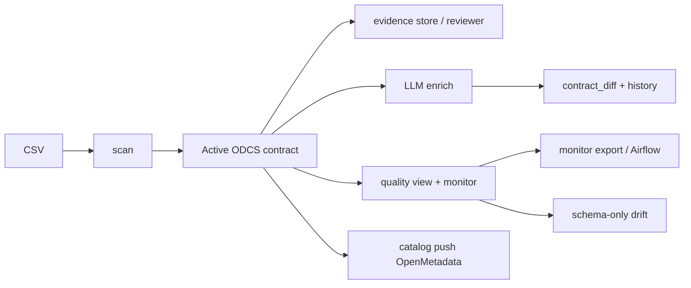

# Redibis intro — dashboard, scan, enrich, quality, catalog

Hands-on operator path from a CSV to an ODCS v3 contract, then LLM enrichment,
evidence review, quality deploy, schema-only drift, and OpenMetadata.

This page is the **start here**. Flag-level cheat sheets live under
[`docs/cli/`](../cli/README.md). Deeper dives are linked at the end of each
section.

**Fixture used throughout:**
[`tests/data/golden_tutorial_customers.csv`](../../tests/data/golden_tutorial_customers.csv)
(20 synthetic rows: name, email, mobile, Egyptian national ID).



---

## 0. Install and pick a store

```bash
cd /path/to/redibis
python3 -m venv .venv
source .venv/bin/activate          # Windows: .venv\Scripts\activate
pip install -e ".[dev,web,ge,ner,enrich,catalog]" -c requirements/constraints.txt
redibis --help
```

Two local stores exist. **They do not share contracts unless you point them at
the same root.**

| Surface | Contracts / runs live here |
|---------|----------------------------|
| **CLI** (this tutorial) | `--output-dir ./reports` → `./reports/_dev_storage/` |
| **Dashboard** (`webapp.sh`) | `LOCAL_STORAGE_ROOT=./_local_storage` (contracts) and `SCAN_OUTPUT_DIR=./scan_output` (sessions) |

Use the **same** `--output-dir` on every CLI command in a workflow (`scan`,
`show`, `enrich`, `monitor`, `catalog`).

```bash
export OUT=./reports
export CSV=tests/data/golden_tutorial_customers.csv
export TABLE=golden.tutorial_customers
mkdir -p "$OUT"
```

---

## 1. Start and stop the dashboard

The FastAPI dashboard is the scan console at **http://localhost:8000/**.

```bash
# Foreground (uvicorn --reload). Ctrl+C stops it.
./scripts/webapp.sh --start --venv

# Detached (no reload). Logs → .run/webapp.log
./scripts/webapp.sh --start --background --venv

./scripts/webapp.sh --status
./scripts/webapp.sh --logs
./scripts/webapp.sh --stop

# Replace a running instance
./scripts/webapp.sh --restart --background --venv

# Wipe users and start again (login: admin / admin)
./scripts/webapp.sh --restart --clean-users --background --venv
```

Equivalent without the helper:

```bash
export USE_LOCAL_STORAGE=true
export LOCAL_STORAGE_ROOT=./_local_storage
export SCAN_OUTPUT_DIR=./scan_output
python -m redibis.webapp.backend
# or: uvicorn redibis.webapp.backend:app --reload --host 0.0.0.0 --port 8000
```

Stop a foreground server with **Ctrl+C**. Do **not** press Ctrl+Z — that
suspends uvicorn and the UI hangs on “Scanning…”. If the port is already in
use: `./scripts/webapp.sh --status` then `--stop` (or `--restart`).

Auth is **on by default**. The browser lands on `/login`. With no `users.json`
yet, sign in as **`admin` / `admin`**, then change it at `/users`. Details:
[`DASHBOARD_AUTH.md`](../DASHBOARD_AUTH.md).

Useful URLs after login:

| URL | What it is |
|-----|------------|
| http://localhost:8000/ | Scan console (upload CSV) |
| http://localhost:8000/v2 | Contracts v2 — enrich, evidence review, share |
| http://localhost:8000/settings | Effective config + LLM providers |
| http://localhost:8000/review?table=golden.tutorial_customers | Evidence reviewer |
| http://localhost:8000/docs | Swagger (also requires a session) |

Ops: [`WEB_ADMIN.md`](../WEB_ADMIN.md) — including the `webapp.sh` launcher flags.

---

## 2. Scan a CSV

A scan **profiles** columns, optionally runs **quality** (Great Expectations)
and **PII** (Presidio regex + GLiNER), writes a **run subcontract**, and —
with `--automerge` — merges into the **active** contract.

### Dashboard

1. Open http://localhost:8000/ and sign in.
2. On the homepage, **upload** `tests/data/golden_tutorial_customers.csv`, or
   paste that full path (it sits under the default `tests/data` sample root)
   and click **use →**.
3. Optional: **Settings** for engines / equation / quality config.
4. Click **scan** (or **PII only** / **Quality only** / **Both**).
5. Open **results** → PII table, quality report, then **contracts**.
6. Approve PII columns / quality rules into the **approved** basket, then merge.
7. **LLM enrich** from the contract banner, or open
   `/v2?table=golden.tutorial_customers&tab=enrich`.

Interactive quality: after a quality scan, open the **Interactive Quality
Report**, drop bad rules, then paste curated GE code on the Quality page
(`POST /api/quality/parse-rules` — parse only, never `exec`).

### CLI (recommended for this tutorial)

```bash
# Fast PII (regex only) → merge into active
redibis scan "$CSV" "$TABLE" \
  --mode pii --automerge pii --equation balanced \
  --pii-engines regex --no-ge-docs \
  --output-dir "$OUT"

# Full contract: profile + quality + PII
redibis scan "$CSV" "$TABLE" \
  --mode all --automerge both --equation balanced \
  --pii-engines both --no-ge-docs \
  --output-dir "$OUT"

redibis list --output-dir "$OUT"
redibis show "$TABLE" --output-dir "$OUT" > "$OUT/${TABLE}.contract.yaml"
```

Without `--automerge` the run only stages a subcontract:

```bash
redibis runs list "$TABLE" --output-dir "$OUT"
redibis runs merge "$TABLE" <run_id> --output-dir "$OUT"
```

| `--mode` | Profile | Quality | PII |
|----------|---------|---------|-----|
| `all` | ✓ | ✓ | ✓ |
| `profile` | ✓ | | |
| `quality` | ✓ | ✓ | |
| `pii` | | | ✓ |

CSV walkthrough: [`CLI_SCAN_TUTORIAL.md`](CLI_SCAN_TUTORIAL.md) · flags:
[`cli/scan.md`](../cli/scan.md).

---

## 3. Enrich with an LLM

Enrichment fills **business names / definitions** (and optionally PII
refinements) on an **already-active** contract. On success it **auto-writes**
the result through `ContractStore.upsert()`.

Probe the provider first (no contract needed):

```bash
redibis llm list
redibis llm test demo                                      # offline templates
redibis llm test ollama --model qwen2.5
redibis llm test sglang --endpoint http://localhost:30000/v1
redibis llm test vllm --endpoint http://127.0.0.1:8080/v1
```

One LLM call (default):

```bash
# Offline smoke — no GPU / API key
redibis enrich "$TABLE" --provider demo --output-dir "$OUT"

# Local OpenAI-compatible (SGLang / vLLM)
redibis enrich "$TABLE" \
  --provider sglang \
  --endpoint http://localhost:30000/v1 \
  --model Qwen/Qwen2.5-7B-Instruct \
  --output-dir "$OUT"

# Custom prompt + glossary (golden tutorial assets)
redibis enrich "$TABLE" \
  --provider demo \
  --prompt tests/data/tutorial_pii_enrich/prompts/system_prompt.md \
  --context tests/data/tutorial_pii_enrich/context/glossary.md \
  --output-dir "$OUT"
```

### Dashboard

Open **Contracts v2** → select the table → **Enrich** tab. Choose **demo**
(offline) or a local/cloud provider, optionally **Review context first**, then
run. The candidate is auto-written; the tab shows the field-level diff.

Architecture: [`LLM_ENRICHMENT.md`](../LLM_ENRICHMENT.md) · providers:
[`LLM_PROVIDERS.md`](../LLM_PROVIDERS.md) · CLI: [`cli/enrich.md`](../cli/enrich.md).

---

## 4. Check all evidence for a change

The detector stores **evidence**; the equation stores **verdicts**. You can
replay a new equation **without reading the CSV again**.

### After a scan

```bash
# Latest bundle (shareable copy has no cell literals)
redibis scan evidence --table "$TABLE" --latest --out - --output-dir "$OUT"
redibis scan evidence --table "$TABLE" --list-runs --output-dir "$OUT"
redibis scan evidence coverage --table "$TABLE" --latest --output-dir "$OUT"

# Persist stripped copy under _meta/evidence/
redibis scan evidence store --table "$TABLE" --latest --output-dir "$OUT"

# Replay PII verdicts at a different floor (zero source reads)
redibis scan decide --table "$TABLE" --latest --preset investigation --output-dir "$OUT"
redibis scan decide --table "$TABLE" --latest --preset audit --out "$OUT/audit_verdicts.json" --output-dir "$OUT"
```

| Preset | Equation | Use |
|--------|----------|-----|
| `investigation` | lenient | recall |
| `reporting` | balanced | default |
| `audit` | strict | precision |

### After an enrich

Each enrich run writes governance artifacts (shareable only — no raw prompts):

```
contract.deterministic.yaml   # input before LLM
contract.llm.yaml             # LLM candidate
contract_diff.json / .md      # per-field override / add / unchanged
enrichment_meta.json
llm_prompt_context.json
```

```bash
redibis history "$TABLE" --output-dir "$OUT"
redibis get llm-call-logs <run_id> --zip "$OUT/evidence.zip" --output-dir "$OUT"
```

Restricted exact LLM prompts (steward-only, audited):

```bash
redibis scan evidence llm --table "$TABLE" --latest --output-dir "$OUT"
redibis scan evidence llm --table "$TABLE" --call-id <id> \
  --raw --actor steward --reason debug --role data_steward --output-dir "$OUT"
```

### Dashboard — run explorer

- Scan **results → PII** → **Open reviewer** (`/review?table=…[&run_id=…]`).
- Contracts v2 → **Evidence Review** tab (same explorer, embedded).
- Contract detail → **history** table + **export package**.

The reviewer is **run-centric**: pick a run from the selector, then walk
Overview / Profiling / Quality / PII / LLM / Artifacts / Decisions. Every
column shows the engine proposal next to the effective verdict; the
**Decisions** tab lets a steward set PII / not-PII, correct the entity type,
see full decision **history**, and paste a verdict package to **preview**,
**replay** (dry run, this run only), or durably **import** it — see
[`EVIDENCE_REVIEW_LEDGER.md`](../EVIDENCE_REVIEW_LEDGER.md) for the full
verdict lifecycle and API/CLI surfaces. Restricted exact evidence (raw LLM
calls) stays behind the audited **View exact evidence** action.

Full model: [`EVIDENCE_STORE.md`](../EVIDENCE_STORE.md) ·
[`EVIDENCE_REVIEW_LEDGER.md`](../EVIDENCE_REVIEW_LEDGER.md).

---

## 5. Deep enrich / multistep enrich

**One-call enrich** is a single LLM request over the whole contract.
**`--multistep`** runs a YAML sequence of prebuilt stages, validates each
delta as ODCS, retries on parse/ODCS errors, then **one** active write.

| Stage | Fills |
|-------|--------|
| `column_definitions` | `businessName` / `business.definition` / tags |
| `classification_pii` | PII classification + entity overrides |
| `table_definition` | Table narrative (`schema[0].description`) |
| `contract_review` | Bounded whole-contract corrections |
| `validate` | ODCS check only (no LLM) |

Default order: columns → privacy → table → review.

```bash
pip install -e ".[enrich,agents]" -c requirements/constraints.txt

redibis enrich "$TABLE" --provider demo --multistep --output-dir "$OUT"

redibis enrich "$TABLE" --provider sglang \
  --endpoint http://localhost:30000/v1 \
  --multistep --steps-file config/examples/enrich-steps-default.yaml \
  --output-dir "$OUT"
```

Skip the extra review LLM call in YAML:

```yaml
enrich:
  multistep:
    review_enabled: false
    review_max_changes: 25
```

**Deep scan** is different: it is extra **profiling producers** on the table,
not LLM stages.

```bash
redibis deep-scan "$CSV" "$TABLE" --output-dir "$OUT"
```

**Batch enrich** (many tables) is `./scripts/batch_enrich.sh`, not
`enrich-batch`. Combine with `--multistep` as in
[`cli/multi-and-batch-enrich.md`](../cli/multi-and-batch-enrich.md).

---

## 6. Compare two enrich results, or two contracts

There are three useful diffs. They answer different questions.

### A. Deterministic vs this LLM run (always produced)

After enrich, open the run’s `contract_diff.md` (also in
`redibis get llm-call-logs`). Fields compared per column:
`classification`, `entity_type`, `tags`, `privacy`, `business.definition`,
`quality`.

Dashboard: **v2 → Enrich** after a run, or
`GET /api/contracts/{table}/enrich/diff` while a candidate still exists.

### B. One-call enrich vs multistep (two LLM results)

Active storage keeps only the **latest** merge, but **every** upsert leaves an
immutable audit snapshot. Run both, then diff the snapshots.

```bash
# Baseline (optional): save YAML before any enrich
redibis show "$TABLE" --output-dir "$OUT" > "$OUT/before_enrich.yaml"

redibis enrich "$TABLE" --provider demo --output-dir "$OUT"
redibis history "$TABLE" --output-dir "$OUT"   # note the enrich run_uuid (A)

redibis enrich "$TABLE" --provider demo --multistep --output-dir "$OUT"
redibis history "$TABLE" --output-dir "$OUT"   # note the later run_uuid (B)
```

Audit files (local store):

```text
$OUT/_dev_storage/active-contracts/audit/golden.tutorial_customers/<uuid>.yaml
```

Dashboard / API:

```bash
# List versions (cookie session — see DASHBOARD_AUTH.md)
curl -sS -b cookies.txt "http://127.0.0.1:8000/api/contracts/${TABLE}/history"
curl -sS -b cookies.txt "http://127.0.0.1:8000/api/contracts/${TABLE}/audit/<uuid-a>" \
  -o "$OUT/contract_a.yaml"
curl -sS -b cookies.txt "http://127.0.0.1:8000/api/contracts/${TABLE}/audit/<uuid-b>" \
  -o "$OUT/contract_b.yaml"
```

Python (same engine as enrich artifacts):

```python
import yaml
from pathlib import Path
from redibis.contracts.contract_diff import diff_contracts, render_diff_md

a = yaml.safe_load(Path("reports/contract_a.yaml").read_text())
b = yaml.safe_load(Path("reports/contract_b.yaml").read_text())
diff = diff_contracts(a, b)
print(diff["summary"])
print(render_diff_md(diff))
```

Or a line-oriented YAML diff: `diff -u contract_a.yaml contract_b.yaml`.

Two **separate output dirs** also work if you want isolated stores instead of
history:

```bash
redibis enrich "$TABLE" --provider demo --output-dir ./reports_one_call
redibis enrich "$TABLE" --provider demo --multistep --output-dir ./reports_multistep
diff -u \
  ./reports_one_call/_dev_storage/active-contracts/active/golden.tutorial_customers.yaml \
  ./reports_multistep/_dev_storage/active-contracts/active/golden.tutorial_customers.yaml
```

### C. Any two contract versions (scan vs enrich vs later scan)

```bash
redibis history "$TABLE" --output-dir "$OUT"
redibis show "$TABLE" --output-dir "$OUT"          # current active
redibis contract pii-view "$TABLE" --output-dir "$OUT"
redibis contract quality-view "$TABLE" --output-dir "$OUT"
redibis contract definitions-view "$TABLE" --output-dir "$OUT"
redibis contract export-package "$TABLE" --output-dir "$OUT"
```

Dashboard **contracts** tab shows the same history. Library:
`BrowseService.diff_contracts(table, uuid_a, uuid_b)`.

---

## 7. Get quality rules and deploy them

Discovery (`redibis scan --mode quality`) **writes** rules into the contract
when you merge. Monitoring **never** writes the contract — it validates the
**effective** rule set (active contract minus suppressions, plus approved
manuals).

```bash
# See rules on the active contract
redibis contract quality-view "$TABLE" --output-dir "$OUT"
redibis rules list "$TABLE" --output-dir "$OUT"
redibis rules export "$TABLE" --target ge --output-dir "$OUT"

# Suppress / restore without a rescan
redibis contract quality-suppress "$TABLE" --rule-id RULE_ID --output-dir "$OUT"
redibis contract quality-restore "$TABLE" --rule-id RULE_ID --output-dir "$OUT"
```

### Dashboard

**results → quality** — interactive report, paste-rules, suppress, then
**export monitoring package** (zip). Contract **Quality** view has the same
suppress/restore controls.

### Deploy: monitoring package

The package is the thing you check into git or drop on a scheduler. It
includes a standalone `{table}_quality.py`, `quality/rule_set.json`, GE paste
fragment, Airflow DAGs, and `CHECKSUMS.json`.

```bash
redibis quality-monitor export "$TABLE" \
  -o ./packages \
  --schedule "0 6 * * *" \
  --output-dir "$OUT"

# Validate-only run against a sample (does not upsert)
redibis quality-monitor run "$TABLE" \
  --sample "$CSV" \
  --no-ge-docs \
  --output-dir "$OUT" \
  --json
```

### Deploy: Airflow

```bash
redibis quality-monitor airflow generate \
  --tables "$TABLE" \
  -o ./dags \
  --schedule "0 6 * * *" \
  --output-dir "$OUT"
```

Copy `./dags/*.py` to `$AIRFLOW_HOME/dags`. Set Airflow Variables
`REDIBIS_CONFIG` and `REDIBIS_SAMPLE_ROOT`.

CLI: [`cli/monitor.md`](../cli/monitor.md) · workflow:
[`QUALITY_WORKFLOW_TUTORIAL.md`](QUALITY_WORKFLOW_TUTORIAL.md).

---

## 8. Example: data drift check for schema only

`redibis quality-monitor` always compares **observed CSV columns** to the contract
column set (`added` / `dropped`). If the effective rule set is empty, that
schema check is the **only** test — no Great Expectations suite runs.

```bash
# 1) Contract with columns, no quality rules (PII scan is enough)
redibis scan "$CSV" "$TABLE" \
  --mode pii --automerge pii --pii-engines regex --no-ge-docs \
  --output-dir "$OUT"

# If you already merged quality rules, park them (overlay — not a YAML edit)
redibis contract quality-suppress-all "$TABLE" --output-dir "$OUT"

# 2) Drifted sample: extra column + dropped column
python - <<'PY'
import pandas as pd
df = pd.read_csv("tests/data/golden_tutorial_customers.csv")
df["loyalty_tier"] = "gold"          # added
df = df.drop(columns=["account_status"])  # dropped
df.to_csv("./reports/customers_schema_drift.csv", index=False)
print("wrote ./reports/customers_schema_drift.csv", list(df.columns))
PY

# 3) Schema-only monitor (no GE docs, no catalog publish)
redibis quality-monitor run "$TABLE" \
  --sample ./reports/customers_schema_drift.csv \
  --no-ge-docs --no-publish \
  --output-dir "$OUT" \
  --json
```

Expect `schema_drift.added: ["loyalty_tier"]` and
`schema_drift.dropped: ["account_status"]`. Exit code `1` when drift is
present. Skip the check with `--no-schema-drift`.

Same check in Python:

```python
import pandas as pd
from redibis.quality.contract_validate import compute_schema_drift
from redibis.store import ContractStore  # use the store you already constructed

store = ...  # same backend as --output-dir
contract = store.get_active("golden.tutorial_customers")
df = pd.read_csv("./reports/customers_schema_drift.csv")
drift = compute_schema_drift(contract, list(df.columns), table="golden.tutorial_customers")
print(drift.added, drift.dropped)
```

This is **column add/drop only**, not distribution drift. Value-level drift
needs quality rules (or a later profiler). See
[`QUALITY_SCAN_ALL_WAYS.md`](../QUALITY_SCAN_ALL_WAYS.md) §6.5.

---

## 9. Push to OpenMetadata

Catalog publish is always `redibis catalog push` (or `push-file` /
`push-batch`). That is **not** `profiling.engine: open_metadata`, which only
computes metrics on a DataFrame.

```bash
pip install -e ".[catalog]" -c requirements/constraints.txt
export REDIBIS_CONFIG=config/examples/catalog-openmetadata.yaml
export OM_BOT_JWT='…'   # real JWT — placeholders are rejected

# Optional local OM
./deployment_scripts/redibis.sh up --build --with-openmetadata
curl -sf http://localhost:8585/api/v1/system/version

redibis catalog backends
redibis catalog push "$TABLE" --dry-run --json --output-dir "$OUT"
redibis catalog push "$TABLE" --output-dir "$OUT"
redibis catalog status "$TABLE" --output-dir "$OUT"
redibis catalog open "$TABLE"
```

One YAML file / a folder of **active** contracts:

```bash
redibis catalog push-file "$OUT/${TABLE}.contract.yaml"
redibis catalog push-batch "$OUT/_dev_storage/active-contracts/active"
# do not batch audit/ — those are historical snapshots of the same table
```

Quality test cases on the OM table come from the contract rules plus the
**latest** `monitor/` run when `catalog.push.quality` is true (default):

```bash
redibis quality-monitor run "$TABLE" --sample "$CSV" --output-dir "$OUT"
redibis catalog push "$TABLE" --output-dir "$OUT"
```

After a successful push, Explore typically shows:

```text
http://localhost:8585/table/redibis.golden.default.tutorial_customers
```

Verified PII → enrich → OM path:
[`PII_CSV_ENRICH_OPENMETADATA_CLI.md`](PII_CSV_ENRICH_OPENMETADATA_CLI.md) ·
flags: [`cli/catalog.md`](../cli/catalog.md).

---

## 10. One sitting — copy-paste path

```bash
export OUT=./reports
export CSV=tests/data/golden_tutorial_customers.csv
export TABLE=golden.tutorial_customers

redibis scan "$CSV" "$TABLE" \
  --mode all --automerge both --pii-engines regex --no-ge-docs \
  --output-dir "$OUT"

redibis scan evidence store --table "$TABLE" --latest --output-dir "$OUT"
redibis llm test demo
redibis enrich "$TABLE" --provider demo --output-dir "$OUT"
redibis enrich "$TABLE" --provider demo --multistep --output-dir "$OUT"
redibis history "$TABLE" --output-dir "$OUT"
# Zip shareable enrich/scan artifacts for a run id from `history` / `runs list`:
# redibis get llm-call-logs <run_id> --zip "$OUT/evidence.zip" --output-dir "$OUT"

redibis contract quality-view "$TABLE" --output-dir "$OUT"
redibis quality-monitor export "$TABLE" -o ./packages --output-dir "$OUT"
redibis quality-monitor run "$TABLE" --sample "$CSV" --no-ge-docs --no-publish --output-dir "$OUT"

# Schema-only drift (optional)
redibis contract quality-suppress-all "$TABLE" --output-dir "$OUT"
# …build drifted CSV as in §8, then:
# redibis quality-monitor run "$TABLE" --sample ./reports/customers_schema_drift.csv \
#   --no-ge-docs --no-publish --output-dir "$OUT" --json

# export OM_BOT_JWT=… REDIBIS_CONFIG=config/examples/catalog-openmetadata.yaml
# redibis catalog push "$TABLE" --dry-run --json --output-dir "$OUT"
```

Dashboard in parallel: `./scripts/webapp.sh --start --venv` → upload the same
CSV. Remember the dashboard store is `_local_storage`, not `./reports`.

---

## Where to go next

| Topic | Doc |
|-------|-----|
| CLI flag sheets | [`docs/cli/README.md`](../cli/README.md) |
| CLI scan → enrich tour | [`CLI_SCAN_ENRICH_TOUR.md`](../CLI_SCAN_ENRICH_TOUR.md) |
| Jupyter / Python pipeline | [`PIPELINE_GUIDE.md`](PIPELINE_GUIDE.md) |
| Golden CSV → OM (verified) | [`PII_CSV_ENRICH_OPENMETADATA_CLI.md`](PII_CSV_ENRICH_OPENMETADATA_CLI.md) |
| Quality all ways | [`QUALITY_SCAN_ALL_WAYS.md`](../QUALITY_SCAN_ALL_WAYS.md) |
| Agentic Ask / Composer | [`docs/agents/howto/00-getting-started.md`](../agents/howto/00-getting-started.md) |
| Steward review A0–A5 / scan verdict memory | [`STEWARD_REVIEW_ARTIFACTS.md`](STEWARD_REVIEW_ARTIFACTS.md) · [`docs/cli/steward.md`](../cli/steward.md) |
| Steward zip export + `--steward-verdict-path` | [`STEWARD_VERDICT_ATTACH.md`](STEWARD_VERDICT_ATTACH.md) |
| Masking / FPE | [`data_masking.md`](../data_masking.md) |
| Free-text PII eval (spans) | [`TEXT_PII_EVAL.md`](../TEXT_PII_EVAL.md) · [tutorial](TEXT_PII_EVAL_TUTORIAL.md) |
