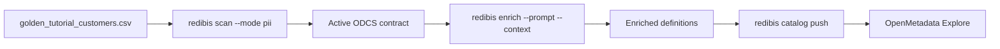

# Tutorial — Golden CSV PII scan → enrich → OpenMetadata (all CLI)

Verified path: scan a **synthetic golden CSV**, enrich with **custom prompt +
context**, classify, and publish **column definitions + PII/classification tags**
to **OpenMetadata** — entirely from the CLI.

| Step | Command | Result |
|------|---------|--------|
| 1 | `redibis scan … --mode pii --automerge pii` | Active ODCS contract with PII verdicts |
| 2 | `redibis enrich … --prompt … --context …` | `businessName` + `business.definition` |
| 3 | `redibis catalog push …` | OM table + tags + glossary + data contract |

**This tutorial was validated against:**

- Golden CSV: [`tests/data/golden_tutorial_customers.csv`](../../tests/data/golden_tutorial_customers.csv)
- Config: [`config/examples/pii-csv-enrich-catalog-tutorial.yaml`](../../config/examples/pii-csv-enrich-catalog-tutorial.yaml)
- Providers: [`config/examples/llm-providers-sglang-qwen.json`](../../config/examples/llm-providers-sglang-qwen.json)
- Automated tests: `tests/test_cli_pii_enrich_catalog_lifecycle.py`
- Live OpenMetadata 1.8.6 push (column definitions, PII tags, policy tags, glossary, status `in_sync`)



---

## What you will see in OpenMetadata

After a successful push, open:

```text
http://localhost:8585/table/redibis.golden.default.tutorial_customers
```

| Column | Expected display name | PII / classification signals |
|--------|-----------------------|------------------------------|
| `email` | Email | `PII.NonSensitive`, `Redibis.EMAIL_ADDRESS`, policy tags |
| `national_id` | National Id | `PII.Sensitive`, `Redibis.EG_NATIONAL_ID`, policy tags |
| `mobile_number` | Mobile Number | `PII.NonSensitive`, `Redibis.PHONE_NUMBER`, `TelcoDataType:MSISDN` |
| `full_name` | Full Name | `PII.NonSensitive`, `Redibis.PERSON` |
| `account_status` | Account Status | Non-PII + lifecycle policy tag |

Column **descriptions** come from enrichment `business.definition` (mapped
automatically when a top-level `description` is absent).

> **Not the same as** `profiling.engine: open_metadata`. That engine only
> computes metrics on a DataFrame. Catalog publishing is always
> `redibis catalog push`.

---

## Prerequisites

```bash
cd /path/to/redibis
pip install -e ".[dev,ner,enrich,catalog]" -c requirements/constraints.txt
```

| Piece | Notes |
|-------|--------|
| Golden CSV | `tests/data/golden_tutorial_customers.csv` (20 synthetic rows) |
| Prompt / context | `tests/data/tutorial_pii_enrich/` |
| OpenMetadata ≥ 1.8 | e.g. `http://localhost:8585` + JWT in `OM_BOT_JWT` |
| LLM for enrich | **Preferred:** local SGLang/Qwen on `:30000`. **Offline fallback:** `--provider demo` |
| Same `--output-dir` | All commands must share one local store |

Optional OM stack:

```bash
./deployment_scripts/redibis.sh up --build --with-openmetadata
curl -sf http://localhost:8585/api/v1/system/version
```

Obtain a JWT (bot token preferred; admin login works for local demos):

```bash
# Example local admin login (password is base64-encoded for OM's login API)
export OM_BOT_JWT="$(
  curl -sf -X POST 'http://localhost:8585/api/v1/users/login' \
    -H 'Content-Type: application/json' \
    -d "{\"email\":\"admin@open-metadata.org\",\"password\":\"$(printf admin | base64 -w0)\"}" \
  | python -c 'import sys,json; print(json.load(sys.stdin)["accessToken"])'
)"
```

---

## 0. Environment

```bash
export REDIBIS_CONFIG=config/examples/pii-csv-enrich-catalog-tutorial.yaml
export REDIBIS_LLM_PROVIDERS=config/examples/llm-providers-sglang-qwen.json
export SGLANG_API_KEY=sk-local          # dummy key for OpenAI-compatible clients
# export OM_BOT_JWT='<paste-real-jwt-here>'   # required for live catalog push

CSV=tests/data/golden_tutorial_customers.csv
TABLE=golden.tutorial_customers
OUT=./tutorial_workspace/reports
CTX=tests/data/tutorial_pii_enrich/context/domain_glossary.md
PROMPT=tests/data/tutorial_pii_enrich/prompts/system_prompt.md
INSTR=tests/data/tutorial_pii_enrich/instructions.md

mkdir -p "$OUT"
```

Local storage is the **default**. Do **not** pass removed flags `--use-local` or
`--auto-write`. Use `--automerge pii` (or `both`) instead.

---

## 1. PII scan the golden CSV

```bash
redibis scan "$CSV" "$TABLE" \
  --config "$REDIBIS_CONFIG" \
  --mode pii \
  --pii-engines regex \
  --automerge pii \
  --no-ge-docs \
  --output-dir "$OUT"
```

Expected: scan succeeds, PII subcontract auto-merges into the active contract.

```bash
redibis show "$TABLE" --output-dir "$OUT" | head
redibis contract pii-view "$TABLE" --output-dir "$OUT"
```

Expected regex verdicts (also frozen in
[`tests/data/packs/pii_golden_tutorial_customers_v1.json`](../../tests/data/packs/pii_golden_tutorial_customers_v1.json)):

| Column | Detected | Entity |
|--------|----------|--------|
| `full_name` | yes | `PERSON` |
| `email` | yes | `EMAIL_ADDRESS` |
| `mobile_number` | yes | `PHONE_NUMBER` |
| `national_id` | yes | `EG_NATIONAL_ID` |
| `account_status` | no | — |
| `created_at` | no | — |

With `classification.enabled: true` in the tutorial config, policy tags are
computed during scan and again on catalog push.

### Review-first alternative (no automerge)

```bash
redibis scan "$CSV" "$TABLE" --mode pii --pii-engines regex --automerge none --output-dir "$OUT"
redibis runs list "$TABLE" --kind pii --output-dir "$OUT"
redibis runs merge "$TABLE" --kind pii --output-dir "$OUT"
```

---

## 2. Custom prompt engineering + context enrich

### Offline (always works)

```bash
redibis enrich "$TABLE" \
  --config "$REDIBIS_CONFIG" \
  --providers-file "$REDIBIS_LLM_PROVIDERS" \
  --provider demo \
  --context "$CTX" \
  --prompt "$PROMPT" \
  --instructions "$INSTR" \
  --output-dir "$OUT"
```

### Local SGLang / Qwen (preferred when available)

```bash
# Probe first
redibis llm test sglang-qwen --providers-file "$REDIBIS_LLM_PROVIDERS"

redibis enrich "$TABLE" \
  --config "$REDIBIS_CONFIG" \
  --providers-file "$REDIBIS_LLM_PROVIDERS" \
  --provider sglang-qwen \
  --endpoint http://localhost:30000/v1 \
  --context "$CTX" \
  --prompt "$PROMPT" \
  --instructions "$INSTR" \
  --output-dir "$OUT"
```

### Prompt-engineering knobs

| Flag | Role |
|------|------|
| `--prompt FILE` | Full system-prompt override (tutorial file under `prompts/`) |
| `--context FILE …` | Steward glossary / domain docs uploaded into enrichment context |
| `--instructions TEXT\|FILE` | Extra steward guidance appended to the system prompt |
| `--dry-run` | Build prompts only — no LLM call, no write |

Inspect definitions:

```bash
redibis contract definitions-view "$TABLE" --output-dir "$OUT" --json | head -c 2000
redibis show "$TABLE" --output-dir "$OUT" | rg -n "businessName|definition" | head
```

Successful enrich **auto-writes** the active contract. No separate merge step is
required (legacy `--automerge` on enrich is only for old candidate files).

---

## 3. Dry-run the OpenMetadata mapping

```bash
redibis catalog push "$TABLE" \
  --config "$REDIBIS_CONFIG" \
  --output-dir "$OUT" \
  --dry-run --json | tee /tmp/catalog_dry.json | head -c 2000
```

Confirm in the preview:

- `entity_fqn` = `redibis.golden.default.tutorial_customers`
- column `description` contains the enrichment definition text
- column tags include `PII.*`, `Redibis.<ENTITY>`, and `RedibisPolicy.*`
- glossary + dataContract steps are present

---

## 4. Live push + verify

```bash
redibis catalog push "$TABLE" --config "$REDIBIS_CONFIG" --output-dir "$OUT"
redibis catalog status "$TABLE" --config "$REDIBIS_CONFIG" --output-dir "$OUT" --json
redibis catalog open "$TABLE" --config "$REDIBIS_CONFIG" --output-dir "$OUT"
```

Expected status snippet:

```json
{
  "table": "golden.tutorial_customers",
  "backend": "openmetadata",
  "in_sync": true,
  "last_push": {
    "entity_fqn": "redibis.golden.default.tutorial_customers",
    "glossary_count": 7
  }
}
```

API check (optional):

```bash
FQN_ENC="$(python - <<'PY'
from urllib.parse import quote
print(quote('redibis.golden.default.tutorial_customers', safe=''))
PY
)"
curl -sf -H "Authorization: Bearer $OM_BOT_JWT" \
  "http://localhost:8585/api/v1/tables/name/${FQN_ENC}?fields=columns,tags" \
  | python -c 'import sys,json; t=json.load(sys.stdin);
for c in t["columns"]:
  print(c["name"], c.get("displayName"), [x["tagFQN"] for x in c.get("tags") or []][:4])'
```

### Data-contract note (OM builds)

- Builds that expose `PUT /v1/dataContracts/odcs` receive the full ODCS document.
- Some 1.8.x builds only expose native `/v1/dataContracts`. Redibis falls back to
  a native linked data contract so push still succeeds; the authoritative ODCS
  YAML remains in the local active-contracts store (`redibis show`).

---

## 5. Cleanup (optional)

```bash
# Delete just this tutorial table from OpenMetadata (dry-run first)
redibis catalog delete golden.tutorial_customers \
  --config "$REDIBIS_CONFIG" --output-dir "$OUT"
redibis catalog delete golden.tutorial_customers \
  --config "$REDIBIS_CONFIG" --output-dir "$OUT" --yes

# Or wipe the whole redibis OM service tree (+ optional glossary/tags)
redibis catalog wipe --config "$REDIBIS_CONFIG" --yes \
  --with-glossary --with-classifications

# Local store + session artifacts for this tutorial workspace
rm -rf ./tutorial_workspace
```

---

## Automated test equivalents

```bash
# Golden CSV PII + enrich(demo)+catalog dry-run lifecycle
pytest tests/test_cli_pii_enrich_catalog_lifecycle.py -v

# Mapping: business.definition → OM description; Redibis.* tag setup
pytest tests/test_catalog_service.py -k "business_definition or redibis_entity or pii_tags" -v

# catalog delete / wipe planning + --yes safety gate
pytest tests/test_catalog_delete_wipe.py -v
```

| Tutorial section | Test |
|------------------|------|
| Golden CSV regex verdicts | `test_tutorial_csv_pii_regex_matches_expected` |
| scan → enrich → catalog dry-run | `test_cli_scan_enrich_catalog_dry_run_lifecycle` |
| Removed CLI flags | `test_cli_help_rejects_removed_scan_flags` |
| `runs merge --kind` | `test_runs_merge_help_requires_kind` |
| Config classification/catalog | `test_tutorial_config_enables_classification_and_catalog` |
| catalog delete / wipe | `tests/test_catalog_delete_wipe.py` |

---

## Troubleshooting

| Symptom | Fix |
|---------|-----|
| `unrecognized arguments: --use-local` / `--auto-write` | Removed. Local is default; use `--automerge pii\|both` |
| `No active contract` on enrich | Run scan with `--automerge pii` or `runs merge --kind pii` first |
| Enrich blocked by RAI | Local/demo providers are fine; cloud needs `--external-masked-ack` + masked samples |
| `OM_BOT_JWT` missing | Export bot/admin JWT before live push; dry-run works without it |
| `'ascii' codec ... '\\u2026'` on catalog push | `OM_BOT_JWT` is a docs placeholder (ellipsis). Set a real JWT — see Prerequisites |
| Catalog tag 404 `Redibis.*` | Fixed in publisher (creates `Redibis` classification + tags before table PUT) |
| Empty OM column descriptions | Ensure enrich wrote `business.definition`; publisher maps it when `description` is absent |
| SGLang connection refused | Use `--provider demo` for offline enrich, or start SGLang on `:30000` |
| Confusing OM profiler vs catalog | Catalog = `redibis catalog …`; profiler engine does not publish |
| `catalog delete/wipe: dry-run only` | Re-run with `--yes` to execute irreversible OM deletes |

---

## Related docs

- [CLI_SCAN_TUTORIAL.md](CLI_SCAN_TUTORIAL.md) — PII scan deep dive
- [SCAN_ENRICH_CATALOG_SGLANG.md](SCAN_ENRICH_CATALOG_SGLANG.md) — full scan + SGLang enrich + catalog
- [CATALOG_OPENMETADATA_TUTORIAL.md](CATALOG_OPENMETADATA_TUTORIAL.md) — catalog push / delete / wipe
- [../cli/catalog.md](../cli/catalog.md) — catalog CLI cheat sheet
- [LLM_ENRICHMENT.md](../LLM_ENRICHMENT.md) — enrich architecture
- [docs/cli/enrich.md](../cli/enrich.md) — enrich cheat sheet
