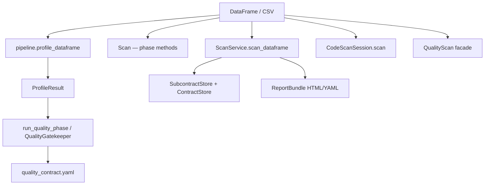
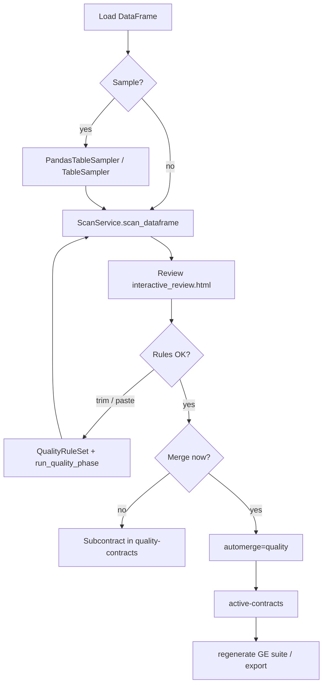

# Python Quality Scan Tutorial

A hands-on guide for running **quality scans** with the `redibis` Python modules, using the
same golden e-shop fixtures and scenarios covered by `tests/test_quality_scan_integration.py`.

For the CLI equivalent see [CLI_SCAN_TUTORIAL.md](CLI_SCAN_TUTORIAL.md). For the full API
reference see [PIPELINE_GUIDE.md](PIPELINE_GUIDE.md).

---

## What you will learn

- Profile data with **Great Expectations** or **OpenMetadata** engines
- Run a full quality scan and generate **contracts + HTML reports**
- **Customize rules** — trim profiler suggestions, paste GE code, suppress rules
- Sample with **pandas** or **Spark** before profiling
- Publish quality **subcontracts** and merge into the **active contract** (MinIO/S3)
- Regenerate a **GE ExpectationSuite** from an accepted ODCS contract

---

## Prerequisites

```bash
pip install -e ".[ge,dev]"        # Great Expectations + pytest
pip install -e ".[spark]"         # optional — Spark TableSampler
```

> **GE version:** use `great_expectations>=0.17,<1.0`. GE 1.x changed the DataContext API
> and breaks `QualityGatekeeper` in this codebase until it is upgraded.

### Golden fixture

```python
from pathlib import Path
import pandas as pd

REPO = Path(".")  # repo root
GOLDEN = REPO / "agents/pii/data/golden/generated_1000_records"
TABLE = "golden.merchant_seller_registry"

df = pd.read_csv(GOLDEN / "realistic_merchant_seller_registry.csv", nrows=20)
```

| Column | Example quality checks |
|---|---|
| `merchant_email` | not-null, regex |
| `merchant_mobile` | not-null, pattern |
| `settlement_iban` | not-null, format |

---

## Python entry points



| Layer | Module | Best for |
|---|---|---|
| **Low-level pipeline** | `redibis.services.pipeline` | Profiling only, custom scripts |
| **Phase orchestrator** | `redibis.scan.base.Scan` | Step-by-step control (profile → quality) |
| **Service** | `redibis.services.scan_service.ScanService` | Full scan + S3/local storage |
| **Session** | `redibis.services.code_scan_session.CodeScanSession` | Same layout as web UI / CLI |
| **Facade** | `redibis.scan.facades.QualityScan` | One-liner quality scan |

---

## Storage setup (local / MinIO stand-in)

```python
from pathlib import Path
from redibis.store.storage_backend import LocalBackend
from redibis.store.contract_store import ContractStore
from redibis.store.subcontract_store import SubcontractStore

storage_root = Path("./dev_storage")
backend = LocalBackend(storage_root)

store = ContractStore(backend, bucket="active-contracts")
sub_store = SubcontractStore(
    backend,
    pii_bucket="pii-contracts",
    quality_bucket="quality-contracts",
)
```

With `LocalBackend`, bucket paths mirror MinIO layout under `dev_storage/`:

```
dev_storage/
  active-contracts/active/golden.merchant_seller_registry.yaml
  quality-contracts/golden.merchant_seller_registry/{run_id}.yaml
  pii-reports/scan/golden_merchant_seller_registry/{run_id}/run_manifest.json
```

For real MinIO, swap `LocalBackend` for `get_backend(S3Config(...))` — see
[PIPELINE_GUIDE.md](PIPELINE_GUIDE.md#61-storage-setup).

---

## Option 1 — Profile only (GE or OpenMetadata)

### Great Expectations profiler

```python
from redibis.config import ProfilingConfig
from redibis.services import pipeline

profile = pipeline.profile_dataframe(
    df,
    dataset_name="merchant_seller_registry",
    profiling=ProfilingConfig(engine="great_expectations"),
)

print(f"Suggested rules: {len(profile.suggested_rules.rules)}")
print(f"Triage signals:  {len(profile.triage_signals)}")
print(f"GE expectations: {len(profile.expectations)}")
```

### OpenMetadata profiler (no GE import for metrics)

```python
from redibis.config import ProfilingConfig
from redibis.profiling import get_profiler

profiler = get_profiler(ProfilingConfig(engine="open_metadata"))
profile = profiler.profile(df, dataset_name="merchant_seller_registry")

print(profile.raw["engine"])          # open_metadata
print(len(profile.suggested_rules.rules))
print(profile.native_report_html[:200])  # OM HTML snippet
```

> OpenMetadata **profiles** metrics; the **gatekeeper** still uses Great Expectations to
> validate expectations when you run the quality phase.

---

## Option 2 — Phase-by-phase with `Scan`

Use when you want to inspect or edit rules between profile and validation.

```python
from pathlib import Path
from redibis.scan.base import Scan
from redibis.services.scan_service import ScanConfig

config = ScanConfig(
    table=TABLE,
    run_pii=False,
    run_profile=True,
    run_quality=False,          # profile only in this step
    profiler_engine="great_expectations",
)

scan = Scan(config)
profile = scan.profile(df, tbl_name="merchant_seller_registry")
suggested = scan.suggest_quality_rules()

for i, rule in enumerate(suggested.rules[:5]):
    print(i, rule["rule"], rule.get("column"), rule.get("kwargs"))
```

### Run quality phase with default (profiler) rules

```python
from redibis.scan.quality_phase import run_quality_phase

run_dir = Path("./run_artifacts")
run_dir.mkdir(exist_ok=True)

quality_contract, qa, results, stats = run_quality_phase(
    df,
    ScanConfig(table=TABLE, run_quality=True, generate_ge_docs=False),
    profile,
    db_name="golden",
    tbl_name="merchant_seller_registry",
    run_dir=run_dir,
)

print(f"Passed {stats['passed']}/{stats['total']}")
print(quality_contract["apiVersion"])
```

---

## Option 3 — Full scan with `ScanService` (recommended)

Writes artifacts, subcontracts, and optional automerge in one call.

```python
from pathlib import Path
from redibis.services.scan_service import ScanConfig, ScanService

run_dir = Path("./run_artifacts")
run_dir.mkdir(exist_ok=True)

config = ScanConfig(
    table=TABLE,
    run_pii=False,
    run_profile=True,
    run_quality=True,
    profiler_engine="great_expectations",
    generate_ge_docs=False,       # True → also copies ge_report/ (slower)
    validate_contracts=False,
    automerge="none",             # "quality" | "both" to merge immediately
    artifacts_dir=run_dir,
    run_id="my_quality_run",
)

service = ScanService(backend, store, runs_bucket="pii-reports", sub_store=sub_store)
result = service.scan_dataframe(df, config)

print(result.status)                    # success
print(result.quality_expectations)      # total GE expectations run
print(result.quality_passed)            # passed count
print(result.artifacts)                 # paths to flushed files
```

### Expected artifacts

| File | Description |
|---|---|
| `quality_contract.yaml` | ODCS quality partial |
| `interactive_review.html` | GE profiler review UI |
| `triage_report.html` | Column triage report |
| `quality-report-{run_id}.html` | redibis validation summary |
| `ge_report/index.html` | GE Data Docs (only when `generate_ge_docs=True`) |

```python
import yaml

contract = yaml.safe_load((run_dir / "quality_contract.yaml").read_text())
assert contract["schema"][0]["physicalName"] == TABLE
```

### Enable GE Data Docs

```python
config = ScanConfig(
    table=TABLE,
    run_pii=False,
    run_quality=True,
    generate_ge_docs=True,    # file-backed GE context + Data Docs copy
    artifacts_dir=run_dir,
)
result = service.scan_dataframe(df, config)
assert (run_dir / "ge_report" / "index.html").exists()
```

---

## Option 4 — `CodeScanSession` (CLI / web-compatible layout)

Same session directory structure as `redibis scan` and the FastAPI dashboard.

```python
from pathlib import Path
from redibis.services.code_scan_session import CodeScanSession

session = CodeScanSession.create(
    df,                                    # or Path("data.csv")
    table=TABLE,
    output_root=Path("./scan_output"),
    backend=backend,
    store=store,
    sub_store=sub_store,
)

result = session.scan(
    mode="quality",
    auto_write=False,
    generate_ge_docs=False,
)

artifacts = session.session_dir / "runs" / result.run_id / "artifacts"
print(artifacts / "quality_contract.yaml")
```

---

## Option 5 — `QualityScan` facade (one-liner)

```python
from redibis.scan.facades import QualityScan
from redibis.services.scan_service import ScanConfig

config = ScanConfig(table=TABLE, run_quality=True, run_pii=False)
result = QualityScan(config).run(df)

print(result.quality_expectations, result.quality_passed)
print(result.artifacts)
```

---

## Customize quality rules

### A — Trim profiler suggestions

```python
from redibis.quality.rule_set import QualityRuleSet
from redibis.scan.quality_phase import run_quality_phase

scan = Scan(ScanConfig(table=TABLE, run_quality=True))
profile = scan.profile(df, tbl_name="merchant_seller_registry")
suggested = scan.suggest_quality_rules()

# Keep only the first two rules
trimmed = QualityRuleSet(rules=list(suggested.rules[:2]))

# Or remove by rule name / column
suggested.remove_where(rule="expect_column_values_to_be_in_set", column="status")

_, qa, results, stats = run_quality_phase(
    df, ScanConfig(table=TABLE), profile,
    db_name="golden", tbl_name="merchant_seller_registry",
    run_dir=Path("./run_artifacts"),
    rule_set=trimmed,
)
print(stats["total"])  # equals len(trimmed.rules)
```

### B — Paste GE code (safe parser, no `exec`)

```python
from redibis.contracts.rule_code_parser import parse_ge_rules
from redibis.quality.rule_set import QualityRuleSet

code = """
qa.add_gx_expectation(
    expectation_name='expect_column_values_to_not_be_null',
    column='merchant_email')
qa.add_gx_expectation(
    expectation_name='expect_column_values_to_not_be_null',
    column='merchant_mobile')
qa.add_gx_expectation(
    expectation_name='expect_table_row_count_to_be_between',
    min_value=1, max_value=1000)
"""
parsed = parse_ge_rules(code)
assert parsed["errors"] == []

custom = QualityRuleSet(rules=[
    {
        "rule": r["expectation_type"],
        "column": r.get("column"),
        "kwargs": r.get("kwargs", {}),
    }
    for r in parsed["rules"]
])

# Feed into run_quality_phase(..., rule_set=custom)
```

Rule shape for `QualityRuleSet`:

```python
{
    "rule":   "expect_column_values_to_not_be_null",
    "column": "merchant_email",
    "kwargs": {"mostly": 0.95},
}
```

### C — Suppress a rule after merge (persistent overlay)

```python
from redibis.contracts.rules import extract_rules

# Scan + automerge first
result = service.scan_dataframe(df, ScanConfig(
    table=TABLE, run_quality=True, automerge="quality", artifacts_dir=run_dir,
))

active = store.get_active(TABLE)
rules = extract_rules(active)
victim = rules[0]

store.suppress_quality_rule(TABLE, victim.rule_id, column=victim.column)

# Re-scan — overlay wins; suppressed rule stays removed
service.scan_dataframe(df, ScanConfig(
    table=TABLE, run_quality=True, automerge="quality",
    artifacts_dir=run_dir / "rescan", run_id="rescan",
))
remaining = {r.rule_id for r in extract_rules(store.get_active(TABLE))}
assert victim.rule_id not in remaining
```

Restore later:

```python
store.restore_quality_rule(TABLE, victim.rule_id)
```

---

## Sampling options

### Pandas (local files, notebooks)

```python
from redibis.quality.sampling import PandasTableSampler, SamplingConfig

# Fixed row count
sampled = PandasTableSampler(
    SamplingConfig(strategy="fixed_rows", fixed_row_count=10, seed=1)
).from_dataframe(df)

# Statistical fraction
sampled = PandasTableSampler(
    SamplingConfig(strategy="statistical", sample_fraction=0.5, seed=3)
).from_dataframe(df)

# Plug into ScanService
config = ScanConfig(
    table=TABLE,
    run_quality=True,
    sampling_config=SamplingConfig(strategy="fixed_rows", fixed_row_count=10),
    artifacts_dir=run_dir,
)
result = service.scan_dataframe(df, config)
print(result.total_rows)  # 10
```

### Spark (cluster / CDP)

```python
from pyspark.sql import SparkSession
from redibis.quality.sampling import TableSampler, SamplingConfig

spark = SparkSession.builder.master("local[1]").appName("quality").getOrCreate()
spark.createDataFrame(df).createOrReplaceTempView("golden_merchant")

sampled_pdf = TableSampler(
    spark,
    SamplingConfig(strategy="fixed_rows", fixed_row_count=8, seed=11),
).sample("golden_merchant")

# Pass sampled_pdf to ScanService or Scan
spark.stop()
```

| Strategy | Pandas | Spark | Use case |
|---|---|---|---|
| `fixed_rows` | yes | yes | CI / quick dev (20 rows) |
| `statistical` | yes | yes | Fraction of large table |
| `partition_picker` | — | yes | Latest `dt` partition |
| `column_first` | yes | yes | Triage string columns by name hints |

---

## Publish quality contract to storage

### Subcontract only (review-first, default)

```python
result = service.scan_dataframe(df, ScanConfig(
    table=TABLE, run_quality=True, automerge="none", artifacts_dir=run_dir,
))

# Subcontract in quality-contracts bucket
assert backend.exists("quality-contracts", f"{TABLE}/{result.run_id}.yaml")

sub = sub_store.get("quality", TABLE, result.run_id)
print(sub.status)   # not merged

# Active contract unchanged
assert store.get_active(TABLE) is None
```

### Automerge into active contract

```python
result = service.scan_dataframe(df, ScanConfig(
    table=TABLE, run_quality=True, automerge="quality", artifacts_dir=run_dir,
))

print(result.quality_contract_version)   # e.g. 1.0.0
active = store.get_active(TABLE)
print(active["contract_uuid"])

sub = sub_store.get("quality", TABLE, result.run_id)
print(sub.status)   # merged
```

Manual merge of a previous run:

```python
from redibis.store.run_merger import RunMerger

merger = RunMerger(store, sub_store)
merger.merge_latest("quality", TABLE, validate=False)
```

---

## Regenerate GE suite from accepted contract

```python
from redibis.contracts.rules import extract_rules, regenerate

active = store.get_active(TABLE)
rules = extract_rules(active)
ge_suite = regenerate(active, "great_expectations")

print(len(ge_suite["expectations"]))
print(ge_suite["expectation_suite_name"])
```

Export to other targets: `regenerate(active, "sodacl")` or `regenerate(active, "dbt")`.

---

## `ScanConfig` quality options reference

| Field | Default | Meaning |
|---|---|---|
| `table` | — | `schema.table` identity (`golden.merchant_seller_registry`) |
| `run_profile` | `True` | Run profiler before quality |
| `run_quality` | `True` | Run GE gatekeeper + build contract |
| `run_pii` | `True` | Set `False` for quality-only |
| `profiler_engine` | `great_expectations` | `open_metadata` for OM metrics |
| `generate_ge_docs` | `True` | Copy GE Data Docs to `ge_report/` |
| `validate_contracts` | `True` | ODCS validation on merge |
| `automerge` | `none` | `quality` / `both` auto-merge after scan |
| `sampling_config` | `None` | `SamplingConfig` for pre-scan sample |
| `artifacts_dir` | `None` | Where to write run artifacts |
| `run_id` | timestamp | Fixed run id for tests / idempotency |

---

## Suggested workflow



1. **Profile** with GE or OM (`profiler_engine`).
2. **Review** `interactive_review.html` and `triage_report.html`.
3. **Customize** rules (trim, paste, or suppress).
4. **Re-run** validation via `ScanService` or `run_quality_phase`.
5. **Publish** subcontract or `automerge="quality"`.
6. **Regenerate** GE / SodaCL / dbt artifacts from the active contract.

---

## Verify with pytest

```bash
# Fast subset (~1 min with GE 0.18.x)
pytest tests/test_quality_scan_integration.py -v -k "not slow" -W ignore

# Profilers + rule customization
pytest tests/test_quality_scan_integration.py -v -k "profiler or customize or paste"

# GE Data Docs (slow)
pytest tests/test_quality_scan_integration.py -v -m slow

# Spark sampler (needs Java 17+)
pytest tests/test_quality_scan_integration.py -v -k spark
```

---

## Troubleshooting

| Symptom | Cause | Fix |
|---|---|---|
| `ImportError: great_expectations` | `[ge]` not installed | `pip install -e ".[ge]"` |
| `EphemeralDataContext has no attribute ...` | GE 1.x installed | `pip install 'great_expectations>=0.17,<1.0'` |
| OM profiler works but scan fails | Gatekeeper needs GE | Install `[ge]` even with `--profiler-engine open_metadata` |
| `No active contract` after scan | Default is subcontract-only | `automerge="quality"` or `RunMerger.merge_latest` |
| Spark sampler skipped | Java too old / missing | Java 17+ and `pip install -e ".[spark]"` |
| Slow first GE run | Profiler assistant | Use `nrows=20` sample; set `generate_ge_docs=False` for CI |

---

## Related docs

- [CLI_SCAN_TUTORIAL.md](CLI_SCAN_TUTORIAL.md) — `redibis scan --mode quality`
- [PIPELINE_GUIDE.md](PIPELINE_GUIDE.md) — full CLI + Python reference
- [../REDIBIS_COMPLETE_USER_GUIDE.md](../REDIBIS_COMPLETE_USER_GUIDE.md) — architecture invariants
- `tests/test_quality_scan_integration.py` — authoritative integration scenarios
