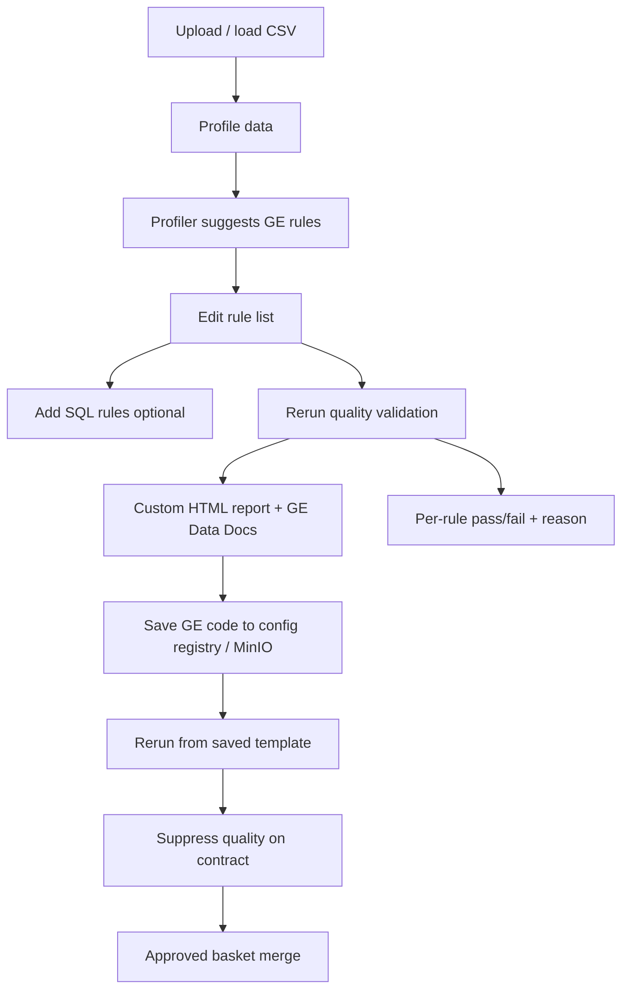

# Quality Workflow Tutorial — Python, CLI & HTTP

End-to-end walkthrough for the **full quality workflow** (profile → suggest rules → edit → SQL → rerun → reports → save rules → rerun saved rules → strip contract quality → approve & merge → per-rule pass/fail).

All examples use CSV fixtures under **`tests/data/`** (repo-relative paths).

For deeper API reference see also:

- [QUALITY_SCAN_PYTHON_TUTORIAL.md](QUALITY_SCAN_PYTHON_TUTORIAL.md) — scan service / facades
- [CLI_QUALITY_SCAN_TUTORIAL.md](CLI_QUALITY_SCAN_TUTORIAL.md) — CLI scan & runs
- [../quality_module_guide.md](../quality_module_guide.md) — module internals

---

## Prerequisites

```bash
cd /path/to/redibis
pip install -e ".[ge,dev]" -c requirements/constraints.txt
pip install duckdb   # optional — SQL quality probes in discovery / evaluate
redibis --help
pytest tests/test_quality_scan_integration.py -q   # sanity check
```

Set paths used throughout this guide:

```bash
export REPO_ROOT="$(pwd)"
export DATA_DIR="$REPO_ROOT/tests/data"
export TABLE="demo.merchant_seller_registry"
export CSV="$DATA_DIR/realistic_merchant_seller_registry.csv"
export SAMPLE_ROWS=20
export OUT_DIR="$REPO_ROOT/scan_output"
export STORAGE="$OUT_DIR/_dev_storage"
mkdir -p "$OUT_DIR"
```

Create a small sample (faster runs; same pattern works on any `tests/data/*.csv`):

```bash
python - <<'PY'
import pandas as pd
from pathlib import Path
import os

repo = Path(os.environ["REPO_ROOT"])
src = repo / "tests/data/realistic_merchant_seller_registry.csv"
out = repo / "scan_output/merchant_sample.csv"
out.parent.mkdir(parents=True, exist_ok=True)
pd.read_csv(src, nrows=int(os.environ.get("SAMPLE_ROWS", 20))).to_csv(out, index=False)
print("wrote", out, "rows=", len(pd.read_csv(out)))
PY

export SAMPLE_CSV="$OUT_DIR/merchant_sample.csv"
```

### Available `tests/data/` fixtures

| File | Good for |
|------|----------|
| `realistic_merchant_seller_registry.csv` | Email/mobile/IBAN null & regex rules |
| `realistic_eshop_customer_account.csv` | Customer identifiers, nullable columns |
| `realistic_eshop_order_header.csv` | Order IDs, row-count rules |
| `realistic_fintech_mobile_wallet_account.csv` | Financial identifiers |
| `realistic_telco_billing_invoice.csv` | Billing amounts, dates |
| `telco_customer_profile.csv` | Telecom profile quality |
| `telco_cdr_event.csv` | High-volume event rows (use `nrows`) |

Swap `CSV` / `SAMPLE_CSV` and `TABLE` for any file above.

---

## Workflow map



| Step | What you do | Python | CLI | HTTP (dashboard) |
|------|-------------|--------|-----|------------------|
| a | Profile data | `Scan.profile` / `pipeline.profile_dataframe` | `redibis profile` | `POST …/step/profile` |
| b | Rule suggestions | `profile.suggested_rules` / interactive review HTML | open `interactive_review.html` | iframe in **quality-review** view |
| c | Edit list | `QualityRuleSet` / trim suggestions | edit YAML + `approved` session | Discovery / session config |
| e | SQL rules | `QualityProbe(rule="sql", sql=…)` | — (use Python or HTTP discovery) | Quality Discovery → SQL |
| f | Rerun + reports | `run_quality_phase` / `Scan.run` | `redibis quality` / `scan --mode quality` | `POST …/step/quality` |
| g | Save GE code | `ObjectConfigStore.save_quality_config(…, ge_code=…)` | write YAML under `configs/quality/` | `POST /api/configs/quality` |
| h | Rerun saved rules | load `QualityRuleSet` then quality step | `scan` with pre-built rules (Python) | `POST …/draft/quality/template` |
| i | Remove all quality | `ContractStore.suppress_all_quality_rules` | loop `contract quality-suppress` | `POST …/quality-decisions/suppress-all` |
| j | Approve → merge | `merge_approved` | `redibis approved merge` | `POST …/approved/merge` |
| k | Pass/fail + why | `run.quality_results[].reason` | inspect `quality_results.json` | Quality dashboard table |
| l | Quality dashboard | N/A (web UI) | N/A | **Results → Quality details** |
| m | Paste GE code | `parse_ge_rules` + evaluate | Python script below | **▶ evaluate** (code persists) |

---

## Part 1 — CLI walkthrough

All commands use local storage (MinIO stand-in). Remove `--use-local` and set S3 env vars for real object storage.

### Step a — Profile only

```bash
redibis profile "$SAMPLE_CSV" \
  --table "$TABLE" \
  --no-validate \
  --use-local \
  --output-dir "$OUT_DIR"
```

Artifacts: `interactive_review.html`, `triage_report.html` under `scan_output/<session_id>/runs/<run_id>/artifacts/`.

### Step b–c — Inspect & edit suggested rules

Open the interactive review in a browser:

```bash
SESSION_DIR=$(find "$OUT_DIR" -name session.json | head -1 | xargs dirname)
REVIEW=$(find "$SESSION_DIR" -name interactive_review.html | head -1)
echo "Open: file://$REVIEW"
```

Curate rules in the HTML UI, copy the remaining GE Python, or build a YAML rule list:

```bash
cat > /tmp/curated_rules.yaml <<'YAML'
name: merchant-curated
rules:
  - rule: expect_column_values_to_not_be_null
    column: merchant_email
    kwargs: {}
  - rule: expect_column_values_to_not_be_null
    column: merchant_mobile
    kwargs: {}
  - rule: expect_table_row_count_to_be_between
    column: null
    kwargs: {min_value: 1, max_value: 1000}
YAML
```

### Step f — Full quality scan (profile + GE validation + reports)

```bash
redibis quality "$SAMPLE_CSV" \
  --table "$TABLE" \
  --no-validate \
  --use-local \
  --output-dir "$OUT_DIR"
```

With GE Data Docs (slower):

```bash
redibis scan "$SAMPLE_CSV" \
  --table "$TABLE" \
  --mode quality \
  --use-local \
  --output-dir "$OUT_DIR"
# omit --no-ge-docs to keep ge_report/
```

Check reports:

```bash
RUN_DIR=$(find "$SESSION_DIR/runs" -mindepth 1 -maxdepth 1 -type d | sort | tail -1)
ls -la "$RUN_DIR/artifacts/"
# quality-report-*.html   — custom redibis report
# ge_report/index.html    — GE Data Docs (if enabled)
# quality_contract.yaml   — ODCS partial
```

### Step k — Per-rule pass/fail (CLI inspection)

```bash
python - <<'PY'
import json, os, glob

out = os.environ["OUT_DIR"]
session = json.load(open(next(iter(glob.glob(f"{out}/*/session.json")))))
for run in reversed(session.get("runs", [])):
    if run.get("run_type") != "scan_quality":
        continue
    print("run", run["run_id"], "passed", run.get("quality_passed"), "/", run.get("quality_total"))
    for r in run.get("quality_results", []):
        status = "PASS" if r.get("success") else "FAIL"
        why = r.get("reason") or ""
        print(f"  [{status}] {r.get('rule')} {r.get('column') or ''} {why}")
    break
PY
```

### Step g — Save rules to config registry (local or MinIO)

Local file store (`configs/quality/`):

```bash
cp /tmp/curated_rules.yaml "$REPO_ROOT/configs/quality/merchant-curated.yaml"
```

Or POST via running dashboard API (when `USE_LOCAL_STORAGE=false`, writes to `quality-configs` bucket). Sign in first: [`DASHBOARD_AUTH.md`](../DASHBOARD_AUTH.md#calling-the-api-curl).

```bash
curl -s -b "$RB_COOKIES" -H "X-CSRF-Token: $CSRF" -X POST http://localhost:8000/api/configs/quality \
  -H 'Content-Type: application/json' \
  -d @- <<'JSON'
{
  "name": "merchant-curated",
  "description": "Curated merchant rules",
  "rules": [
    {"rule": "expect_column_values_to_not_be_null", "column": "merchant_email", "kwargs": {}},
    {"rule": "expect_column_values_to_not_be_null", "column": "merchant_mobile", "kwargs": {}}
  ],
  "ge_code": "qa.add_gx_expectation(expectation_name='expect_column_values_to_not_be_null', column='merchant_email')"
}
JSON
```

### Step j — Approved basket → merge contract

After a scan session exists on disk:

```bash
# List session dirs
ls "$OUT_DIR"

SESSION_ID=$(basename "$(find "$OUT_DIR" -name session.json | head -1 | xargs dirname)")

# Add a curated rule to the approved basket
cat > /tmp/rule.json <<'JSON'
{"expectation_type": "expect_column_values_to_not_be_null", "column": "merchant_email", "kwargs": {}}
JSON

redibis approved add-quality --session "$OUT_DIR/$SESSION_ID" \
  --column merchant_email --from-json /tmp/rule.json

redibis approved list --session "$OUT_DIR/$SESSION_ID"
redibis approved preview --session "$OUT_DIR/$SESSION_ID"

redibis approved merge --session "$OUT_DIR/$SESSION_ID" --use-local
```

### Step i — Remove quality from active contract

List rules:

```bash
redibis contract quality-view "$TABLE" --use-local
redibis rules list "$TABLE" --use-local
```

Suppress one rule:

```bash
redibis contract quality-suppress "$TABLE" --rule-id '<rule_id_from_view>' --use-local
```

Suppress **all** active rules (Python — bulk API):

```bash
python - <<'PY'
import os
from redibis.store.storage_backend import LocalBackend
from redibis.store.contract_store import ContractStore

storage = os.environ["STORAGE"]
table = os.environ["TABLE"]
store = ContractStore(LocalBackend(storage), bucket="active-contracts")
res = store.suppress_all_quality_rules(table, decided_by="tutorial")
print("suppressed all → version", res.version_after)
PY
```

### Step h — Export GE suite from merged contract (Spark / offline GE)

```bash
redibis rules export "$TABLE" --target ge --use-local > /tmp/merchant_expectation_suite.json
# Run this JSON with your Spark GE job / checkpoint
```

### Other `tests/data/` files (one-liner)

```bash
for f in realistic_eshop_customer_account realistic_eshop_order_header telco_customer_profile; do
  redibis quality "$DATA_DIR/${f}.csv" \
    --table "demo.${f}" \
    --no-validate --use-local --output-dir "$OUT_DIR"
done
```

---

## Part 2 — Python programmatic walkthrough

Runnable script: save as `scripts/quality_workflow_demo.py` or paste into a notebook.

```python
#!/usr/bin/env python3
"""Full quality workflow demo using tests/data fixtures."""
from __future__ import annotations

import json
from pathlib import Path

import pandas as pd
import yaml

REPO = Path(__file__).resolve().parent.parent
DATA = REPO / "tests/data/realistic_merchant_seller_registry.csv"
TABLE = "demo.merchant_seller_registry"
SAMPLE_ROWS = 20
OUT = REPO / "scan_output" / "python_workflow"
STORAGE = OUT / "_dev_storage"

# ── storage ─────────────────────────────────────────────────────────────────
from redibis.store.storage_backend import LocalBackend
from redibis.store.contract_store import ContractStore
from redibis.store.subcontract_store import SubcontractStore
from redibis.store.config_store import LocalConfigStore

backend = LocalBackend(STORAGE)
store = ContractStore(backend, bucket="active-contracts")
sub_store = SubcontractStore(backend, pii_bucket="pii-contracts", quality_bucket="quality-contracts")
config_store = LocalConfigStore(REPO / "configs")

df = pd.read_csv(DATA, nrows=SAMPLE_ROWS)
run_dir = OUT / "run_artifacts"
run_dir.mkdir(parents=True, exist_ok=True)

# ── a) Profile ──────────────────────────────────────────────────────────────
from redibis.services import pipeline

profile = pipeline.profile_dataframe(df, "merchant_seller_registry")
print(f"profiled {len(df.columns)} columns, {len(profile.expectations)} profiler expectations")

# ── b) Suggestions ───────────────────────────────────────────────────────────
from redibis.quality.rule_set import QualityRuleSet

suggested = profile.suggested_rules
print("suggested rules:", len(suggested.rules))

# ── c) Edit list — keep email + mobile not-null only ────────────────────────
curated = QualityRuleSet(rules=[
    {"rule": "expect_column_values_to_not_be_null", "column": "merchant_email", "kwargs": {}},
    {"rule": "expect_column_values_to_not_be_null", "column": "merchant_mobile", "kwargs": {}},
])

# ── e) Add SQL rule (DuckDB probe) ──────────────────────────────────────────
from redibis.services.discovery_service import DiscoveryService, QualityProbe

sql = "SELECT * FROM data WHERE merchant_email IS NULL OR merchant_email = ''"
sql_probe = QualityProbe(rule="sql", sql=sql)
sql_result = DiscoveryService().probe_quality(sql_probe, df)
print("SQL probe:", "pass" if sql_result.success else "fail",
      "violations=", sql_result.unexpected_count)

# ── f) Rerun quality + reports ──────────────────────────────────────────────
from redibis.scan.quality_phase import run_quality_phase
from redibis.services.scan_service import ScanConfig

config = ScanConfig(
    table=TABLE,
    run_profile=False,
    run_quality=True,
    generate_ge_docs=False,
    validate_contracts=False,
)
contract, qa, ge_results, stats = run_quality_phase(
    df, config, profile,
    db_name="demo", tbl_name="merchant_seller_registry",
    run_dir=run_dir, rule_set=curated,
)
report_path = qa.export_quality_report(
    ge_results,
    output_filename=str(run_dir / "quality-report-demo.html"),
    report_title=f"Quality — {TABLE}",
)
print("custom report:", report_path)
print("stats:", stats)

# ── k) Per-rule pass/fail + why ─────────────────────────────────────────────
report = qa._extract_report_data(ge_results)
for r in report["results"]:
    mark = "PASS" if r["success"] else "FAIL"
    why = "" if r["success"] else (
        f"{r.get('unexpected_count', 0)} unexpected"
        if r.get("unexpected_count")
        else str(r.get("observed_value", "failed"))
    )
    print(f"  [{mark}] {r['rule']} @ {r.get('column')} — {why}")

# ── g) Save GE code + rules to config registry ──────────────────────────────
ge_code = """
qa.add_gx_expectation(
    expectation_name='expect_column_values_to_not_be_null',
    column='merchant_email')
qa.add_gx_expectation(
    expectation_name='expect_column_values_to_not_be_null',
    column='merchant_mobile')
"""
config_store.save_quality_config(
    "merchant-curated-demo",
    curated.rules,
    description="Tutorial curated rules",
    ge_code=ge_code.strip(),
)
print("saved config: merchant-curated-demo")

# ── h) Rerun from saved config ──────────────────────────────────────────────
loaded = QualityRuleSet(name="merchant-curated-demo", rules=config_store.load_quality_config("merchant-curated-demo"))
_, qa2, ge_results2, stats2 = run_quality_phase(
    df, config, profile,
    db_name="demo", tbl_name="merchant_seller_registry",
    run_dir=run_dir / "rerun", rule_set=loaded,
)
print("rerun stats:", stats2)

# ── Publish subcontract + merge (j) ───────────────────────────────────────
from redibis.services.scan_service import ScanService, ScanConfig as SvcConfig

svc = ScanService(backend, store, runs_bucket="pii-reports", sub_store=sub_store)
svc_config = SvcConfig(
    table=TABLE,
    run_pii=False,
    run_profile=True,
    run_quality=True,
    validate_contracts=False,
    automerge="quality",
    artifacts_dir=run_dir / "service_run",
    run_id="workflow_merge_run",
)
result = svc.scan_dataframe(df, svc_config)
print("scan service:", result.status, result.quality_passed, "/", result.quality_expectations)

# ── j-alt) Approved basket merge ────────────────────────────────────────────
from redibis.services.session.state import ScanSession, ApprovedSet
from redibis.services.session.config import GlobalConfig
from redibis.services.session_service import quality_row_to_fragment, merge_approved

session = ScanSession(
    session_id="tutorial-approved",
    table_name=TABLE,
    data_path=str(OUT / "data.csv"),
    common_config=GlobalConfig(),
)
df.to_csv(OUT / "data.csv", index=False)
frag = quality_row_to_fragment({
    "expectation_type": "expect_column_values_to_not_be_null",
    "column": "merchant_email",
    "kwargs": {},
})
session.approve_property(kind="quality", column="merchant_email", payload=frag, source="manual")
merge_res = merge_approved(session, store, validate=False)
print("approved merge → version", merge_res.get("merged_version"))

# ── i) Strip all quality from contract ───────────────────────────────────────
res = store.suppress_all_quality_rules(TABLE, decided_by="tutorial")
print("suppress all quality → version", res.version_after)

# ── Export GE suite for Spark ─────────────────────────────────────────────────
from redibis.contracts.rules import regenerate

active = store.get_active(TABLE)
if active:
    suite = regenerate(active, target="ge")
    (run_dir / "exported_ge_suite.json").write_text(json.dumps(suite, indent=2, default=str))
    print("exported GE suite:", run_dir / "exported_ge_suite.json")
```

Run it:

```bash
python scripts/quality_workflow_demo.py
```

### Paste-rules (step m) — safe parse, never exec

```python
from redibis.contracts.rule_code_parser import parse_ge_rules
from redibis.quality.rule_set import QualityRuleSet
from redibis.scan.quality_phase import run_quality_phase
from redibis.services.scan_service import ScanConfig

code = open("my_rules.py").read()  # curated from interactive_review.html
parsed = parse_ge_rules(code)
assert not parsed["errors"], parsed["errors"]

rules = QualityRuleSet(rules=[
    {
        "rule": r["expectation_type"],
        "column": r.get("column"),
        "kwargs": r.get("kwargs") or {},
    }
    for r in parsed["rules"]
])
# then pass rule_set=rules into run_quality_phase(...)
```

### Session steps (same as web UI `step/profile` → `step/quality`)

```python
from pathlib import Path
import pandas as pd
from redibis.services.session.state import ScanSession
from redibis.services.session.config import GlobalConfig, _build_scan_config
from redibis.services.session.steps import execute_profile_step, execute_quality_step
from redibis.store.storage_backend import LocalBackend
from redibis.store.contract_store import ContractStore

out = Path("./scan_output/session_steps")
out.mkdir(parents=True, exist_ok=True)
csv_path = out / "data.csv"
pd.read_csv("tests/data/realistic_merchant_seller_registry.csv", nrows=20).to_csv(csv_path, index=False)

backend = LocalBackend(out / "storage")
store = ContractStore(backend, bucket="active-contracts")

session = ScanSession(
    session_id="step-demo",
    table_name="demo.merchant_seller_registry",
    data_path=str(csv_path),
    common_config=GlobalConfig(scan_mode="quality"),
)
session.config = _build_scan_config(session.table_name, session.common_config, out)

execute_profile_step(session, session.config, store)          # a
assert session.status == "profiling_complete"
execute_quality_step(session, backend, store)                 # f
assert session.status == "quality_complete"

run = session.latest_run("scan_quality")
print(run.quality_passed, "/", run.quality_total)
for r in run.quality_results:
    print(r["rule"], r["success"], r.get("reason", ""))
```

### `QualityScan` facade (minimal one-liner)

```python
import pandas as pd
from redibis import QualityScan
from redibis.services.scan_service import ScanConfig

df = pd.read_csv("tests/data/realistic_merchant_seller_registry.csv", nrows=20)
result = QualityScan(ScanConfig(table="demo.merchant", run_quality=True)).run(df)
print(result.quality_passed, result.quality_total)
```

---

## Part 3 — HTTP API (dashboard parity)

Start the app:

```bash
uvicorn redibis.webapp.backend:app --reload --port 8000
```

Auth is on by default. Sign in once and keep `$RB_COOKIES` / `$CSRF` —
[`DASHBOARD_AUTH.md` — Calling the API](../DASHBOARD_AUTH.md#calling-the-api-curl).
Examples below assume that shell state. Writes need the **admin** role.

### Create session & upload `tests/data` CSV

```bash
curl -s -b "$RB_COOKIES" -H "X-CSRF-Token: $CSRF" -X POST http://localhost:8000/api/sessions \
  -F "file=@tests/data/realistic_merchant_seller_registry.csv;filename=merchant.csv" \
  -F "table=demo.merchant_seller_registry" \
  -F "scan_mode=quality" | jq .
```

Save `session_id` as `SID`.

### a — Profile

```bash
curl -s -b "$RB_COOKIES" -H "X-CSRF-Token: $CSRF" -X POST "http://localhost:8000/api/sessions/$SID/step/profile" | jq .
# poll until status profiling_complete:
curl -s -b "$RB_COOKIES" "http://localhost:8000/api/sessions/$SID" | jq .status
```

### b — Interactive review

Open: `http://localhost:8000/api/sessions/$SID/artifacts/interactive_review`

### m — Paste GE code → evaluate (code stays in UI; one button)

```bash
curl -s -b "$RB_COOKIES" -H "X-CSRF-Token: $CSRF" -X POST http://localhost:8000/api/quality/parse-rules \
  -H 'Content-Type: application/json' \
  -d '{"code": "qa.add_gx_expectation(expectation_name='"'"'expect_column_values_to_not_be_null'"'"', column='"'"'merchant_email'"'"')"}' | jq .

curl -s -b "$RB_COOKIES" -H "X-CSRF-Token: $CSRF" -X POST "http://localhost:8000/api/sessions/$SID/quality/evaluate" \
  -H 'Content-Type: application/json' \
  -d '{"code": "qa.add_gx_expectation(expectation_name='"'"'expect_column_values_to_not_be_null'"'"', column='"'"'merchant_email'"'"')"}' | jq .
```

### f — Rerun quality

```bash
curl -s -b "$RB_COOKIES" -H "X-CSRF-Token: $CSRF" -X POST "http://localhost:8000/api/sessions/$SID/step/quality" | jq .
curl -s -b "$RB_COOKIES" "http://localhost:8000/api/sessions/$SID" | jq '.quality_passed, .quality_total, .runs[-1].quality_results'
```

Reports:

- Custom: `/api/sessions/$SID/artifacts/quality_report`
- GE docs: `/api/sessions/$SID/artifacts/ge_report` (when GE docs enabled)

### g — Save to registry / MinIO

```bash
curl -s -b "$RB_COOKIES" -H "X-CSRF-Token: $CSRF" -X POST http://localhost:8000/api/configs/quality \
  -H 'Content-Type: application/json' \
  -d '{
    "name": "merchant-tutorial",
    "rules": [{"rule": "expect_column_values_to_not_be_null", "column": "merchant_email", "kwargs": {}}],
    "ge_code": "qa.add_gx_expectation(expectation_name='"'"'expect_column_values_to_not_be_null'"'"', column='"'"'merchant_email'"'"')"
  }' | jq .
```

### h — Load saved template into session

```bash
curl -s -b "$RB_COOKIES" -H "X-CSRF-Token: $CSRF" -X POST "http://localhost:8000/api/sessions/$SID/draft/quality/template" \
  -H 'Content-Type: application/json' \
  -d '{"template_name": "merchant-tutorial"}' | jq .
curl -s -b "$RB_COOKIES" -H "X-CSRF-Token: $CSRF" -X POST "http://localhost:8000/api/sessions/$SID/step/quality" | jq .
```

### e — SQL discovery probe

```bash
curl -s -b "$RB_COOKIES" -H "X-CSRF-Token: $CSRF" -X POST "http://localhost:8000/api/sessions/$SID/discovery/quality" \
  -H 'Content-Type: application/json' \
  -d '{
    "rules": [
      {"rule": "sql", "sql": "SELECT * FROM data WHERE merchant_email IS NULL"}
    ],
    "subset_rows": 20
  }' | jq .
```

### j — Approve & merge

```bash
curl -s -b "$RB_COOKIES" -H "X-CSRF-Token: $CSRF" -X POST "http://localhost:8000/api/sessions/$SID/approved/quality" \
  -H 'Content-Type: application/json' \
  -d '{"column": "merchant_email", "rule": {"expectation_type": "expect_column_values_to_not_be_null", "kwargs": {}}}' | jq .

curl -s -b "$RB_COOKIES" -H "X-CSRF-Token: $CSRF" -X POST "http://localhost:8000/api/sessions/$SID/approved/merge" \
  -H 'Content-Type: application/json' \
  -d '{"validate_contract": false}' | jq .
```

### i — Suppress all quality on contract

```bash
curl -s -b "$RB_COOKIES" -H "X-CSRF-Token: $CSRF" -X POST "http://localhost:8000/api/contracts/demo.merchant_seller_registry/quality-decisions/suppress-all" \
  -H 'Content-Type: application/json' \
  -d '{"decided_by": "tutorial"}' | jq .
```

---

## Verify with pytest

Integration tests mirror this workflow (update paths if you copy patterns):

```bash
# Uses agents/pii golden dir in tests; same APIs apply to tests/data CSVs
pytest tests/test_quality_scan_integration.py -v

# New web route smoke tests
pytest tests/test_quality_workflow_routes.py -v
```

Quick check against `tests/data`:

```bash
pytest tests/test_quality_scan_integration.py -v -k "merchant" --tb=short
```

---

## Troubleshooting

| Symptom | Fix |
|---------|-----|
| Donut shows `0/0` on Quality page | Refresh session after scan; ensure `quality_total` is set (fixed in recent UI) |
| Pasted GE code disappears | Use **▶ evaluate**; code is stored in `pasteCode` client state |
| `step/profile` 404 | Upgrade to build with `/api/sessions/{id}/step/*` routes |
| SQL probe fails | `pip install duckdb`; SQL table alias is `data` |
| GE Data Docs missing | Omit `--no-ge-docs` / set `generate_ge_docs: true` |
| Active contract unchanged | Default `automerge=none`; use `redibis runs merge` or `approved merge` |

---

## Part 4 — Continuous monitoring (after merge)

Once rules are in the **active contract**, switch to validate-only monitoring (no re-discovery):

```bash
redibis quality-monitor run demo.merchant_seller_registry \
  --sample "$SAMPLE_CSV" \
  --output-dir "$OUT_DIR" \
  --json

redibis quality-monitor batch --tables demo.merchant_seller_registry --json
```

Export a deployment package — a complete executable, Spark-first
`{table}_quality.py` program (rules inline as literals), the canonical rule set,
legacy rules YAML, the rules-only `ge_paste.py` compatibility fragment, JSON
Schemas, and `spark-submit` Airflow DAGs
(see [`cli/monitor.md`](../cli/monitor.md#export-deployment-package)):

```bash
redibis quality-monitor export demo.merchant_seller_registry -o "$OUT_DIR/packages"
```

Web UI: on the interactive review or Data quality page → **Copy Jupyter Code**
(the same program, straight to the clipboard) or **Download monitor package**.

HTTP:

```bash
# the full Jupyter-ready program
curl -s -b "$RB_COOKIES" -H "X-CSRF-Token: $CSRF" -X POST \
  "http://localhost:8000/api/sessions/$SID/quality/full-code" \
  -H 'Content-Type: application/json' -d '{"engine":"spark"}' \
  -o merchant_quality.py

# the deployment package
curl -s -b "$RB_COOKIES" -H "X-CSRF-Token: $CSRF" -X POST \
  "http://localhost:8000/api/sessions/$SID/quality/export-package" \
  -H 'Content-Type: application/json' \
  -d '{"schedule":"0 6 * * *"}' \
  -o merchant-monitoring.zip
```

Extend `merchant_quality.py` in Jupyter — edit the inline `RULES = [...]` block,
call `validate(existing_spark_dataframe)` — then bring it back either as a fresh
package or as proposed contract rules:

```bash
redibis quality-monitor export demo.merchant_seller_registry \
  --python-file ./merchant_quality.py -o "$OUT_DIR/packages"
```

The file is parsed with AST + literals only and never executed; contract writes
still go through evaluate → approve → merge.

OpenMetadata: enable `catalog.push.quality: true`, run monitor, then `redibis catalog push`.

See [../cli/monitor.md](../cli/monitor.md).

---

## Quick reference

```bash
# Profile → quality on any tests/data CSV
redibis quality tests/data/<file>.csv --table demo.<name> --use-local --output-dir ./scan_output

# List runs & merge
redibis runs list demo.<name> --kind quality --use-local
redibis runs merge demo.<name> --kind quality --run-id <id> --use-local

# Contract quality admin
redibis contract quality-view demo.<name> --use-local
redibis rules export demo.<name> --target ge --use-local

# Continuous monitor (validate-only, after rules merged)
redibis quality-monitor run demo.<name> --sample ./scan_output/merchant_sample.csv --use-local --json
redibis quality-monitor export demo.<name> -o ./packages --use-local
```
