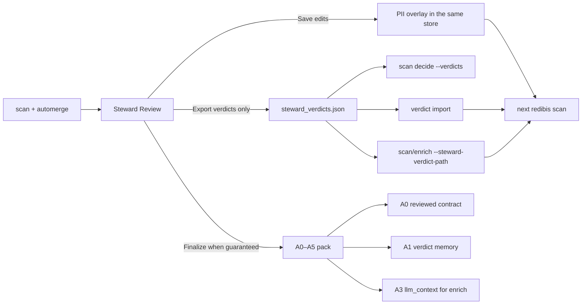

# Steward review artifacts — Finalize A0–A5 and verdict memory for scan

Hands-on operator path: review a contract, **export PII verdicts only** for the
next CLI scan, or **finalize** when every column is done and take the full
A0–A5 pack (guaranteed contract, memory, evidence, LLM context, fine-tune
corpus, graph).

Flag sheet: [`docs/cli/steward.md`](../cli/steward.md).
Related: [`docs/EVIDENCE_REVIEW_LEDGER.md`](../EVIDENCE_REVIEW_LEDGER.md)
(portable `redibis.verdict_package`), [`docs/cli/scan.md`](../cli/scan.md).
Dedicated attach walkthrough (zip + `--steward-verdict-path`):
[`STEWARD_VERDICT_ATTACH.md`](STEWARD_VERDICT_ATTACH.md).

**Fixture used in the worked example:**
[`tests/data/golden_tutorial_customers.csv`](../../tests/data/golden_tutorial_customers.csv).



---

## 0. Two kinds of “memory” — pick one

| Goal | What to do | Finalize required? |
|------|------------|--------------------|
| **Same machine, same `--output-dir`** | Save column edits in Steward Review. The next `redibis scan … --automerge pii` **already remembers** matching PII (fingerprint-gated). | No |
| **File to feed CLI scan / another store** | Export verdicts only (`steward export-verdicts` or the UI button). Use that file on `scan --steward-verdict-path`, `scan decide --verdicts`, or `verdict import`. | No |
| **Organisation pack** (guaranteed contract + audit + LLM pack + corpus + graph) | Finish every column and table item, then **Finalize**. | **Yes** |

Saving an edit writes the PII overlay immediately. Finalize does **not** create
memory; it **packages** the review into A0–A5 under one `review_digest`.

Scan `--verdicts` / `verdict import` replay **PII only**. Definitions, tags, and
classification stay in the contract store (same `--output-dir`) or in the A1
JSON for audit. They are not applied by `--verdicts`.

---

## 1. Use the same store on every command

CLI contracts live under `--output-dir/_dev_storage` (default `./reports`).
The dashboard (`webapp.sh`) uses `LOCAL_STORAGE_ROOT=./_local_storage`.
**They do not share contracts** unless you point them at the same root.

```bash
export OUT=./reports
export CSV=tests/data/golden_tutorial_customers.csv
export TABLE=golden.tutorial_customers
mkdir -p "$OUT" ./artifacts
```

Pass `--output-dir "$OUT"` on `scan`, `steward`, `verdict`, `enrich`, and
`scan decide`.

---

## 2. Review the contract (UI or CLI)

### Dashboard

1. Scan and merge so an **active** contract exists (see [INTRO.md](INTRO.md)).
2. Open **Contracts v2** → table → tab **Steward Review**.
3. **Table** — accept / edit name, description, owner, table quality rules.
4. **Overview** — contested / no-evidence tiles; click to filter the rail.
5. **Column** — profile, PII on/off, engine cards (regex, NER, phone, LLM
   enrich, deep enrich, business rules, prior steward), definitions, reason
   per field. **Save edits** writes overlays. **Export verdicts (memory)**
   downloads A1 without finalize. **Export all artifacts (zip)** (also on the
   Contract tab) is current A1 plus finalized A0–A5 when present. **Finalize**
   stays disabled until the guarantee holds (no pending / needs-review /
   rejected columns or table items).

Keyboard on a column: `←` `→` columns, `a` accept, `r` reject, `n` needs
review, `x` no action, `e` edit, `Enter` confirm accept.

Nothing on this page starts a scan.

### CLI (same writes)

```bash
redibis steward overview "$TABLE" --output-dir "$OUT"
redibis steward column "$TABLE" email --output-dir "$OUT"
# Consented samples (role-gated; default role is explorer → no values)
redibis steward column "$TABLE" email --samples --as-role admin --output-dir "$OUT"

redibis steward verdict "$TABLE" email \
  --field pii --decision edit --source human \
  --rationale false_positive_identifier_not_personal \
  --rationale-text "internal routing, not personal" \
  --value '{"is_pii": false}' \
  --actor ada --output-dir "$OUT"

redibis steward verdict "$TABLE" national_id \
  --field pii --decision accept --source regex \
  --rationale engine_correct \
  --actor ada --output-dir "$OUT"
```

`--rationale other` requires `--rationale-text`. Decisions:
`accept` | `reject` | `needs_review` | `no_action` | `edit`.
`no_action` counts as reviewed; `needs_review` **blocks** Finalize.

---

## 3. Export verdicts only (no Finalize) — CLI scan memory

Use this when you want a **file**. You do not need every column reviewed.

### CLI

```bash
# A1 (full steward_verdicts.json). scan decide / verdict import accept this kind.
redibis steward export-verdicts "$TABLE" \
  -o ./artifacts/steward_verdicts.json \
  --actor ada \
  --output-dir "$OUT"

# Optional second file: PII-only redibis.verdict_package (same payload scan uses)
redibis steward export-verdicts "$TABLE" \
  -o ./artifacts/steward_verdicts.json \
  --scan-package ./artifacts/scan_verdicts.json \
  --output-dir "$OUT"
```

Equivalent overlay dump (PII decisions already in the store, not A1):

```bash
redibis verdict export --table "$TABLE" --out ./artifacts/from_overlay.json --output-dir "$OUT"
```

### UI

Steward Review rail → **Export verdicts (memory)**. Saves
`steward_verdicts_<table>.json` (A1). That file is valid on
`scan decide --verdicts` and `verdict import`.

### REST

```bash
curl -o ./artifacts/steward_verdicts.json \
  "http://localhost:8000/api/contracts/${TABLE}/steward/export/verdicts"
```

A1 is **portable**: no samples, no unscrubbed cell values. Kind is
`redibis.steward_verdicts`. Redibis projects PII rows onto
`redibis.verdict_package` when you pass the file to scan/import.

---

## 4. Feed that file into scan commands

### A. Same store — just scan again

Fingerprints still match → steward PII wins over the engines.

```bash
redibis scan "$CSV" "$TABLE" \
  --mode pii --automerge pii --pii-engines regex \
  --output-dir "$OUT"
```

If the column’s format/type changed, the decision goes **stale** and the
engine proposal is used until a steward confirms again.

### B. Replay a run without writing the overlay — `scan decide --verdicts`

Zero source-table reads. Matching entries appear as
`effective_verdict.source = supplied`. Stale fingerprints are ignored
(warning), not applied.

```bash
redibis scan decide --table "$TABLE" --latest --preset reporting \
  --verdicts ./artifacts/steward_verdicts.json \
  --out ./artifacts/replayed.json \
  --output-dir "$OUT"
```

`--verdicts` also accepts `./artifacts/scan_verdicts.json` or
`redibis verdict export` JSON/JSONL.

### C. Other directory / other host — import, then scan

Import **classifies** against a run’s evidence (needs a completed scan in
that `--output-dir`). Matching fingerprints are written into the PII overlay.
Stale / missing / invalid rows are never promoted.

```bash
# Target store must already have a scan + evidence bundle for $TABLE
redibis verdict preview "$TABLE" \
  --package ./artifacts/steward_verdicts.json \
  --output-dir "$OUT"

redibis verdict import "$TABLE" \
  --package ./artifacts/steward_verdicts.json \
  --actor ada --reason "steward review from staging" \
  --merge-policy matching_only \
  --output-dir "$OUT"

redibis scan "$CSV" "$TABLE" --mode pii --automerge pii --output-dir "$OUT"
```

`--merge-policy overwrite_conflicts` also promotes rows that disagree with an
**active** local steward decision. Stale/missing/invalid still never apply.

Same-store shortcut (maps A1 PII rows through the evidence-review importer):

```bash
redibis steward import-verdicts "$TABLE" ./artifacts/steward_verdicts.json \
  --actor ada --reason "re-apply A1" --output-dir "$OUT"
```

Prefer `verdict import` when you need fingerprint checks against a real run.

---

## 5. Finalize — full A0–A5 pack

Finalize is the **guarantee** step. It writes nothing until every required
item is reviewed.

### What blocks it

| Blocker | Meaning |
|---------|---------|
| `pending` | Column never given a verdict |
| `needs_review` | Deferred to another steward |
| `rejected` | Explicit reject |
| table items | `name`, `description`, `owner`, and each table-level quality rule |

`no_action` and `accept` / `edit` count as reviewed.

CLI exits **1** when blocked; HTTP `200` with `ok: false` and header
`X-Redibis-Guarantee: blocked`.

```bash
redibis steward overview "$TABLE" --output-dir "$OUT" | python -c \
  "import json,sys; g=json.load(sys.stdin)['guarantee']; print(g)"
```

Mark remaining table items if that is the only blocker: open Steward Review
**Table** and **Accept** or **No action** on name, description, and owner.
There is no `steward verdict` subcommand for table items; use the UI or
`POST /api/contracts/{table}/steward/table/verdict`.

```bash
redibis steward finalize "$TABLE" --actor ada --out-dir ./artifacts/a0a5 --output-dir "$OUT"
```

`--out-dir` copies `contract.reviewed.json`, `steward_verdicts.json`,
`review_evidence.json`, and `graph.jsonld` next to the CLI. The canonical
copies stay in the contracts bucket:

`_meta/steward_artifacts/{table}/{review_digest}/`

CLI exit 0 only when `ok` is true.

### Download one artifact later

```bash
redibis steward export "$TABLE" --artifact contract -o ./artifacts/A0.json --output-dir "$OUT"
redibis steward export "$TABLE" --artifact verdicts -o ./artifacts/A1.json --output-dir "$OUT"
redibis steward export "$TABLE" --artifact evidence -o ./artifacts/A2.json --output-dir "$OUT"
redibis steward export "$TABLE" --artifact llm-context -o ./artifacts/A3.json --output-dir "$OUT"
redibis steward export "$TABLE" --artifact corpus -o ./artifacts/A4_manifest.json --output-dir "$OUT"
redibis steward export "$TABLE" --artifact graph -o ./artifacts/A5.jsonld --output-dir "$OUT"
```

`export --artifact verdicts` is the **finalized** A1 (same schema as
`export-verdicts`). It is also valid on `scan decide --verdicts`.

REST: `GET /api/contracts/{table}/steward/artifacts` then
`GET /api/contracts/{table}/steward/artifacts/{name}`.
All artifacts as one zip (current A1 always, plus finalized A0–A5):
`GET /api/contracts/{table}/steward/export/artifacts`.

### Attach A1 on the next scan / enrich

`--steward-verdict-path` accepts one JSON/JSONL file or a **directory** of
them. Table name and schema column must match. Human-verified PII
(`accept` / `edit` / `no_action`, or a portable `pii` / `not_pii` row) is
**promoted** into the overlay and later deterministic / LLM contracts skip
those columns. `needs_review`, `reject`, other tables, missing columns, and
fingerprint-stale rows stay with the engine.

```bash
redibis scan "$CSV" "$TABLE" --mode pii --automerge pii \
  --steward-verdict-path ./artifacts/steward_verdicts.json \
  --output-dir "$OUT"

redibis enrich "$TABLE" --provider demo \
  --steward-verdict-path ./artifacts/verdicts \
  --output-dir "$OUT"

redibis deep-scan "$CSV" "$TABLE" \
  --steward-verdict-path ./artifacts/steward_verdicts.json \
  --output-dir "$OUT"
```

Same flag on `profile` and `quality`.

---

## 6. What each artifact is for

| # | File | Kind | Who consumes it |
|---|------|------|-----------------|
| **A0** | `contract.reviewed.json` | Guaranteed ODCS + `x-redibis-review` | Organisation / catalog / `redibis show` consumers |
| **A1** | `steward_verdicts.json` | Verdict memory (all fields) | Next scan (PII rows), `verdict import`, audit |
| **A2** | `review_evidence.json` | Why + which engine won (scrubbed) | Audit, compliance |
| **A3** | `llm_context/` | Taxonomy, glossary, few-shot decisions | `redibis enrich --context-pack` |
| **A4** | `finetune/` | columns.jsonl, optional spans, taxonomy | `redibis training export --label-source steward_review` |
| **A5** | `graph.jsonld` + `graph.json` | Columns, entities, decisions | Knowledge-graph tools |

All six share one `review_digest`. Re-finalize after new verdicts → new digest.

### A3 → enrich

After finalize, copy `llm_context/` from the artifact prefix (or download via
API) and pass the directory:

```bash
redibis enrich "$TABLE" --provider demo \
  --context-pack ./artifacts/a0a5/llm_context \
  --output-dir "$OUT"
```

`--context-pack` is steward markdown+JSON appended to pack context. Values
never appear; column names and definitions may.

### A4 → training export

```bash
redibis training export \
  --table "$TABLE" \
  --label-source steward_review \
  --spans \
  --out ./artifacts/finetune \
  --output-dir "$OUT"
```

Span rows are omitted without sampling consent (`spans_skipped_no_consent` in
the manifest). Every row is leak-checked.

---

## 7. Worked example (golden CSV)

```bash
export OUT=./reports
export CSV=tests/data/golden_tutorial_customers.csv
export TABLE=golden.tutorial_customers
mkdir -p "$OUT" ./artifacts

# 1. Scan + merge (regex-only is enough for the fixture)
redibis scan "$CSV" "$TABLE" \
  --mode pii --automerge pii --pii-engines regex \
  --output-dir "$OUT"

# 2. Record two verdicts (or do this in the UI)
redibis steward verdict "$TABLE" email \
  --field pii --decision accept --source regex \
  --rationale engine_correct --actor ada --output-dir "$OUT"

redibis steward verdict "$TABLE" national_id \
  --field pii --decision accept --source regex \
  --rationale engine_correct --actor ada --output-dir "$OUT"

# 3. Export verdicts ONLY — no finalize
redibis steward export-verdicts "$TABLE" \
  -o ./artifacts/steward_verdicts.json \
  --scan-package ./artifacts/scan_verdicts.json \
  --output-dir "$OUT"

# 4. Replay this run at reporting thresholds, overlaying steward PII
redibis scan decide --table "$TABLE" --latest --preset reporting \
  --verdicts ./artifacts/steward_verdicts.json \
  --out ./artifacts/replayed.json \
  --output-dir "$OUT"

# 5. Same-store rescan: overlay already in $OUT/_dev_storage
redibis scan "$CSV" "$TABLE" --mode pii --automerge pii --pii-engines regex \
  --output-dir "$OUT"
```

Finalize is a separate, later step: complete **every** column plus table
name/description/owner on the Steward Review **Table** page, then:

```bash
redibis steward finalize "$TABLE" --actor ada --out-dir ./artifacts/a0a5 --output-dir "$OUT"
```

If finalize prints `"ok": false`, read `blockers` and finish those columns.

---

## 8. Command cheat sheet

```bash
redibis steward overview <table>
redibis steward column <table> <column> [--samples] [--as-role admin]
redibis steward verdict <table> <column> --field pii --decision accept --source regex --rationale engine_correct
redibis steward export-verdicts <table> -o steward_verdicts.json [--scan-package scan_verdicts.json]
redibis steward finalize <table> [--out-dir DIR]
redibis steward export <table> --artifact verdicts|evidence|llm-context|corpus|graph|contract -o PATH
redibis steward import-verdicts <table> steward_verdicts.json --actor A --reason R

redibis verdict export --table <table> --out overlay.json
redibis verdict preview <table> --package PATH
redibis verdict import <table> --package PATH --actor A --reason R

redibis scan decide --table <table> --latest --preset reporting --verdicts PATH
redibis enrich <table> --context-pack ./llm_context
redibis training export --table <table> --label-source steward_review --spans --out ./finetune
```

Every `steward` / `verdict` / `scan` command above needs the same
`--output-dir` as the original scan unless you pass `--use-s3`.

---

## 9. Troubleshooting

| Symptom | Cause | Fix |
|---------|--------|-----|
| Finalize `"ok": false` | Pending / needs_review / rejected / table items | `overview` → `blockers`; verdict remaining items |
| CLI finalize exit 1 | Same | Same; do not treat 200-from-HTTP as success — check `ok` |
| `--verdicts` `unsupported kind` | Old build | Upgrade; A1 `redibis.steward_verdicts` is accepted as of this tutorial |
| Import promotes nothing | Fingerprints drifted or no evidence run | `verdict preview`; rescan the same data; do not use `--merge-policy` to force stale rows |
| Next scan ignores a decision | `lifecycle_state: stale` | Column format/type changed; review the column again |
| No profile on the column page | Scan did not write the guarded profile store | Re-scan with `--mode all` or `profile`; stats also fall back from the ledger |
| Samples always hidden | No consent, or role `explorer` | Approve sampling consent; `--as-role admin` / `view_samples` |
| Dashboard vs CLI disagree | Different storage roots | Point both at the same directory, or `workspace promote` |
| Definitions not in next scan | `--verdicts` is PII-only | Keep the same `--output-dir`, or carry A0/active contract |

---

## See also

- [STEWARD_VERDICT_ATTACH.md](STEWARD_VERDICT_ATTACH.md) — zip export + `--steward-verdict-path` (golden CSV)
- [cli/steward.md](../cli/steward.md) — flag sheet
- [EVIDENCE_REVIEW_LEDGER.md](../EVIDENCE_REVIEW_LEDGER.md) — overlay precedence, stale vs supplied
- [cli/scan.md](../cli/scan.md) — `scan decide` presets
- [cli/enrich.md](../cli/enrich.md) — `--context-pack`
- [INTRO.md](INTRO.md) — scan → enrich → catalog start here
