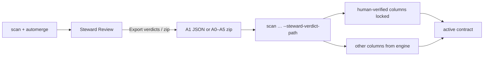

# Steward verdict attach — export zip & `--steward-verdict-path`

Hands-on path for the **portable steward memory** features:

1. **Export all artifacts (zip)** from Contracts v2 / Steward Review
2. **Attach** that memory on the next CLI `scan` / `enrich` / `deep-scan` with
   `--steward-verdict-path`

Human-verified columns stay locked. Columns with no steward verdict, or marked
`needs_review`, still take the deterministic / LLM engine.

Flag sheet: [`docs/cli/steward.md`](../cli/steward.md).  
Related (Finalize A0–A5 in full): [`STEWARD_REVIEW_ARTIFACTS.md`](STEWARD_REVIEW_ARTIFACTS.md).

**Default fixture in this tutorial:**
[`tests/data/golden_tutorial_customers.csv`](../../tests/data/golden_tutorial_customers.csv)
(20 synthetic rows — `email`, `mobile_number`, `national_id`, …).



---

## 0. What this feature does

| Piece | What you get |
|-------|----------------|
| **Export verdicts (memory)** | One A1 JSON (`redibis.steward_verdicts`) — portable PII decisions |
| **Export all artifacts (zip)** | Current A1 + active contract YAML, plus finalized A0–A5 when present |
| **`--steward-verdict-path PATH`** | On `scan` / `profile` / `quality` / `deep-scan` / `enrich`: load a file **or directory** of A1 / `verdict_package` JSON |

### Matching rules (attach)

| Situation | Result |
|-----------|--------|
| Same **table** name + column in **schema** + human-verified (`accept` / `edit` / `no_action`, or portable `pii` / `not_pii`) | **Promote** into the PII overlay; later det/LLM merges **skip** that column |
| `needs_review` or `reject` | **Engine wins** (not locked) |
| Column never reviewed | **Engine wins** |
| Different table in a batch file | Skipped |
| Column not in this CSV / contract schema | Skipped |
| Fingerprint changed (format/type drift) | Treated as **stale** — engine wins |

Same-store shortcut: if you already saved edits under the same `--output-dir`,
the next scan remembers without a file. Use `--steward-verdict-path` when you
carry verdicts to another host, another `--output-dir`, or a **batch** of A1
files.

---

## 1. Setup (same store every step)

```bash
cd /path/to/redibis-enterprise   # or your install root

export OUT=./reports/steward_attach_demo
export CSV=tests/data/golden_tutorial_customers.csv
export TABLE=golden.tutorial_customers
mkdir -p "$OUT" ./artifacts/steward_attach
```

Pass `--output-dir "$OUT"` on every command below. Dashboard storage
(`./_local_storage`) is separate unless you point both at the same root.

Optional larger CSV (start-page default):
`tests/data/realistic_eshop_customer_account.csv` with e.g.
`TABLE=eshop.customer_account` — same steps, more columns.

---

## 2. First scan — build an active contract

```bash
redibis scan "$CSV" "$TABLE" \
  --mode pii \
  --automerge pii \
  --equation independent \
  --pii-engines both \
  --output-dir "$OUT"
```

Check:

```bash
redibis show "$TABLE" --output-dir "$OUT" | head -n 40
redibis steward overview "$TABLE" --output-dir "$OUT"
```

You should see PII on columns such as `email`, `mobile_number`, `national_id`.

---

## 3. Review a few columns (CLI)

Lock email and mobile as PII; leave `account_status` for the engine; mark
`full_name` as needs more review (engine may still propose on the next attach).

```bash
# Accept engine PII on email
redibis steward verdict "$TABLE" email \
  --field pii --decision accept --source regex \
  --rationale engine_correct \
  --actor ada --output-dir "$OUT"

# Accept mobile
redibis steward verdict "$TABLE" mobile_number \
  --field pii --decision accept --source regex \
  --rationale engine_correct \
  --actor ada --output-dir "$OUT"

# Human edit: national_id is PII (confirm)
redibis steward verdict "$TABLE" national_id \
  --field pii --decision edit --source human \
  --rationale domain_knowledge \
  --value '{"is_pii": true, "entity_type": "NATIONAL_ID"}' \
  --actor ada --output-dir "$OUT"

# Defer full_name — next attach will NOT lock this column
redibis steward verdict "$TABLE" full_name \
  --field pii --decision needs_review --source human \
  --rationale other --rationale-text "check display-name vs legal name policy" \
  --actor ada --output-dir "$OUT"
```

`account_status` and `created_at` stay **pending** → engine fills them on attach.

### Same thing in the UI

1. `./scripts/webapp.sh --start --venv` (use the same storage root if you want
   CLI and UI to share contracts).
2. **Contracts v2** → open `$TABLE` → **Steward Review**.
3. Per column: Accept / Edit / Needs review → **Save edits**.
4. Rail: **Export verdicts (memory)** or **Export all artifacts (zip)**.
5. Contract tab → **Integration export** → **steward artifacts (zip)** does the
   same zip from the contract page.

---

## 4. Export portable memory

### A1 only (smallest file for attach)

```bash
redibis steward export-verdicts "$TABLE" \
  -o ./artifacts/steward_attach/steward_verdicts.json \
  --scan-package ./artifacts/steward_attach/scan_verdicts.json \
  --actor ada --output-dir "$OUT"
```

| File | Kind | Use with |
|------|------|----------|
| `steward_verdicts.json` | `redibis.steward_verdicts` (A1) | `--steward-verdict-path`, `scan decide --verdicts`, `verdict import` |
| `scan_verdicts.json` | `redibis.verdict_package` | Same — PII-only projection |

### Full zip (UI or after Finalize)

Without Finalize, the zip still includes:

- `…/current/steward_verdicts.json` (live A1)
- `…/current/contract.yaml`

After **Finalize**, the zip also packs A0–A5 under the latest `review_digest`.

REST:

```text
GET /api/contracts/{table}/steward/export/verdicts
GET /api/contracts/{table}/steward/export/artifacts   → application/zip
```

---

## 5. Simulate a fresh store and attach

Wipe only this demo root’s active overlay by using a **new** output dir (or a
second machine). Keep the CSV and the exported A1.

```bash
export OUT2=./reports/steward_attach_replay
mkdir -p "$OUT2"

# Fresh scan of the same CSV + attach steward memory in one command
redibis scan "$CSV" "$TABLE" \
  --mode pii \
  --automerge pii \
  --steward-verdict-path ./artifacts/steward_attach/steward_verdicts.json \
  --output-dir "$OUT2"
```

CLI prints a summary like:

```text
  steward verdicts: locked 3 · needs_review 1 · schema skip 0 · …
    locked columns: email, mobile_number, national_id
    engine (needs review): full_name
```

### What should be true

```bash
# Overlay: locked columns decided by steward-verdict:…
python - <<'PY'
from pathlib import Path
from redibis.store.storage_backend import LocalBackend
from redibis.store.contract_store import ContractStore
import os
out = Path(os.environ["OUT2"]) / "_dev_storage"
store = ContractStore(LocalBackend(str(out)), "active-contracts")
d = store.get_pii_decisions(os.environ["TABLE"])
for col in ("email", "mobile_number", "national_id", "full_name", "account_status"):
    print(col, "→", (d.get(col) or {}).get("status"), (d.get(col) or {}).get("decided_by", "")[:40])
PY
```

Expect roughly:

| Column | After attach |
|--------|----------------|
| `email`, `mobile_number`, `national_id` | Overlay `pii`, `decided_by` starts with `steward-verdict:` |
| `full_name` | Not locked from A1 (`needs_review`) — engine may write |
| `account_status` | Engine only (never in A1 as verified) |

A later enrich with the same flag keeps those three columns locked:

```bash
redibis enrich "$TABLE" --provider demo \
  --steward-verdict-path ./artifacts/steward_attach/steward_verdicts.json \
  --output-dir "$OUT2"
```

Deep scan (evidence only; still attaches overlay when a contract store exists):

```bash
redibis deep-scan "$CSV" "$TABLE" \
  --steward-verdict-path ./artifacts/steward_attach/steward_verdicts.json \
  --output-dir "$OUT2"
```

---

## 6. Batch directory of verdict files

Point `--steward-verdict-path` at a **folder** of `.json` / `.jsonl` packages.
Only entries whose `table` matches the current scan table are applied.

```bash
mkdir -p ./artifacts/steward_attach/batch
cp ./artifacts/steward_attach/steward_verdicts.json \
   ./artifacts/steward_attach/batch/golden.json
# Add more tables' A1 files here when you have them…

redibis scan "$CSV" "$TABLE" --mode pii --automerge pii \
  --steward-verdict-path ./artifacts/steward_attach/batch \
  --output-dir "$OUT2"
```

---

## 7. How attach differs from other replay tools

| Command / flag | Writes overlay? | Fingerprint gate | Typical use |
|----------------|-----------------|------------------|-------------|
| `scan … --steward-verdict-path` | **Yes** (lock + skip det/LLM) | Stale skipped | Bring steward memory into a scan/enrich |
| `enrich … --steward-verdict-path` | **Yes** (before enrich) | Same | Keep human PII while LLM enriches the rest |
| `scan decide --verdicts` | No (run-scoped report) | Yes | Audit / reporting without store write |
| `verdict import` | Yes (after evidence preview) | Yes | Promote into store with actor + reason |
| Same `--output-dir` after Save edits | Already in overlay | Drift marks stale | Day-to-day same machine |

Precedence once locked: human overlay wins on `ContractStore.upsert` via
`reconcile_pii_columns`. LLM enrich skips locked columns in
`apply_llm_classification_decisions`.

---

## 8. Command cheat sheet

```bash
# Export
redibis steward export-verdicts <table> -o steward_verdicts.json --output-dir "$OUT"
# UI zip: Contracts v2 → steward artifacts (zip)
#          or Steward Review → Export all artifacts (zip)

# Attach (file or directory)
redibis scan <csv> <table> --mode pii --automerge pii \
  --steward-verdict-path ./steward_verdicts.json --output-dir "$OUT"
redibis profile <csv> <table> --steward-verdict-path ./verdicts/ --output-dir "$OUT"
redibis quality <csv> <table> --automerge quality \
  --steward-verdict-path ./steward_verdicts.json --output-dir "$OUT"
redibis deep-scan <csv> <table> --steward-verdict-path ./steward_verdicts.json --output-dir "$OUT"
redibis enrich <table> --provider demo \
  --steward-verdict-path ./steward_verdicts.json --output-dir "$OUT"
```

---

## 9. Troubleshooting

| Symptom | Cause | Fix |
|---------|--------|-----|
| `locked 0` | Table name mismatch (`TABLE` ≠ A1 `table`) | Use the same `schema.table` as export |
| Locked columns overwritten by enrich | Old build without skip | Upgrade; enrich must go through `apply_llm_classification_decisions` |
| `needs_review` column locked | Should not happen | Re-export A1; only accept/edit/no_action (or portable pii/not_pii) promote |
| Schema skip for every column | Attach before any contract and CSV header unread | Pass the same CSV on `scan`; schema comes from active contract or file header |
| Stale skips | Format/type changed vs fingerprint in A1 | Re-review columns; re-export A1 |
| Zip has no A0–A5 | Finalize never run | Zip still has `current/` A1 + contract; Finalize for full pack |
| UI zip empty / 404 | No active contract | Scan + automerge first |
| Dashboard vs CLI disagree | Different storage roots | Same `--output-dir` / `LOCAL_STORAGE_ROOT` |

---

## See also

- [`STEWARD_REVIEW_ARTIFACTS.md`](STEWARD_REVIEW_ARTIFACTS.md) — Finalize A0–A5, export-verdicts deep dive
- [`docs/cli/steward.md`](../cli/steward.md) — steward CLI flags
- [`docs/cli/scan.md`](../cli/scan.md) — `--steward-verdict-path` on scan family
- [`docs/cli/enrich.md`](../cli/enrich.md) — enrich + steward context
- [`EVIDENCE_REVIEW_LEDGER.md`](../EVIDENCE_REVIEW_LEDGER.md) — overlay precedence
- [`INTRO.md`](INTRO.md) — first scan / dashboard
